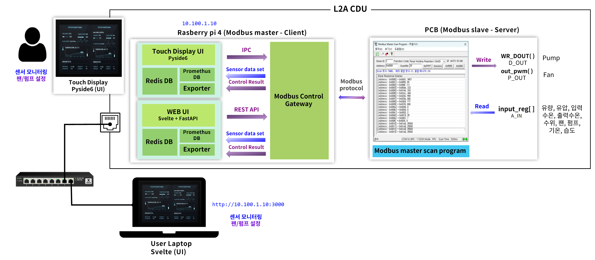

# [RESEARCH] L2A CDU 터치모니터 개발

## 개요

본 문서는 L2A CDU 시스템의 전체 아키텍처와 요구사항, 그리고 HW/SW 구성 요소를 정의함. 본 문서는 시스템의 큰 구조와 설계 기준을 설명하는 것을 목적으로 하며, 세부 구현 사항은 추후 지속적으로 업데이트한다.

**Last Update:** 2026.04.08

## Table of Contents

1. L2A CDU 시스템 전체 구성
2. 요구사항
3. 통신
   - 3.1 통신 구조
   - 3.2 통신 방식
   - 3.3 Modbus 동작
4. 시스템 구성 요소 상세
   - 4.1 Raspberry Pi (Modbus Master)
   - 4.2 Modbus Control Gateway (MCG)
   - 4.3 UI
   - 4.4 PCB (Modbus Slave)
   - 4.5 Sensor / Actuator
5. 사용자 인터페이스 설계
   - 5.1 UI 선정 기준
   - 5.2 UI 후보 비교
6. 라즈베리파이 키오스크 모드 설계
7. TODO

---

## 1. L2A CDU 시스템 전체 구성

| 구성 요소 | 역할 |
|---|---|
| Raspberry Pi | MCG, UI, DB를 탑재하는 하드웨어 플랫폼 (IP: DHCP 할당 — Local UI Top bar에서 확인). 온/습도 센서를 I2C/GPIO로 직접 연결하여 읽음 (예외적 직접 수집 — Modbus 미경유) |
| Web UI (Svelte + FastAPI) | WEB 기반 유저 인터페이스. http 기반으로 파이썬 기반의 제어모듈(MCG - modbus control gateway)과 통신. 모니터링 및 제어 화면, 과거 기록 확인 화면 |
| Touch Display UI (PySide6) | 로컬 기반 유저 인터페이스. IPC 기반으로 파이썬 기반의 제어모듈(MCG - modbus control gateway)과 통신. 모니터링 및 제어, 과거 기록 확인 화면 |
| Redis DB | 현재값 전용 DB (`sensor:*`, `comm:*`, `alarm:*`) — 이력 저장 없음 |
| Prometheus + Exporter | 센서 이력 DB. Exporter가 Redis `sensor:*` 를 주기적으로 scrape |
| Prometheus Pushgateway | 제어 명령·통신 장애 이력 수신. MCG가 이벤트 발생 시 직접 push |
| Modbus Control Gateway (MCG) | 실질적 Modbus Master (읽기/쓰기). 읽기: pcb 로부터 polling → redis에 전송. 쓰기: UI 로부터 요청받음 → PCB 로 write 명령 |
| PCB | Modbus Slave, 센서 입력 및 펌프/팬 제어 |
| 센서 및 엑츄에이터 | 센서: 수온, 유량, 유압, 누수, 수위센서. 엑츄에이터: 펌프, 팬 |

## 2. 요구사항

- 사용자는 터치 디스플레이 또는 웹 UI를 통해 시스템을 모니터링하고 제어할 수 있어야 함
- 시스템은 키오스크 사용자에게 제한된 기능만 노출해야 함
- 시스템은 사용자에게 하드웨어 플랫폼 정보 (라즈베리파이 기반 여부, OS 정보 등)를 노출하지 않아야 함
- 시스템은 부팅 완료 후 사용자 개입 없이 제어 서비스 및 사용자 인터페이스를 자동으로 실행해야 함

## 3. 통신

### 3.1 통신 구조

- MCG는 Modbus 통신의 단일 Master로 동작
- 모든 센서 데이터 조회 및 제어 요청은 MCG를 통해 처리됨
- UI는 MCG와만 통신하며 PCB와 직접 통신하지 않음

> **예외 — 온/습도 센서**: 외기 온도·습도 센서(`sensor:ambient_temp`, `sensor:ambient_humidity`)는 PCB를 경유하지 않고 Raspberry Pi에 직접 연결(I2C/GPIO)하여 수집함. 별도의 RPi Ambient Sensor Reader 프로세스가 값을 읽어 Redis에 직접 SET.

### 3.2 통신 방식

| 구간 | 방식 |
|---|---|
| MCG ↔ PCB | Modbus RTU (Master / Slave) |
| Touch Display UI ↔ MCG | IPC (Unix Domain Socket) |
| Web UI ↔ MCG | REST API |
| RPi ↔ 온/습도 센서 | I2C / GPIO (직접 연결 — Modbus 미경유) |

### 3.3 Modbus 동작

- **Read**: MCG가 PCB에 주기적으로 polling → 센서·상태 레지스터 읽기
- **Write**: UI 제어 요청 수신 시 MCG가 PCB에 write 명령 전송

## 4. 시스템 구성 요소 상세

### 4.1 Raspberry Pi (Modbus Master)

- MCG, UI, DB를 탑재하는 하드웨어 플랫폼
- 구성요소
  - UI: 4.3 참고
  - MCG: 4.2 참고
  - DB: Redis DB, Prometheus (상세 내용은 4.3 DB 참고)
- **온/습도 센서 직접 수집 (예외)**
  - 외기 온도·습도 센서를 I2C/GPIO로 직접 연결
  - RPi Ambient Sensor Reader 프로세스가 주기적으로 값을 읽어 Redis에 SET (`sensor:ambient_temp`, `sensor:ambient_humidity`)
  - MCG Modbus polling 대상에서 제외

### 4.2 Modbus Control Gateway (MCG)

- 시스템 내 중앙 제어 및 통신 허브 (Modbus Master)
- 4개 레이어로 구성: 요청 수신·검증 / 스케줄링·큐 / Modbus 통신 / 이벤트 처리
- 작업 소스 우선순위: Emergency Queue > Control Queue > Polling (Task Scheduler가 중재)

> 상세 내용: [v1/MCG.md](docs/v1/MCG.md) (MCG 단독 시퀀스) / [v2/MCG.md](docs/v2/MCG.md) (PCB Watchdog/OP_MODE 연동)

### 4.3 UI

- Local UI (PySide6): 터치 디스플레이 기반, IPC로 MCG와 통신
- WEB UI (Svelte + FastAPI): 브라우저 기반, REST API로 MCG와 통신
- 양쪽 모두 모니터링 페이지 / 기록 확인 페이지로 구성
- DB: Redis (실시간), Prometheus (이력)

> 상세 내용: [UI.md](docs/UI.md)

### 4.4 PCB (Modbus Slave)

- 센서 입력 값 제공
- 펌프 및 팬 제어 출력 수행 (PWM / DOUT)
- Modbus 레지스터 기반 Read / Write 지원
- Master(MCG)와 독립적인 자율 동작 기능 내장:
  - **OP_MODE** (HR addr=19): Normal / Emergency Stop / Default Value / Auto Control 선택
  - **Master Heartbeat Watchdog**: MCG가 `MASTER_HEARTBEAT` (HR addr=20)를 주기적으로 갱신하지 않으면 Timeout 후 자동 모드 전환
  - **Flash 저장 파라미터**: 전원 재인가 후에도 초기값·Watchdog 정책 유지
- 상세 내용: [v1/PCB.md](docs/v1/PCB.md) (단순 R/W) / [v2/PCB.md](docs/v2/PCB.md) (자율 동작)

### 4.5 Sensor / Actuator

- 수위, 유량, 수온 등 시스템 동작에 필요한 센서 데이터 제공
- 펌프, 팬 등 제어 대상 액추에이터 포함
- PCB를 통해 MCG에 의해 간접적으로 제어됨

> **예외 — 온/습도 센서**: 외기 온도·습도 센서는 PCB에 연결되지 않고 Raspberry Pi에 직접 연결(I2C/GPIO)됨. 데이터 경로: 센서 → RPi Ambient Sensor Reader → Redis (`sensor:ambient_temp`, `sensor:ambient_humidity`)

## 5. 사용자 인터페이스 설계 (참고)

### 5.1 UI 선정 기준

- 키오스크 모드 동작 가능
- 제어 요청에 대한 저지연 응답
- 상업적 사용 가능 라이선스
- 커스텀 UI 구성 용이성

### 5.2 UI 후보 비교 (참고)

| 항목 | FlowFuse Dashboard | Grafana | PyQt6 | PySide6 |
|---|---|---|---|---|
| 상업 판매 비용 | 무료 | 무료 | $550/년 | 무료 |
| 웹 기반 | O | O | X | X |
| 데이터 수신 지연 | 5~20ms | 100~1000ms | <1ms | <1ms |
| 제어 요청 지연 | 20~60ms | 50~200ms | <1ms | <1ms |
| 키오스크 지원 | O | O | O | O |
| 커스텀 자유도 | 중간 | 높음 | 매우 높음 | 매우 높음 |
| 메모리 사용량 | 200~300MB | 200~300MB | 50~100MB | 50~100MB |

## 6. 라즈베리파이 키오스크 모드 설계

> 상세 내용: [Kiosk.md](docs/Kiosk.md)

**Local UI (PySide6) 키오스크**
- 부팅 후 자동 로그인
- PySide6 앱 자동 실행 (브라우저 불필요)
- 전체화면 모드 강제 적용
- 앱 비정상 종료 시 자동 재시작
- 화면 절전 및 전원 관리 비활성화
- 마우스 커서 숨김

> WEB UI는 원격 브라우저 접속용 (http://\<RPi-IP\>:3000) — 키오스크 모드 해당 없음
