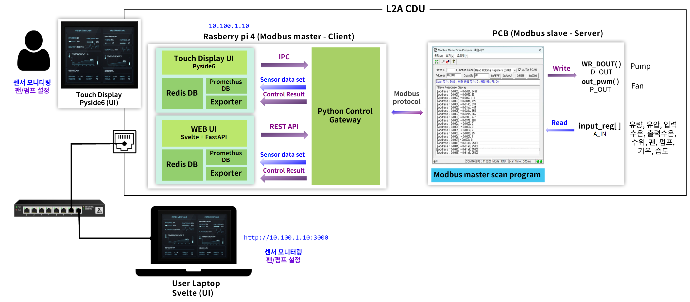

# [RESEARCH] L2A CDU 터치모니터 개발

## 개요

본 문서는 L2A CDU 시스템의 전체 아키텍처와 요구사항, 그리고 HW/SW 구성 요소를 정의함. 본 문서는 시스템의 큰 구조와 설계 기준을 설명하는 것을 목적으로 하며, 세부 구현 사항은 추후 지속적으로 업데이트한다.

**Last Update:** 2026.03.24

## Table of Contents

1. L2A CDU 시스템 전체 구성
2. 요구사항
3. 데이터 및 통신
   - 3.1 통신 구조
   - 3.2 통신 방식
   - 3.3 데이터 흐름
4. 시스템 구성 요소 상세
   - 4.1 Raspberry Pi (Modbus Master)
   - 4.2 Python Control Gateway (PCG)
   - 4.3 UI
   - 4.4 PCB (Modbus Slave)
   - 4.5 Sensor / Actuator
5. 사용자 인터페이스 설계
   - 5.1 UI 선정 기준
   - 5.2 UI 후보 비교
6. 라즈베리파이 키오스크 모드 설계
7. TODO

---

## 1. L2A CDU 시스템 전체 구성

| 구성 요소 | 역할 |
|---|---|
| Raspberry Pi | PCG, UI, DB를 탑재하는 하드웨어 플랫폼 (IP: 10.100.1.10) |
| Web UI (Svelte + FastAPI) | WEB 기반 유저 인터페이스. http 기반으로 파이썬 기반의 제어모듈(PCG - python control gateway)과 통신. 모니터링 및 제어 화면, 과거 기록 확인 화면 |
| Touch Display UI (PySide6) | 로컬 기반 유저 인터페이스. IPC 기반으로 파이썬 기반의 제어모듈(PCG - python control gateway)과 통신. 모니터링 및 제어, 과거 기록 확인 화면 |
| Redis DB | 실시간 DB, UI 에 표시 |
| PrometheusDB + exporter | History 용 DB, exporter 는 redisDB 로부터 value를 받음 |
| Python Control Gateway (PCG) | 실질적 Modbus Master (읽기/쓰기). 읽기: pcb 로부터 polling → redis에 전송. 쓰기: UI 로부터 요청받음 → PCB 로 write 명령 |
| PCB | Modbus Slave, 센서 입력 및 펌프/팬 제어 |
| 센서 및 엑츄에이터 | 센서: 수온, 유량, 유압, 누수, 수위센서. 엑츄에이터: 펌프, 팬 |

## 2. 요구사항

- 사용자는 터치 디스플레이 또는 웹 UI를 통해 시스템을 모니터링하고 제어할 수 있어야 함
- 시스템은 키오스크 사용자에게 제한된 기능만 노출해야 함
- 시스템은 사용자에게 하드웨어 플랫폼 정보 (라즈베리파이 기반 여부, OS 정보 등)를 노출하지 않아야 함
- 시스템은 부팅 완료 후 사용자 개입 없이 제어 서비스 및 사용자 인터페이스를 자동으로 실행해야 함

## 3. 데이터 및 통신

### 3.1 통신 구조

- Python Control Gateway(PCG)는 Modbus 통신의 중앙 제어 노드로 동작함
- 모든 센서 데이터 조회 및 제어 요청은 PCG를 통해 처리됨
- UI는 PCG와만 통신하며 PCB와 직접 통신하지 않음
- Touch Display UI와 Web UI가 사용하는 DB(Redis, Prometheus)는 동일함

### 3.2 통신 방식

- **PCG ↔ PCB**
  - Modbus RTU
  - Master / Slave 구조
    - Modbus Master: PCG
    - Modbus Slave: PCB
- **UI ↔ PCG**
  - Touch Display
    - Inter Process Communication (IPC) 기반
  - WEB
    - REST API 기반

### 3.3 데이터 흐름

**Read**
- PCG는 주기적으로 PCB에 센서 데이터 Read 요청을 전송함(Polling 기반)
- Data Flow
  - 실시간 데이터: 센서 및 엑츄에이터 → PCB → PCG → Redis → UI
  - 기록 확인용: 센서 및 엑츄에이터 → PCB → PCG → Redis → exporter → Prometheus

**Write**
- 사용자는 엑츄에이터 조절 가능
- PCG 에서는 Write 후 통신 결과에 대한 피드백을 redis 로 전송
- 추후 사용자는 제어 기록을 확인가능
- Data Flow
  - 제어요청: UI → PCG → PCB
  - 피드백: PCB → PCG → Redis DB → exporter → Prometheus

## 4. 시스템 구성 요소 상세

### 4.1 Raspberry Pi (Modbus Master)

- PCG, UI, DB를 탑재하는 하드웨어 플랫폼
- 구성요소
  - UI: 4.3 참고
  - PCG: 4.2 참고
  - DB: Redis DB, Prometheus (상세 내용은 4.3 DB 참고)

### 4.2 Python Control Gateway (PCG)

#### 개요

- 시스템 내 중앙 제어 및 통신 허브
- PCB 대상 단일 Modbus Master
- 센서/액추에이터 레지스터 주기적 polling
- UI 제어 요청 수신 및 처리
- 제어 결과 및 통신 상태 Redis 저장
- 이상 상태 이벤트 생성 및 외부 전달

**요청 처리 우선순위: 긴급 요청 큐 > 제어 처리 큐 > Polling Scheduler**

#### 컴포넌트 구성

**[레이어 1] 요청 수신 & 검증**

`Command Validator / Safety Checker`
- UI로부터 제어 요청 수신 (IPC / REST API)
- 요청값 허용 범위 검증 및 잘못된 값 차단
- 비정상 상태 시 제어 제한, 긴급 상태 시 일반 요청 차단
- 검증 통과 시 제어 처리 큐에 적재
- 허용 범위 예시: Pump Duty 0~100%, Fan 전압 0~12V
- 누수 감지 시 특정 제어 요청 거부

**[레이어 2] 스케줄링 & 큐**

`Polling Scheduler`
- 설정 주기마다 센서/액추에이터 read 작업 트리거
- 주기 설정 및 변경 가능, 제어 요청 큐와 독립 동작
- 긴급 상황 진입 시 polling 일시 중단 / 복구 시 재개
- 주요 polling 대상: 수온, 유압, 유량, 수위, 누수, 펌프 상태, 팬 상태

`제어 처리 큐`
- Command Validator 통과한 일반 제어 요청 순차 적재
- Polling Scheduler보다 높은 우선순위, 직렬 처리로 충돌 방지
- 처리 대상: Pump Duty 변경, Fan 전압 변경, 기타 액추에이터 제어

`긴급 요청 큐`
- Alarm / Event Manager가 적재하는 긴급 전용 큐
- 제어 처리 큐 및 Polling Scheduler 선점
- 트리거 조건: 누수 감지, 과온, 수위 이상, 통신 이상, 비상 정지
- 실행 동작: Pump OFF, Fan Full Speed, 특정 액추에이터 차단

**[레이어 3] Modbus 통신**

`Modbus Transport Manager`
- 큐에서 요청을 꺼내 Modbus RTU 송수신 실행
- timeout / retry / reconnect 처리, 연속 실패 횟수 관리
- slave 응답 이상 감지 및 통신 실패 상태 관리
- Function code별 요청 송신 및 예외 응답 처리

`Modbus Request Translator` *(Write 경로 전용)*
- 제어 요청을 Modbus 명령으로 변환 (address 매핑, FC 결정, value encoding)
- 단일/복수 register write 구성
- 예: `set_pump_duty(70)` → `FC06 / addr=0x0012 / value=700`

`Modbus Data Parser` *(Read 경로 전용)*
- raw register 값 해석: scaling, signed/unsigned 변환, bitfield decode
- 센서/상태값 구조화 후 즉시 임계치 판단
- 센서 실시간 값(`sensor:*`, `control:*`)은 항상 Redis SET
- 임계치 초과 / 복귀 감지 시 → Alarm/Event Manager에 통보 (알람 키(`alarm:*`) 조작은 하지 않음)
- 예: `input_reg[3] = 412` → `coolant_temp = 41.2` / `status bit 1` = Leak detected

**[레이어 4] 이벤트 처리**

`Alarm / Event Manager`
- Modbus Data Parser로부터 임계치 초과/복귀 통보 수신
- 경고 / 치명 / 복구 이벤트 분류 후 긴급 요청 큐에 적재
- 알람 상태 키 관리: 임계치 초과 시 Redis SET (`alarm:*`), 정상 복귀 시 Redis DEL
- 중복 이벤트 억제, 이벤트 발생/해제 시점 기록
- 주요 이벤트: 온도 임계치 초과, 누수 감지, 수위 부족, 센서 이상, PCB 무응답, 통신 timeout, 복구

#### 시나리오

**시나리오 1. 주기적 상태 수집**
- 트리거: Polling Scheduler 주기 도달
- 흐름: `Polling Scheduler → Modbus Transport Manager → PCB → Modbus Data Parser → Redis`

| 순서 | 실행 주체 | 동작 |
|---|---|---|
| 1 | Polling Scheduler | 주기 도달 → read 작업 트리거 |
| 2 | Modbus Transport Manager | PCB로 read 요청 송신 → 응답 수신 (timeout/retry 처리) |
| 3 | Modbus Data Parser | register 값 해석 → 구조화 → 임계치 판단 |
| 4 | Modbus Data Parser | 센서 실시간 값 Redis SET (항상 수행) |
| 5 | Alarm / Event Manager | 임계치 정상 → 통보 없음, 이벤트 없음 |

**시나리오 2. 일반 제어 요청 처리**
- 트리거: UI로부터 제어 요청 수신
- 흐름: `UI → Command Validator → 제어 처리 큐 → Modbus Request Translator → Modbus Transport Manager → Alarm/Event Manager`

| 순서 | 실행 주체 | 동작 |
|---|---|---|
| 1 | Command Validator | 허용 범위 검증 → 통과 시 제어 처리 큐 적재, 실패 시 차단 |
| 2 | Modbus Request Translator | 제어 요청 → Modbus write 명령 변환 (FC, address, value) |
| 3 | Modbus Transport Manager | PCB로 write 명령 송신 → ACK/NACK 수신 및 성공 여부 확인 |
| 4 | Alarm / Event Manager | 제어 결과 이벤트 기록 (성공/실패) |

**시나리오 3. 긴급 상황 처리**
- 트리거: Modbus Data Parser 임계치 판단에서 긴급 조건 감지
- 흐름: `Modbus Data Parser → Alarm/Event Manager → 긴급 요청 큐 → Modbus Request Translator → Modbus Transport Manager → [복구] Modbus Data Parser → Alarm/Event Manager`

**[진입 단계]**

| 순서 | 실행 주체 | 동작 |
|---|---|---|
| 1 | Modbus Data Parser | polling 중 임계치 초과 감지 → 센서값 Redis SET + Alarm/Event Manager 통보 |
| 2 | Alarm / Event Manager | 이벤트 종류 분류 (경고/치명) → `alarm:*` Redis SET → 긴급 요청 큐 적재 |
| 3 | 긴급 요청 큐 | 제어 처리 큐 및 Polling Scheduler 선점 |
| 4 | Polling Scheduler | polling 일시 중단 |
| 5 | Command Validator | 긴급 상태 플래그 설정 → 일반 제어 요청 차단 |

**[안전 동작 단계]**

| 순서 | 실행 주체 | 동작 |
|---|---|---|
| 6 | Modbus Request Translator | 긴급 명령 변환 (예: Pump OFF → FC06, Fan 최대 전압 → FC06) |
| 7 | Modbus Transport Manager | 긴급 명령 PCB로 즉시 송신 → 응답 수신 |
| 8 | Modbus Data Parser | write 응답 파싱 → 안전 동작 수행 확인 |

**[복구 단계]**

| 순서 | 실행 주체 | 동작 |
|---|---|---|
| 9 | Modbus Transport Manager | PCB read 재개 |
| 10 | Modbus Data Parser | 임계치 복귀 감지 → Alarm/Event Manager에 복구 통보 |
| 11 | Alarm / Event Manager | `alarm:*` Redis DEL → 복구 이벤트 기록 → Polling Scheduler·Command Validator 재개 신호 전달 |
| 12 | Polling Scheduler | polling 정상 재개 |
| 13 | Command Validator | 긴급 상태 플래그 해제 → 일반 제어 요청 허용 |

### 4.3 UI

#### Local UI (PySide6)

**FE (PySide6)**
- 모니터링 페이지: 실시간 센서 데이터(수온·유압·유량·수위·누수·펌프·팬 상태) 조회 및 표시, 펌프·팬 제어 요청
- 기록 확인 페이지: Prometheus에서 이력 데이터 조회 및 표시

**BE (PySide6)**
- PCG와 IPC 기반 통신 (제어 요청 전달 / 결과 수신)
- Redis DB 조회 (실시간 센서 데이터 소스)
- Prometheus DB 조회 (이력 데이터 소스)

#### WEB UI (Svelte + FastAPI)

**FE (Svelte)**
- 모니터링 페이지: 실시간 센서 데이터 조회 및 표시, 펌프·팬 제어 요청
- 기록 확인 페이지: 이력 데이터 조회 및 표시
- 접속: http://10.100.1.10:3000 (User Laptop 등 외부 브라우저)

**BE (FastAPI)**
- PCG와 REST API 기반 통신 (제어 요청 전달 / 결과 수신)
- Redis DB 조회 (실시간 데이터 소스)
- Prometheus DB 조회 (이력 데이터 소스)

#### DB

**Redis DB**

| Key | 설명 | 설정 주체 |
|---|---|---|
| `sensor:coolant_temp` | 수온 | Modbus Data Parser |
| `sensor:pressure` | 유압 | Modbus Data Parser |
| `sensor:flow_rate` | 유량 | Modbus Data Parser |
| `sensor:water_level` | 수위 | Modbus Data Parser |
| `sensor:leak` | 누수 | Modbus Data Parser |
| `sensor:pump_status` | 펌프 상태 | Modbus Data Parser |
| `sensor:fan_status` | 팬 상태 | Modbus Data Parser |
| `control:pump_duty` | 펌프 duty 현재값 | Modbus Data Parser |
| `control:fan_voltage` | 팬 전압 현재값 | Modbus Data Parser |
| `alarm:coolant_temp_high` | 수온 임계치 초과 | Alarm / Event Manager |
| `alarm:leak_detected` | 누수 감지 | Alarm / Event Manager |
| `alarm:water_level_low` | 수위 부족 | Alarm / Event Manager |
| `alarm:comm_timeout` | 통신 timeout | Alarm / Event Manager |

**Exporter**
- 독립 프로세스로 동작
- Redis의 `sensor:*`, `control:*` key를 참조하여 메트릭 수집 후 Prometheus로 전송 (Pull 방식)
- `alarm:*` 키는 수집 대상 제외

**Prometheus DB**
- Exporter로부터 수집된 시계열 메트릭 데이터 저장
- 이력 조회용 데이터 소스

### 4.4 PCB (Modbus Slave)

- 센서 입력 값 제공
- 펌프 및 팬 제어 출력 수행
- Modbus 레지스터 기반 Read / Write 지원
- Slave 설정 및 레지스터 맵은 PCB 명세서 기준으로 정의

### 4.5 Sensor / Actuator

- 수위, 유량, 수온 등 시스템 동작에 필요한 센서 데이터 제공
- 펌프, 팬 등 제어 대상 액추에이터 포함
- PCB를 통해 PCG에 의해 간접적으로 제어됨

## 5. 사용자 인터페이스 설계 (참고)

### 5.1 UI 선정 기준

- 키오스크 모드 동작 가능
- 제어 요청에 대한 저지연 응답
- 상업적 사용 가능 라이선스
- 커스텀 UI 구성 용이성

### 5.2 UI 후보 비교 (참고)

| 항목 | FlowFuse Dashboard | Grafana | PyQt6 | PySide6 |
|---|---|---|---|---|
| 상업 판매 비용 | 무료 | 무료 | $550/년 | 무료 |
| 웹 기반 | O | O | X | X |
| 데이터 수신 지연 | 5~20ms | 100~1000ms | <1ms | <1ms |
| 제어 요청 지연 | 20~60ms | 50~200ms | <1ms | <1ms |
| 키오스크 지원 | O | O | O | O |
| 커스텀 자유도 | 중간 | 높음 | 매우 높음 | 매우 높음 |
| 메모리 사용량 | 200~300MB | 200~300MB | 50~100MB | 50~100MB |

## 6. 라즈베리파이 키오스크 모드 설계

**Local UI (PySide6) 키오스크**
- 부팅 후 자동 로그인
- PySide6 앱 자동 실행 (브라우저 불필요)
- 전체화면 모드 강제 적용
- 앱 비정상 종료 시 자동 재시작
- 화면 절전 및 전원 관리 비활성화
- 마우스 커서 숨김

**WEB UI (Svelte) 키오스크**
- 부팅 후 자동 로그인
- Chromium 브라우저 자동 실행
- 키오스크 전용 세션 구성 (주소창·탭 숨김)
- 브라우저 강제 전체화면 실행
- 브라우저 비정상 종료 시 자동 재시작
- 화면 절전 및 전원 관리 비활성화
- 마우스 커서 숨김

