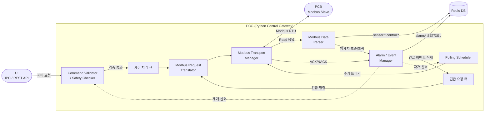

# Python Control Gateway (PCG)

## 개요

- 시스템 내 중앙 제어 및 통신 허브
- PCB 대상 단일 Modbus Master
- 센서/액추에이터 레지스터 주기적 polling
- UI 제어 요청 수신 및 처리
- 제어 결과 및 통신 상태 Redis 저장
- 이상 상태 이벤트 생성 및 외부 전달

**요청 처리 우선순위: 긴급 요청 큐 > 제어 처리 큐 > Polling Scheduler**

## 컴포넌트 구성

### 전체 흐름

### 요구사항 적합성 검토

| 요구사항 | 관련 컴포넌트 | 판정 | 비고 |
|---|---|---|---|
| 터치/웹 UI를 통한 모니터링 및 제어 | Command Validator (IPC/REST API 수신), Modbus Data Parser (Redis SET) | ✅ | 양쪽 인터페이스 모두 지원 |
| 키오스크 사용자에게 제한된 기능만 노출 | Command Validator (허용 범위 검증, 잘못된 값 차단) | ⚠️ | 값 범위 제한은 있으나 사용자 권한 레벨(관리자/일반) 구분 없음 |
| 하드웨어 플랫폼 정보 미노출 | PCG 추상화 계층 (UI ↔ PCG ↔ PCB), Redis key 추상화 네이밍 | ✅ | UI는 PCB register에 직접 접근 불가 |
| 부팅 후 자동 실행 | Polling Scheduler (자동 polling 시작) | ⚠️ | PCG 프로세스 자체의 자동 시작 방식(systemd 등) 미정의 |

**개요 항목 대비 컴포넌트 커버리지**

| 개요 항목 | 담당 컴포넌트 | 판정 | 비고 |
|---|---|---|---|
| 시스템 내 중앙 제어 및 통신 허브 | 전체 구조 | ✅ | |
| PCB 대상 단일 Modbus Master | Modbus Transport Manager | ✅ | |
| 센서/액추에이터 레지스터 주기적 polling | Polling Scheduler | ✅ | |
| UI 제어 요청 수신 및 처리 | Command Validator + 제어 처리 큐 | ✅ | |
| 제어 결과 및 통신 상태 Redis 저장 | Alarm/Event Manager (이벤트 기록), Transport Manager (통신 상태 관리) | ⚠️ | 통신 실패 상태의 Redis 저장 key가 미정의. 제어 결과 Redis 저장 경로 불명확 |
| 이상 상태 이벤트 생성 및 외부 전달 | Alarm / Event Manager | ⚠️ | alarm:* Redis SET이 "외부 전달" 역할이나, UI 외 외부 시스템(알림 등) 전달 수단 미정의 |

---

**[레이어 1] 요청 수신 & 검증**

`Command Validator / Safety Checker`
- UI로부터 제어 요청 수신 (IPC / REST API)
- 요청값 허용 범위 검증 및 잘못된 값 차단
- 비정상 상태 시 제어 제한, 긴급 상태 시 일반 요청 차단
- 검증 통과 시 제어 처리 큐에 적재
- 허용 범위 예시: Pump Duty 0~100%, Fan 전압 0~12V
- 누수 감지 시 특정 제어 요청 거부

**[레이어 2] 스케줄링 & 큐**

`Polling Scheduler`
- 설정 주기마다 센서/액추에이터 read 작업 트리거
- 주기 설정 및 변경 가능, 제어 요청 큐와 독립 동작
- 긴급 상황 진입 시 polling 일시 중단 / 복구 시 재개
- 주요 polling 대상: 수온, 유압, 유량, 수위, 누수, 펌프 상태, 팬 상태

`제어 처리 큐`
- Command Validator 통과한 일반 제어 요청 순차 적재
- Polling Scheduler보다 높은 우선순위, 직렬 처리로 충돌 방지
- 처리 대상: Pump Duty 변경, Fan 전압 변경, 기타 액추에이터 제어

`긴급 요청 큐`
- Alarm / Event Manager가 적재하는 긴급 전용 큐
- 제어 처리 큐 및 Polling Scheduler 선점
- 트리거 조건: 누수 감지, 과온, 수위 이상, 통신 이상, 비상 정지
- 실행 동작: Pump OFF, Fan Full Speed, 특정 액추에이터 차단

**[레이어 3] Modbus 통신**

`Modbus Transport Manager`
- 큐에서 요청을 꺼내 Modbus RTU 송수신 실행
- timeout / retry / reconnect 처리, 연속 실패 횟수 관리
- slave 응답 이상 감지 및 통신 실패 상태 관리
- Function code별 요청 송신 및 예외 응답 처리

`Modbus Request Translator` *(Write 경로 전용)*
- 제어 요청을 Modbus 명령으로 변환 (address 매핑, FC 결정, value encoding)
- 단일/복수 register write 구성
- 예: `set_pump_duty(70)` → `FC06 / addr=0x0012 / value=700`

`Modbus Data Parser` *(Read 경로 전용)*
- raw register 값 해석: scaling, signed/unsigned 변환, bitfield decode
- 센서/상태값 구조화 후 즉시 임계치 판단
- 센서 실시간 값(`sensor:*`, `control:*`)은 항상 Redis SET
- 임계치 초과 / 복귀 감지 시 → Alarm/Event Manager에 통보 (알람 키(`alarm:*`) 조작은 하지 않음)
- 예: `input_reg[3] = 412` → `coolant_temp = 41.2` / `status bit 1` = Leak detected

**[레이어 4] 이벤트 처리**

`Alarm / Event Manager`
- Modbus Data Parser로부터 임계치 초과/복귀 통보 수신
- 경고 / 치명 / 복구 이벤트 분류 후 긴급 요청 큐에 적재
- 알람 상태 키 관리: 임계치 초과 시 Redis SET (`alarm:*`), 정상 복귀 시 Redis DEL
- 중복 이벤트 억제, 이벤트 발생/해제 시점 기록
- 주요 이벤트: 온도 임계치 초과, 누수 감지, 수위 부족, 센서 이상, PCB 무응답, 통신 timeout, 복구

## 시나리오

**시나리오 1. 주기적 상태 수집**
- 트리거: Polling Scheduler 주기 도달
- 흐름: `Polling Scheduler → Modbus Transport Manager → PCB → Modbus Data Parser → Redis`

| 순서 | 실행 주체 | 동작 |
|---|---|---|
| 1 | Polling Scheduler | 주기 도달 → read 작업 트리거 |
| 2 | Modbus Transport Manager | PCB로 read 요청 송신 → 응답 수신 (timeout/retry 처리) |
| 3 | Modbus Data Parser | register 값 해석 → 구조화 → 임계치 판단 |
| 4 | Modbus Data Parser | 센서 실시간 값 Redis SET (항상 수행) |
| 5 | Alarm / Event Manager | 임계치 정상 → 통보 없음, 이벤트 없음 |

**시나리오 2. 일반 제어 요청 처리**
- 트리거: UI로부터 제어 요청 수신
- 흐름: `UI → Command Validator → 제어 처리 큐 → Modbus Request Translator → Modbus Transport Manager → Alarm/Event Manager`

| 순서 | 실행 주체 | 동작 |
|---|---|---|
| 1 | Command Validator | 허용 범위 검증 → 통과 시 제어 처리 큐 적재, 실패 시 차단 |
| 2 | Modbus Request Translator | 제어 요청 → Modbus write 명령 변환 (FC, address, value) |
| 3 | Modbus Transport Manager | PCB로 write 명령 송신 → ACK/NACK 수신 및 성공 여부 확인 |
| 4 | Alarm / Event Manager | 제어 결과 이벤트 기록 (성공/실패) |

**시나리오 3. 긴급 상황 처리**
- 트리거: Modbus Data Parser 임계치 판단에서 긴급 조건 감지
- 흐름: `Modbus Data Parser → Alarm/Event Manager → 긴급 요청 큐 → Modbus Request Translator → Modbus Transport Manager → [복구] Modbus Data Parser → Alarm/Event Manager`

**[진입 단계]**

| 순서 | 실행 주체 | 동작 |
|---|---|---|
| 1 | Modbus Data Parser | polling 중 임계치 초과 감지 → 센서값 Redis SET + Alarm/Event Manager 통보 |
| 2 | Alarm / Event Manager | 이벤트 종류 분류 (경고/치명) → `alarm:*` Redis SET → 긴급 요청 큐 적재 |
| 3 | 긴급 요청 큐 | 제어 처리 큐 및 Polling Scheduler 선점 |
| 4 | Polling Scheduler | polling 일시 중단 |
| 5 | Command Validator | 긴급 상태 플래그 설정 → 일반 제어 요청 차단 |

**[안전 동작 단계]**

| 순서 | 실행 주체 | 동작 |
|---|---|---|
| 6 | Modbus Request Translator | 긴급 명령 변환 (예: Pump OFF → FC06, Fan 최대 전압 → FC06) |
| 7 | Modbus Transport Manager | 긴급 명령 PCB로 즉시 송신 → 응답 수신 |
| 8 | Modbus Data Parser | write 응답 파싱 → 안전 동작 수행 확인 |

**[복구 단계]**

| 순서 | 실행 주체 | 동작 |
|---|---|---|
| 9 | Modbus Transport Manager | PCB read 재개 |
| 10 | Modbus Data Parser | 임계치 복귀 감지 → Alarm/Event Manager에 복구 통보 |
| 11 | Alarm / Event Manager | `alarm:*` Redis DEL → 복구 이벤트 기록 → Polling Scheduler·Command Validator 재개 신호 전달 |
| 12 | Polling Scheduler | polling 정상 재개 |
| 13 | Command Validator | 긴급 상태 플래그 해제 → 일반 제어 요청 허용 |
