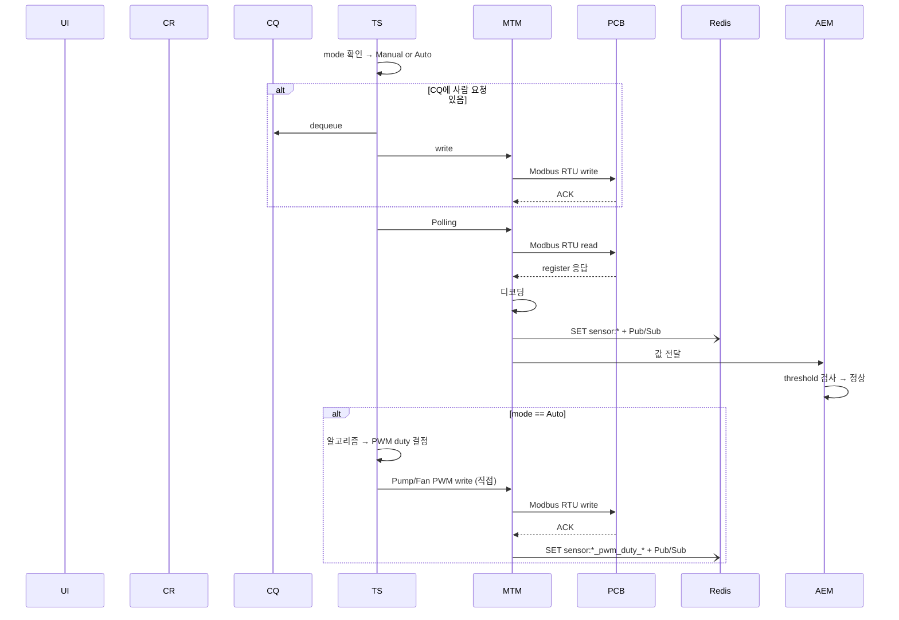
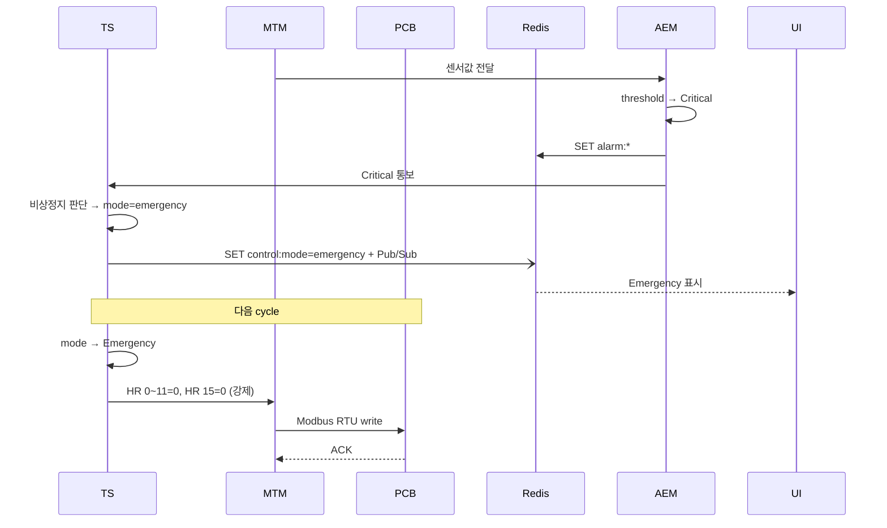
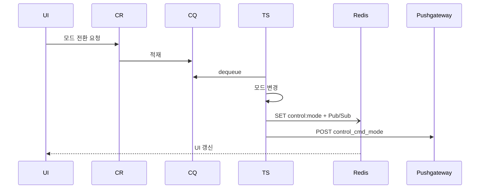

# Modbus Control Gateway (MCG)

## 1. 개요

MCG는 L2A CDU 시스템의 중앙 제어 허브로, PCB(Modbus Slave)와 UI 사이에서 센서 수집·제어 명령·알람 관리를 수행한다.

**컴포넌트 4개:**

| 컴포넌트 | 약어 | 역할 |
|---|---|---|
| Command Receiver | CR | UI로부터 제어 요청 수신 → CQ에 적재 (이것만 함) |
| Control Queue | CQ | 사람의 제어 요청을 임시 보관하는 큐 (적재 소스: CR만) |
| Task Scheduler | TS | MCG의 핵심 — 매 cycle 모드 판단 + CQ 소비 + Polling + Auto write + 비상정지 전담 |
| Modbus Transport Manager | MTM | TS의 지시로 Modbus RTU 송수신 실행 |
| Alarm / Event Manager | AEM | 센서값 threshold 검사 → 알람 SET/DEL. 제어 명령은 생성하지 않음 |

```
UI ──→ CR ──→ CQ (사람의 의지)
                 │
                 ▼
                TS (시스템의 판단)
              │       ▲
              │       │ critical 통보
              ▼       │
             MTM ──→ AEM (감지·알람만)
              │
              ▼
             PCB

CQ 경유:  Manual 제어, 모드 전환 (사람 요청)
TS 직접:  Auto write, Emergency 진입 (시스템 판단)
```

---

## 2. 제어 모드

TS가 매 cycle 최우선으로 참조하는 시스템 상태. Redis `control:mode` 키로 관리.

### 모드 정의

| 모드 | 동작 | 진입 |
|---|---|---|
| **Manual** (기본값) | CQ에 쌓인 사람의 PWM 제어 요청 처리 + Polling | UI → CQ 경유 |
| **Auto** | Polling 후 알고리즘으로 PWM 자동 계산 → MTM 직접 write | UI → CQ 경유 |
| **Emergency** | 전체 PWM=0, DOUT=0 매 cycle 강제. CQ/Polling/Auto 중단 | TS가 AEM critical 수신 후 직접 SET |

### 전환 규칙

| 전환 | 트리거 | 경로 |
|---|---|---|
| Manual → Auto | 사용자 UI 요청 | CR → CQ → TS |
| Auto → Manual | 사용자 UI 요청 | CR → CQ → TS |
| Any → Emergency | AEM critical 알람 → TS 비상정지 판단 | TS 직접 SET (CQ 미경유) |
| Emergency → Manual | 사용자 UI 명시적 복귀 요청 | CR → CQ → TS |

> Auto 모드에서 Pump/Fan 수동 제어 UI는 비활성화 (Manual 전환 시 재활성화).
> AEM 동작은 모든 모드에서 동일 (감지·알람만).

### TS 매 cycle 로직

```
매 cycle:
  1. mode 확인 (최우선)

  2. if mode == Emergency:
       → HR 0~11=0, HR 15=0 write (매 cycle 강제)
       → CQ/Polling/Auto 건너뜀 → 다음 cycle

  3. CQ 확인 → 있으면 dequeue → 처리 (write > read)

  4. Polling → MTM read → 센서 수집 → AEM 검사
       → Critical 알람 시: TS가 비상정지 판단 → mode=emergency SET

  5. if mode == Auto: 알고리즘 → MTM 직접 write
```

---

## 3. 컴포넌트 상세

### CR (Command Receiver)

UI(Local PySide6 / Web Svelte)로부터 IPC 또는 REST API로 제어 요청을 수신하여 CQ에 적재한다. 요청 종류: Pump/Fan PWM 변경, 모드 전환 (Manual↔Auto, Emergency→Manual).

### CQ (Control Queue)

사람의 의지를 전달하는 단일 채널. 적재 소스는 CR만. TS가 매 cycle Polling보다 우선 dequeue한다. Auto write와 Emergency 진입은 CQ를 경유하지 않는다 (TS 내부 동작).

### TS (Task Scheduler)

MCG의 핵심 주체. 위 §2 "TS 매 cycle 로직" 참고. 모드 판단, CQ 소비, Polling 트리거, Auto 알고리즘 실행, 비상정지 진입을 모두 전담한다.

### MTM (Modbus Transport Manager)

TS의 지시로 Modbus RTU 송수신을 실행한다.

- **Read path**: IR read → scaling/bitfield 디코딩 → Redis SET `sensor:*` + Pub/Sub publish → AEM에 값 전달
- **Write path**: 입력값 → HR 주소/register value 변환 → Modbus write → ACK 확인
  - Manual 제어 시 Pushgateway POST (이력). Auto/Emergency write 시 POST 없음
- **통신 상태**: Redis `comm:status`, `comm:consecutive_failures`, `comm:last_error` SET + Pub/Sub. 상태 변경 시 Pushgateway POST
- **통신 오류**: timeout → retry → 연속 N회 실패 시 AEM 통보 → PCB 무응답 시 Polling 중단

> 레지스터 맵, S-Curve, Flash 저장 등 PCB 하드웨어 상세는 [PCB.md](PCB.md) 참고.

### AEM (Alarm / Event Manager)

MTM으로부터 디코딩된 센서값을 수신하여 threshold 검사 → 알람 SET/DEL. Critical 알람 시 TS에 통보. AEM은 감지와 알람 전달만 담당하며 제어 명령은 생성하지 않는다.

---

## 4. Auto Control 알고리즘

mode=Auto일 때 TS가 Polling 완료 후 실행.

- **입력**: 냉각수 inlet/outlet 온도, 유량
- **출력**: HR 0~11 (Pump/Fan PWM Duty)
- **알고리즘**: 지정된 알고리즘에 의해 PWM duty 결정 (상세는 구현 시 정의)
- **적용**: 양 루프(L1, L2) 독립 또는 대칭 제어 (구현 시 결정)
- **이력**: Pushgateway POST 없음 — Exporter가 `sensor:*`로 수집

---

## 5. 시나리오

### 시나리오 1. 정상 동작 (Manual/Auto)



### 시나리오 2. 비상정지 진입



> 비상정지 조건 (구현 시 정의): 누수 감지, 수위 LOW, 냉각수온 critical 등 복합 판단.
> S-Curve 1초 적용 (보드 사양).

### 시나리오 3. 모드 전환



---

## 6. 서비스 초기화

PCB 펌웨어에 초기값 Flash 저장이 미구현이므로, MCG 서비스 시작 시 config.yaml에서 로드한 초기값을 PCB에 write.

| 대상 | HR 주소 | 비고 |
|---|---|---|
| Pump L1 PWM | HR 0~3 | TIM1 (CH1~4) |
| Pump L2 PWM | HR 4~7 | TIM2 (CH5~8) |
| Fan PWM | HR 8~11 | TIM8 (CH9~12) |
| PWM Freq | HR 12~14 | TIM1/TIM2/TIM8 |
| DOUT | HR 15 | bit0~5 |

> 전원 재인가 시 MCG 재시작(systemd Restart=always)으로 초기값 자동 적용.

---

## 7. 예외 처리

### 목표

L2A CDU의 1차 목표는 **서버의 안정적인 냉각 유지**. 예외 처리는 이 목표를 위협하는 시나리오를 중심으로 설계.

| # | 시나리오 | 트리거 조건 |
|---|----------|-------------|
| S1 | 냉각 성능 저하 | 냉각수 온도 임계 초과 |
| S2 | 냉각수 손실 | 수위 부족 |
| S3 | 냉각수 누출 | 누수 감지 |
| S4 | 제어 불능 | Modbus 통신 두절 |
| S5 | 환경 한계 초과 | 장치 내부 온도·습도 한계 초과 |

### 심각도

| 심각도 | MCG 동작 |
|---|---|
| **Warning** | AEM → 알람 SET → UI 표시 |
| **Critical** | AEM → 알람 SET + TS 통보 → TS가 비상정지 판단 |

### 센서 이상

| 예외 | 심각도 | 알람 키 | 복구 조건 |
|---|---|---|---|
| 수온 경고 (L1/L2) | Warning | `alarm:coolant_temp_l1_warning` / `l2_warning` | 임계치 이하 복귀 |
| 수온 위험 (L1/L2) | Critical | `alarm:coolant_temp_l1_critical` / `l2_critical` | 임계치 이하 복귀 |
| 누수 감지 | Critical | `alarm:leak_detected` | 누수 비트 해제 |
| 수위 부족 | Warning | `alarm:water_level_warning` | `sensor:water_level`≥2 |
| 수위 위험 | Critical | `alarm:water_level_critical` | `sensor:water_level`≥1 |
| 유압 이상 | Warning | `alarm:pressure_warning` | 정상 범위 복귀 |
| 유량 저하 | Warning | `alarm:flow_rate_warning` | 정상 유량 복귀 |
| 장치 내부 온도 경고 | Warning | `alarm:ambient_temp_warning` | 임계치 이하 복귀 |
| 장치 내부 온도 한계 초과 | Critical | `alarm:ambient_temp_critical` | 정상 범위 복귀 |
| 장치 내부 습도 경고 | Warning | `alarm:ambient_humidity_warning` | 임계치 이하 복귀 |
| 장치 내부 습도 한계 초과 | Critical | `alarm:ambient_humidity_critical` | 정상 범위 복귀 |

### 통신 이상

| 예외 | 심각도 | 처리 | 복구 |
|---|---|---|---|
| 단일 timeout | — | MTM 내부 retry | retry 성공 |
| 연속 N회 실패 | Warning | `alarm:comm_timeout` SET, Pushgateway POST | 통신 복구 |
| PCB 무응답 | Critical | `alarm:comm_disconnected` SET, Polling 중단 | 통신 복구 후 재개 |

### 복구 원칙

- 알람 해제: AEM이 threshold 복귀 확인 → `alarm:*` DEL
- 비상정지 복구: 사용자가 UI에서 Emergency → Manual 전환 (명시적)
- 통신 복구: MTM 재연결 성공 → Polling 재개

---

## 8. 미구현 — PCB Watchdog

MCG 다운 시 PCB가 자체적으로 안전 모드로 전환하는 Watchdog 기능은 MCG로 대체 불가. 펌웨어 업데이트 필요.

- **필요 기능**: Master Heartbeat 감시 → timeout 시 PCB 자체 보호 모드 전환
- **현재 한계**: MCG가 죽으면 PCB에 명령을 보낼 수 없음
- **임시 대응**: systemd `Restart=always`로 MCG 자동 재시작
- **상세**: [PCB.md](PCB.md) "미구현 기능" 섹션 참고
