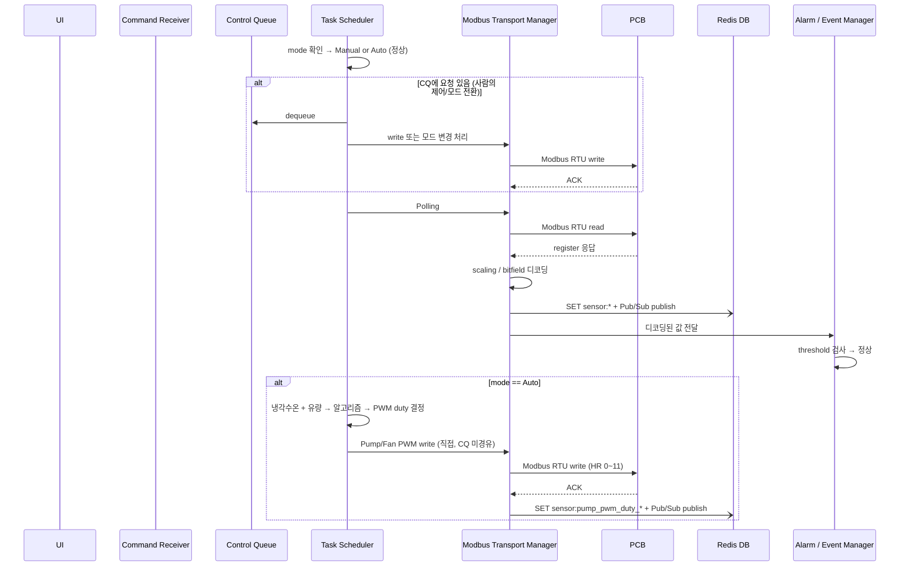
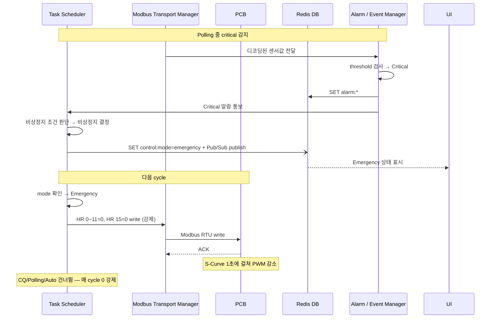
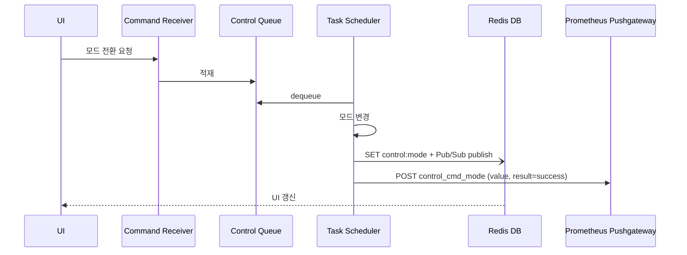

# Modbus Control Gateway (MCG)

## 개요

- 시스템 내 중앙 제어 및 통신 허브
- PCB 대상 단일 Modbus Master
- 센서/액추에이터 레지스터 주기적 polling
- UI 제어 요청 수신 및 처리
- 제어 결과 및 통신 상태 저장
- 이상 상태 이벤트 생성 및 외부 전달

---

## 제어 모드

Task Scheduler가 매 cycle 최우선으로 참조하는 시스템 상태.

| 모드 | 설명 | 진입 경로 |
|---|---|---|
| **Manual** (기본값) | 사람이 UI에서 Pump/Fan PWM을 직접 설정 | UI → CR → CQ → TS |
| **Auto** | MCG가 냉각수온·유량 기반으로 PWM 자동 계산 → PCB 직접 write | UI → CR → CQ → TS |
| **Emergency** | 비상정지. 전체 PWM=0, DOUT=0 강제 유지. | TS가 AEM critical 수신 후 직접 SET |

- 현재 모드: Redis `control:mode` (`manual` | `auto` | `emergency`)
- Manual ↔ Auto 전환: UI 요청 → CQ 경유
- Emergency 진입: TS가 AEM으로부터 critical 알람 수신 → 비상정지 판단 → mode 직접 변경
- Emergency 복귀: 사용자가 UI에서 명시적으로 Manual 전환 요청 (CQ 경유)
- AEM 동작은 모든 모드에서 동일 (감지·알람만, 제어 명령 생성 안 함)

---

## 컴포넌트 구성

4개 컴포넌트: Command Receiver, Task Scheduler + Control Queue, Modbus Transport Manager, Alarm / Event Manager

### [레이어 1] 요청 수신

`Command Receiver`
- UI로부터 제어 요청 수신 (IPC / REST API)
- Control Queue에 적재 (이것만 함)
- 처리 대상: Pump/Fan PWM 변경, 모드 전환 (Manual ↔ Auto, Emergency → Manual)

### [레이어 2] 스케줄링·큐

`Task Scheduler`
- **MCG의 핵심 주체** — 모드 판단 + CQ 소비 + Polling + Auto write + 비상정지 전부 전담
- 매 cycle "TS 매 cycle 로직" 참고

`Control Queue`
- **사람의 의지를 전달하는 채널** — CQ 적재 소스는 Command Receiver만 (단일 소스)
- Manual 제어 요청 + 모드 전환 요청을 보관
- TS가 Polling보다 우선 dequeue (write > read)
- Auto write, Emergency 진입은 CQ를 경유하지 않음 (TS 내부 동작)

### [레이어 3] Modbus 통신

`Modbus Transport Manager`
- Task Scheduler로부터 요청을 받아 Modbus RTU 송수신 실행
- timeout / retry / reconnect 처리, 연속 실패 횟수 관리
- **Read path**: IR read → scaling / bitfield 디코딩 → Redis SET `sensor:*` + Pub/Sub publish (async) ∥ AEM에 값 전달
  - **수위 센서 융합**: 상·하위 광센서 2개 bit를 조합해 `sensor:water_level` 단일 값(`2`/`1`/`0`)으로 SET
- **Write path**: 입력값 → HR 주소 / register value 변환 → Modbus write → ACK 확인
  - Manual 제어 시 Pushgateway POST (이력 기록)
  - Auto 제어 / Emergency write 시 Pushgateway POST 없음
  - 예: set_pump(70%) → FC06 / HR 0 / value=700
- 통신 상태 Redis SET + Pub/Sub: `comm:status`, `comm:consecutive_failures`, `comm:last_error`
- 통신 상태 변경 시 Pushgateway POST (이력용)

### [레이어 4] 이벤트 처리

`Alarm / Event Manager`
- MTM으로부터 디코딩된 센서값 수신 → threshold 검사 → 이상/복귀 판단
- 알람 상태 키 관리: 임계치 초과 시 Redis SET (`alarm:*`), 정상 복귀 시 Redis DEL
- **Critical 알람 발생 시 Task Scheduler에 통보** → TS가 비상정지 판단

> AEM은 감지와 알람 전달만 담당. 제어 명령은 생성하지 않음.

---

### 컴포넌트 관계 요약

```
UI ──→ Command Receiver ──→ Control Queue (사람의 의지)
                                  │
                                  ▼
                            Task Scheduler (시스템의 판단)
                              │       ▲
                              │       │ critical 통보
                              ▼       │
                             MTM ──→ AEM (감지·알람만)
                              │
                              ▼
                             PCB

CQ 경유:    Manual 제어, 모드 전환 (사람 요청)
TS 직접:    Auto write, Emergency 진입 (시스템 판단)
```

---

### TS 매 cycle 로직

```
매 cycle:
  ┌─ 1. mode 확인 (최우선)
  │
  ├─ 2. if mode == Emergency:
  │       → HR 0~11=0, HR 15=0 write (매 cycle 강제)
  │       → CQ/Polling/Auto 건너뜀
  │       → 다음 cycle
  │
  ├─ 3. CQ 확인 → 있으면 dequeue → 처리 (write > read)
  │       (모드 전환이면 control:mode 변경 + Pushgateway POST)
  │       (Manual PWM이면 MTM write + Pushgateway POST)
  │
  ├─ 4. Polling → MTM read → 센서 수집 → AEM 검사
  │       → Warning: 알람 SET
  │       → Critical: 알람 SET + TS에 통보
  │                   → TS가 비상정지 판단 → mode=emergency 직접 SET
  │
  └─ 5. if mode == Auto: 알고리즘 → MTM 직접 write
```

---

## MCG 서비스 초기화

PCB 펌웨어에 초기값 Flash 저장이 미구현이므로, MCG 서비스 시작 시 아래 초기값을 PCB에 write.

| 대상 | HR 주소 | 초기값 | 비고 |
|---|---|---|---|
| Pump L1 PWM | HR 0~3 | config.yaml에서 로드 | TIM1 (CH1~4) |
| Pump L2 PWM | HR 4~7 | config.yaml에서 로드 | TIM2 (CH5~8) |
| Fan PWM | HR 8~11 | config.yaml에서 로드 | TIM8 (CH9~12) |
| PWM Freq | HR 12~14 | config.yaml에서 로드 | TIM1/TIM2/TIM8 |
| DOUT | HR 15 | config.yaml에서 로드 | bit0~5 |

> 전원 재인가 시 MCG 재시작(systemd Restart=always)으로 초기값 자동 적용.

---

## 예외 처리 설계

### 목표 기반 시나리오

L2A CDU의 1차 목표는 **서버의 안정적인 냉각 유지**.

| # | 시나리오 | 위협 대상 | 트리거 조건 |
|---|----------|-----------|-------------|
| S1 | **냉각 성능 저하** | 서버 과열 | 냉각수 온도 임계 초과 |
| S2 | **냉각수 손실** | 순환 불가 | 수위 부족 |
| S3 | **냉각수 누출** | 침수·서버 과열 복합 | 누수 감지 |
| S4 | **제어 불능** | 대응 불가 | Modbus 통신 두절 |
| S5 | **환경 한계 초과** | 장치 동작 불가 | 장치 내부 온도·습도 한계 초과 |

### 심각도

| 심각도 | 정의 | MCG 동작 |
|---|---|---|
| **Warning** | 주의 필요 | AEM → 알람 SET → UI 표시 |
| **Critical** | 즉각 조치 필요 | AEM → 알람 SET + TS에 통보 → **TS가 비상정지 판단** |

### 센서 이상

| 예외 | 심각도 | AEM 처리 | 복구 조건 |
|---|---|---|---|
| 수온 경고 (L1/L2) | Warning | `alarm:coolant_temp_l1_warning` / `l2_warning` SET | 임계치 이하 복귀 |
| 수온 위험 (L1/L2) | Critical | `alarm:coolant_temp_l1_critical` / `l2_critical` SET → TS 통보 | 임계치 이하 복귀 |
| 누수 감지 | Critical | `alarm:leak_detected` SET → TS 통보 | 누수 비트 해제 |
| 수위 부족 | Warning | `alarm:water_level_warning` SET | `sensor:water_level`≥2 |
| 수위 위험 | Critical | `alarm:water_level_critical` SET → TS 통보 | `sensor:water_level`≥1 |
| 유압 이상 | Warning | `alarm:pressure_warning` SET | 정상 범위 복귀 |
| 유량 저하 (Pump ON) | Warning | `alarm:flow_rate_warning` SET | 정상 유량 복귀 |
| 장치 내부 온도 경고 | Warning | `alarm:ambient_temp_warning` SET | 임계치 이하 복귀 |
| 장치 내부 온도 한계 초과 | Critical | `alarm:ambient_temp_critical` SET → TS 통보 | 정상 범위 복귀 |
| 장치 내부 습도 경고 | Warning | `alarm:ambient_humidity_warning` SET | 임계치 이하 복귀 |
| 장치 내부 습도 한계 초과 | Critical | `alarm:ambient_humidity_critical` SET → TS 통보 | 정상 범위 복귀 |

### 통신 이상

| 예외 | 심각도 | 처리 | 복구 조건 |
|---|---|---|---|
| 단일 timeout | — | MTM 내부 retry | retry 성공 |
| 연속 N회 실패 | Warning | `alarm:comm_timeout` SET, Pushgateway POST | 통신 복구 |
| PCB 무응답 | Critical | `alarm:comm_disconnected` SET, Polling 중단 | 통신 복구 후 재개 |

### 복구 원칙

- 알람 해제: AEM이 threshold 복귀 확인 → `alarm:*` Redis DEL
- 비상정지 복구: 사용자가 UI에서 Emergency → Manual 전환 (명시적)
- 통신 복구: MTM 재연결 성공 → Polling 재개

---

## 시나리오

### 시나리오 1. 정상 동작 (Polling + CQ)

mode=Manual/Auto, CQ 비어있음 또는 CQ에 요청 있음



> CQ 처리, Polling, Auto write가 하나의 cycle에서 순서대로 실행됨.
> 통신 오류 시: MTM retry → 연속 실패 시 AEM 통보 → 알람 SET. PCB 무응답 시 Polling 중단.

---

### 시나리오 2. 비상정지 진입

AEM이 critical 알람 발생 → TS가 비상정지 판단



> Emergency 모드에서는 매 cycle PWM=0, DOUT=0 강제.
> S-Curve 1초 적용 (보드 사양).
> 비상정지 조건 (구현 시 정의): 누수 감지, 수위 LOW, 냉각수온 critical 등 복합 판단.

---

### 시나리오 3. 모드 전환

UI에서 모드 전환 요청 → CQ 경유



| 전환 | 비고 |
|---|---|
| Manual → Auto | 다음 cycle부터 알고리즘 write 시작 |
| Auto → Manual | PWM은 마지막 Auto 값 유지 |
| Emergency → Manual | 사용자 명시적 복귀 (UI에서만 가능) |

> Emergency 진입은 TS가 수행 (시나리오 2). UI에서 Emergency 진입 불가.

---

## Auto Control 알고리즘

- **입력 센서**: 냉각수 inlet/outlet 온도, 유량
- **출력**: HR 0~11 (Pump/Fan PWM Duty)
- **알고리즘**: 지정된 알고리즘에 의해 PWM duty 결정 (상세는 구현 시 정의)
- **적용 방식**: 양 루프(L1, L2) 독립 또는 대칭 제어 (구현 시 결정)

---

## 미구현 — PCB Watchdog (펌웨어 업데이트 필요)

MCG 다운 시 PCB가 자체적으로 안전 모드로 전환하는 Watchdog 기능은 MCG 소프트웨어로 대체 불가. 현재 PCB 펌웨어에 미구현 상태이며, 펌웨어 업데이트가 필요해 보임.

- **필요 기능**: Master Heartbeat 감시 → timeout 시 PCB 자체 보호 모드 전환
- **현재 한계**: MCG가 죽으면 PCB에 명령을 보낼 수 없음
- **임시 대응**: systemd `Restart=always`로 MCG 서비스 자동 재시작
- **상세**: [PCB.md](PCB.md) "미구현 기능" 섹션 참고
