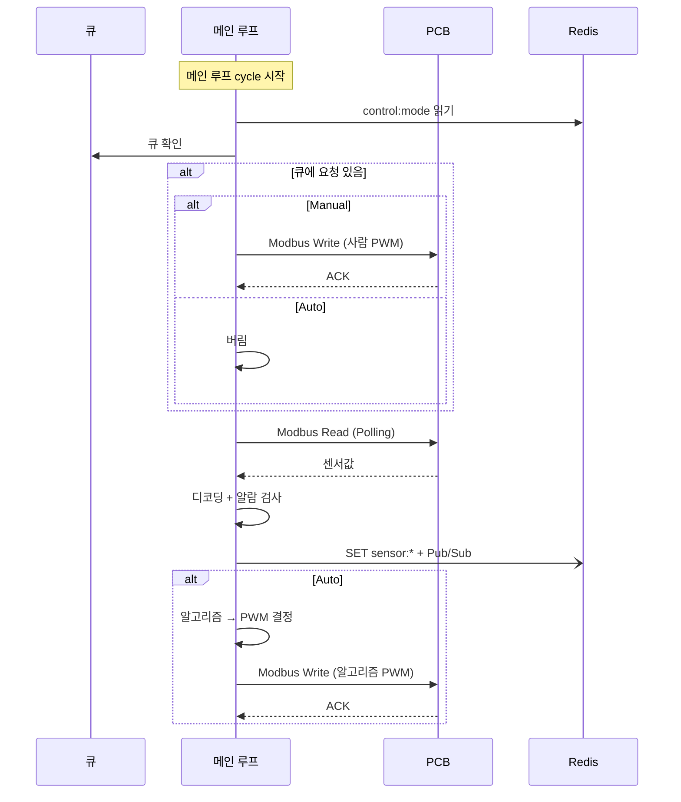

# Modbus Control Gateway (MCG)

## 1. 요구사항

| # | 요구사항 | 설명 |
|---|---|---|
| R1 | **모니터링** | PCB에서 센서값을 주기적으로 읽어와 Redis에 저장. UI에 실시간 표시. |
| R2 | **Manual 제어** | 사람이 UI에서 팬/펌프 PWM을 직접 설정 → PCB에 write |
| R3 | **Auto 제어** | 모니터링값 기반으로 자동으로 팬/펌프 PWM 결정 → PCB에 write |
| R4 | **비상정지** | 지정한 특정 센서가 critical 상태 → 전체 정지 (PWM=0, DOUT=0) |

---

## 2. 구조 개요

### 요구사항에서 도출

- **R1 모니터링** → PCB 센서 레지스터를 주기적으로 Modbus Read. 읽은 값을 Redis SET + 알람 threshold 검사.
- **R2 Manual 제어** → UI에서 PWM 값을 받으면 PCB에 Modbus Write. UI 요청은 **언제든** 올 수 있음.
- **R3 Auto 제어** → 모니터링 결과를 보고 알고리즘이 PWM 결정 → PCB에 Modbus Write.
- **R4 비상정지** → 모니터링 결과에서 특정 센서 critical → 전체 PWM=0, DOUT=0 Write.
- **공통** → Modbus는 단일 시리얼 버스. Read와 Write를 동시에 할 수 없음. 모든 Modbus 통신은 순차 실행.

### 2 쓰레드

| 쓰레드 | 역할 | 근거 |
|---|---|---|
| **UI 수신 쓰레드** | IPC/REST 소켓 listen → PWM 제어 요청을 큐에 적재 | R2: UI 요청은 언제든 올 수 있으므로 항상 listen 필요 |
| **메인 루프 쓰레드** | Redis에서 mode 읽기 → 큐 확인 → Polling → Auto면 알고리즘으로 PWM 결정 후 Modbus Write | R1~R4 + Modbus 순차 제약 |

---

## 3. 제어 모드

UI가 Redis `control:mode`에 직접 SET. 메인 루프는 매 cycle Redis에서 읽어서 분기.

| 모드 | 동작 | 진입 |
|---|---|---|
| **Manual** | 큐에서 사람의 PWM 요청 꺼내서 Write + Polling | UI 요청 (모드 전환) |
| **Auto** (기본값) | Polling 후 알고리즘으로 PWM 결정 → Write | UI 요청 (모드 전환) |
| **Emergency** | TODO — 시스템 안정화 후 설계 | TODO |

> `control:mode` key 초기화는 **UI 서비스 담당**. UI 최초 기동 시 key가 비어있으면 `auto`로 SETNX. MCG는 mode key에 쓰지 않고 읽기만 함 (mode 관리 주체 = UI).

### 전환 규칙

| 전환 | 트리거 |
|---|---|
| Manual ↔ Auto | UI가 Redis `control:mode` 직접 SET → 메인 루프가 다음 cycle에서 읽어서 반영 |

### 비상정지 (TODO)

> 비상정지 모드는 특정 센서(예: 누수, 수위 위험)가 critical일 때 전체 PWM=0, DOUT=0을 강제하는 모드.
> 어떤 센서가 비상정지를 트리거할지, 어떤 상황에서 어떻게 제어할지는 시스템 구현·안정화 후 결정.
> 현재는 Manual / Auto 2가지 모드에 집중하여 설계.

---

## 4. 메인 루프

```
매 cycle:

  1. Redis에서 `control:mode` 읽기

  2. if Emergency: TODO (시스템 안정화 후 설계)

  3. 큐 확인 (항상 실행)
       → Manual: 요청 있으면 Modbus Write
       → Auto: 요청 있으면 버림 (Auto 모드에서는 사람 제어 무효)

  4. Polling (항상 실행)
       → Modbus Read (센서 레지스터)
       → 디코딩 → Redis SET + Pub/Sub
       → 알람 threshold 검사

  5. if Auto: 알고리즘 (센서값 → PWM duty 결정) → Modbus Write
```

> step 3의 Modbus Write와 step 5의 Modbus Write는 같은 시리얼 버스를 사용하므로 동일 cycle 내에서 순차 실행.
> S-Curve 1초 적용 (보드 사양 — [PCB.md](PCB.md) 참고).

---

## 5. 상세

### Polling (Modbus Read)

- 센서값 + 현재 PWM duty 읽기 → 디코딩 → Redis SET `sensor:*` + Pub/Sub publish
- 레지스터 매핑 상세: §9 Redis Key 참고

### 제어 (Modbus Write)

- Manual: 사람이 UI에서 설정한 값 Write → Pushgateway POST (이력)
- Auto: 알고리즘이 결정한 값 Write → POST 없음 (Exporter가 `sensor:*`로 수집)
- 레지스터 매핑 상세: §9 Redis Key 참고

### 모드 전환

- UI가 Redis `control:mode` 직접 SET (MCG 관여 없음)

### 알람 검사

- 매 Polling 후 센서값 threshold 비교 → 초과 시 Redis SET `alarm:*`, 복귀 시 DEL
- 알람 검사는 제어 명령을 생성하지 않음 (감지·알람만)
- 비상정지 연동: TODO (시스템 안정화 후 설계)
- threshold 상세: [threshold.md](threshold.md) 참고

### Auto 알고리즘

- **입력**: 냉각수 inlet/outlet 온도, 유량, 현재 Pump/Fan PWM duty
- **출력**: 새 Pump/Fan PWM duty → Modbus Write
- **알고리즘**: 지정된 알고리즘에 의해 결정 (상세는 구현 시 정의)
- **적용**: 양 루프(L1, L2) 독립 또는 대칭 (구현 시 결정)

---

## 6. 시나리오

### 정상 동작



### 비상정지 진입 (TODO)

> 시스템 안정화 후 설계. 특정 센서 critical 시 전체 PWM=0, DOUT=0 강제하는 시나리오.

---

## 7. 서비스 초기화

PCB 펌웨어에 초기값 Flash 저장이 미구현이므로, MCG 시작 시 config.yaml에서 로드한 값을 PCB에 Write.

| 대상 | HR 주소 | 비고 |
|---|---|---|
| Fan L1 PWM | Holding Register 0 | CH1, TIM1 25KHz |
| Fan L2 PWM | Holding Register 1 | CH2, TIM1 25KHz |
| Pump L1 PWM | Holding Register 4 | CH5, TIM2 1KHz |
| Pump L2 PWM | Holding Register 5 | CH6, TIM2 1KHz |
| PWM Freq (TIM1) | Holding Register 12 | 25000 Hz (팬) |
| PWM Freq (TIM2) | Holding Register 13 | 1000 Hz (펌프) |

> 전원 재인가 시 MCG 재시작(systemd Restart=always)으로 초기값 자동 적용.

---

## 8. 알람 및 이상 감지

모니터링 중 센서값이 정상 범위를 벗어나면 알람을 발생시켜 UI에 표시한다.

### 알람 목록

| 예외 | 심각도 | 알람 키 | 복구 조건 |
|---|---|---|---|
| 수온 경고 (L1/L2) | Warning | `alarm:coolant_temp_l1_warning` / `l2_warning` | 임계치 이하 |
| 수온 위험 (L1/L2) | Critical | `alarm:coolant_temp_l1_critical` / `l2_critical` | 임계치 이하 |
| 누수 감지 | Critical | `alarm:leak_detected` | 누수 비트 해제 |
| 수위 부족 | Warning | `alarm:water_level_warning` | `water_level`≥2 |
| 수위 위험 | Critical | `alarm:water_level_critical` | `water_level`≥1 |
| 유압 이상 | Warning | `alarm:pressure_warning` | 정상 범위 |
| 유량 저하 | Warning | `alarm:flow_rate_warning` | 정상 유량 |
| 장치 내부 온도 경고 | Warning | `alarm:ambient_temp_warning` | 임계치 이하 |
| 장치 내부 온도 한계 초과 | Critical | `alarm:ambient_temp_critical` | 정상 범위 |
| 장치 내부 습도 경고 | Warning | `alarm:ambient_humidity_warning` | 임계치 이하 |
| 장치 내부 습도 한계 초과 | Critical | `alarm:ambient_humidity_critical` | 정상 범위 |
| 통신 연속 실패 | Warning | `alarm:comm_timeout` | 통신 복구 |
| PCB 무응답 | Critical | `alarm:comm_disconnected` | 통신 복구 |

> 비상정지: 어떤 알람이 비상정지를 트리거할지는 TODO. 시스템 안정화 후 결정.

### 복구 원칙

- 알람 해제: threshold 복귀 확인 → `alarm:*` DEL
- 비상정지 복구: TODO (시스템 안정화 후 설계)
- 통신 복구: 재연결 성공 → Polling 재개

---

## 9. DB (Redis / Prometheus)

> Redis는 현재값 전용 DB. 이벤트 이력·명령 기록은 저장하지 않음.

### Redis Key — Modbus 연동

**수온 (NTC — Input Register 28~31)**

| Key | 설명 | Register | 단위 |
|---|---|---|---|
| `sensor:coolant_temp_inlet_1` | 냉각수 입수 온도 L1 | Input Register 28 (NTC CH13) | 0.1°C |
| `sensor:coolant_temp_inlet_2` | 냉각수 입수 온도 L2 | Input Register 29 (NTC CH14) | 0.1°C |
| `sensor:coolant_temp_outlet_1` | 냉각수 출수 온도 L1 | Input Register 30 (NTC CH15) | 0.1°C |
| `sensor:coolant_temp_outlet_2` | 냉각수 출수 온도 L2 | Input Register 31 (NTC CH16) | 0.1°C |

**디지털 입력 (DIN — Input Register 25)**

| Key | 설명 | Register | 비고 |
|---|---|---|---|
| `sensor:water_level` | 수위 (2/1/0) | Input Register 25, bit 조합 | MCG가 고/저 2센서 조합 → HIGH/MIDDLE/LOW 판단 |
| `sensor:leak` | 누수 (NORMAL/LEAKED) | Input Register 25, 특정 bit | |

**팬/펌프 PWM duty — Read/Write**

| Key | 설명 | Register | 제어 대상 |
|---|---|---|---|
| `sensor:fan_pwm_duty_1` | 팬 PWM L1 (0–100%) | Holding Register 0 (CH1, TIM1 25KHz) | COOLTRON FD8038B12W7, L1 최대 60개 |
| `sensor:fan_pwm_duty_2` | 팬 PWM L2 (0–100%) | Holding Register 1 (CH2, TIM1 25KHz) | COOLTRON FD8038B12W7, L2 최대 60개 |
| `sensor:pump_pwm_duty_1` | 펌프 PWM L1 (0–100%) | Holding Register 4 (CH5, TIM2 1KHz) | Johnson Electric eModule, L1 2개 |
| `sensor:pump_pwm_duty_2` | 펌프 PWM L2 (0–100%) | Holding Register 5 (CH6, TIM2 1KHz) | Johnson Electric eModule, L2 2개 |

> TIM1 CH3~4 (Holding Register 2~3): 미사용 예비.
> TIM2 CH7~8 (Holding Register 6~7): 미사용 예비.
> TIM8 (Holding Register 8~11): 전압제어 펌프용 (Koolance PMP-500, dg5R용). L2A CDU에서는 미사용.

**팬 RPM 피드백 (Pulse Freq — Input Register 13~24)**

| Key | 설명 | Register | 비고 |
|---|---|---|---|
| `sensor:fan_rpm_1` | 팬 RPM L1 | Input Register 13 (Pulse CH1) | FG wire, 2 pulses/rotation → RPM 환산 |
| `sensor:fan_rpm_2` | 팬 RPM L2 | Input Register 14 (Pulse CH2) | FG wire, 2 pulses/rotation → RPM 환산 |

> 펌프 Fault 피드백 (Johnson Electric PWM 에러 패턴): TODO — 구현 시 Pulse 채널 추가 할당.

**RPi 직접 수집 (Modbus 미경유)**

| Key | 설명 | 인터페이스 |
|---|---|---|
| `sensor:ambient_temp` | 장치 내부 온도 | RPi I2C |
| `sensor:ambient_humidity` | 장치 내부 습도 | RPi I2C |

**4-20mA 센서 (TODO — 호환 방법 미정)**

| Key | 설명 | Register |
|---|---|---|
| `sensor:flow_rate_1` | 유량 L1 | TODO — Input Register 32~39 (Voltage) 예상 |
| `sensor:flow_rate_2` | 유량 L2 | TODO |
| `sensor:ph` | pH | TODO |
| `sensor:conductivity` | 전도도 | TODO |
| `sensor:pressure` | 유압 | TODO |

### Redis Key — 알람 (MCG 내부 생성)

| Key | 설명 |
|---|---|
| `alarm:coolant_temp_l1_warning` | 수온 경고 — L1 |
| `alarm:coolant_temp_l1_critical` | 수온 위험 — L1 |
| `alarm:coolant_temp_l2_warning` | 수온 경고 — L2 |
| `alarm:coolant_temp_l2_critical` | 수온 위험 — L2 |
| `alarm:leak_detected` | 누수 감지 |
| `alarm:water_level_warning` | 수위 부족 |
| `alarm:water_level_critical` | 수위 위험 |
| `alarm:ph_warning` | pH 이상 |
| `alarm:conductivity_warning` | 전도도 이상 |
| `alarm:flow_rate_warning` | 유량 저하 |
| `alarm:pressure_warning` | 유압 이상 |
| `alarm:ambient_temp_warning` | 장치 내부 온도 경고 |
| `alarm:ambient_temp_critical` | 장치 내부 온도 한계 초과 |
| `alarm:ambient_humidity_warning` | 장치 내부 습도 경고 |
| `alarm:ambient_humidity_critical` | 장치 내부 습도 한계 초과 |
| `alarm:comm_timeout` | 통신 연속 실패 |
| `alarm:comm_disconnected` | 통신 두절 |

### Redis Key — 상태

| Key | 설명 |
|---|---|
| `comm:status` | 통신 상태 (ok / timeout / disconnected) |
| `comm:consecutive_failures` | 연속 실패 횟수 |
| `comm:last_error` | 마지막 오류 |
| `control:mode` | 제어 모드 (manual / auto / emergency) |

### Prometheus (이력)

**Exporter** (Pull): `sensor:*`, `alarm:*` 주기적 수집 → 시계열 적재.

**Pushgateway** (Push): 이벤트 발생 시 MCG가 직접 push.

| Metric | 설명 | push 시점 |
|---|---|---|
| `control_cmd_pump` | Manual 펌프 제어 명령값 | Manual 제어 완료 시 |
| `control_cmd_fan` | Manual 팬 제어 명령값 | Manual 제어 완료 시 |
| `control_cmd_mode` | 모드 전환 (manual/auto) | 모드 전환 시 |
| `comm_event` | 통신 상태 변경 | 상태 전환 시 |

---

## 10. 미구현 — PCB Watchdog

MCG 다운 시 PCB가 자체적으로 안전 모드로 전환하는 기능. MCG로 대체 불가 — 펌웨어 업데이트 필요.

- **현재 한계**: MCG가 죽으면 PCB에 명령을 보낼 수 없음
- **임시 대응**: systemd `Restart=always`로 MCG 자동 재시작
- **상세**: [PCB.md](PCB.md) "미구현 기능" 참고
