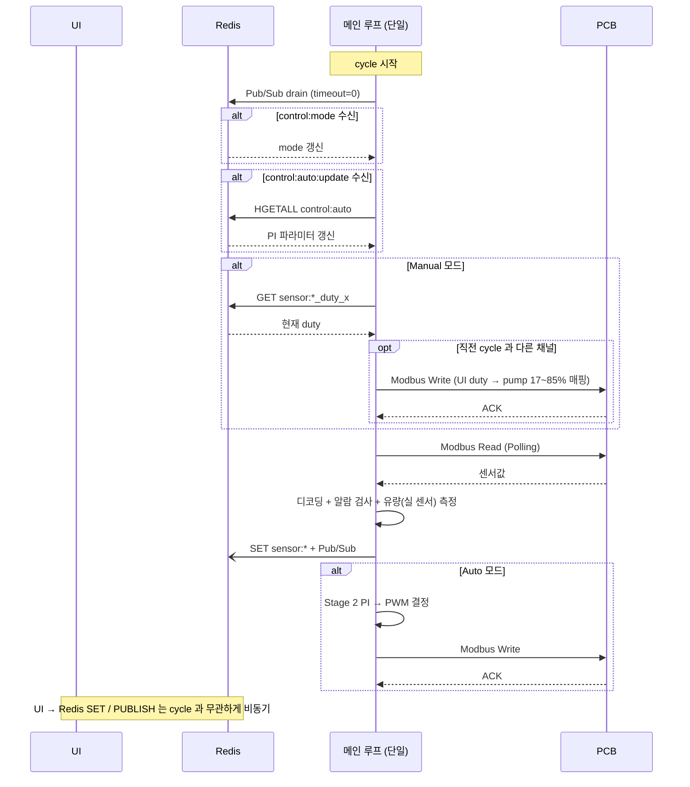

# Modbus Control Gateway (MCG)

## 1. 요구사항

| # | 요구사항 | 설명 |
|---|---|---|
| R1 | **모니터링** | PCB에서 센서값을 주기적으로 읽어와 Redis에 저장. UI에 실시간 표시. |
| R2 | **Manual 제어** | 사람이 UI에서 팬/펌프 PWM을 직접 설정 → PCB에 write |
| R3 | **Auto 제어** | 모니터링값 기반으로 자동으로 팬/펌프 PWM 결정 → PCB에 write |
| R4 | **비상정지** | 지정한 특정 센서가 critical 상태 → 전체 정지 (PWM=0, DOUT=0) |

---

## 2. 구조 개요

### 요구사항에서 도출

- **R1 모니터링** → PCB 센서 레지스터를 주기적으로 Modbus Read. 읽은 값을 Redis SET + 알람 threshold 검사.
- **R2 Manual 제어** → UI에서 PWM 값을 받으면 PCB에 Modbus Write. UI 요청은 **언제든** 올 수 있음.
- **R3 Auto 제어** → 모니터링 결과를 보고 알고리즘이 PWM 결정 → PCB에 Modbus Write.
- **R4 비상정지** → 모니터링 결과에서 특정 센서 critical → 전체 PWM=0, DOUT=0 Write.
- **공통** → Modbus는 단일 시리얼 버스. Read와 Write를 동시에 할 수 없음. 모든 Modbus 통신은 순차 실행.

### 단일 쓰레드

| 쓰레드 | 역할 | 근거 |
|---|---|---|
| **메인 루프 (단일)** | Pub/Sub 비차단 drain → mode 분기 → Manual 명령 적용 / Polling / Auto 알고리즘 → Modbus Write | Modbus 가 단일 시리얼 버스(순차 제약)라 쓰레드를 나눠도 이득이 작음. UI 갱신은 **Redis Pub/Sub 메시지 매 cycle drain** 으로 픽업. |

> **참고 사례** — `gadgetini/src/control_board` 는 동일 사상으로 단일 쓰레드 + `config.yaml` mtime polling 으로 web UI 갱신을 픽업한다 (`main_loop.py:run()` 무한 while 루프 안에서 모든 작업 순차 실행). L2A 는 Redis 가 이미 표준 인프라이므로 file mtime 대신 **Redis Pub/Sub drain** 또는 **Redis GET 폴링** 으로 동일 효과.

---

## 3. 제어 모드

UI가 Redis `control:mode`에 직접 SET. 메인 루프는 매 cycle Redis에서 읽어서 분기.

| 모드 | 동작 | 진입 |
|---|---|---|
| **Manual** (기동 default) | UI 가 Redis duty 키 (`sensor:pump_pwm_duty_x`, `sensor:fan_pwm_duty_x`) 에 직접 SET → 메인 루프가 다음 cycle 에서 직전 cycle 값과 비교 후 변경분만 Modbus Write + Polling | UI 요청 (모드 전환) |
| **Auto** | Polling 후 알고리즘으로 PWM 결정 → Write | UI 요청 (모드 전환) |
| **Emergency** | TODO — 시스템 안정화 후 설계 | TODO |

> `control:mode` key 초기화는 **UI 서비스 담당**. UI 최초 기동 시 key가 비어있으면 `manual`로 SETNX (기동 default = manual + Pump UI 78 % + Fan 100 %, §7). 이후 재시작은 사용자 마지막 값 보존. MCG는 mode key에 쓰지 않고 읽기만 함.

### 전환 규칙

| 전환 | 트리거 |
|---|---|
| Manual ↔ Auto | UI가 Redis `control:mode` 직접 SET → 메인 루프가 다음 cycle에서 읽어서 반영 |

- **Auto → Manual**: PCB는 마지막 Auto PWM을 유지 (MCG Manual은 큐 입력이 있을 때만 Write). 사용자가 첫 수동 입력을 넣을 때까지 duty 불변.
- **Manual → Auto**: PI 내부 상태를 현재 실제 duty로 초기화(bumpless transfer). [auto_control.md](auto_control.md#bumpless-transfer-manual--auto-전환-시) 참고.

### 비상정지 (TODO)

> 비상정지 모드는 특정 센서(예: 누수, 수위 위험)가 critical일 때 전체 PWM=0, DOUT=0을 강제하는 모드.
> 어떤 센서가 비상정지를 트리거할지, 어떤 상황에서 어떻게 제어할지는 시스템 구현·안정화 후 결정.
> 현재는 Manual / Auto 2가지 모드에 집중하여 설계.

---

## 4. 메인 루프

```
매 cycle (단일 쓰레드):

  0. Pub/Sub 비차단 drain (timeout=0)
       → control:mode 수신 → in-memory mode 갱신
       → control:auto:update 수신 → HGETALL control:auto → in-memory PI 파라미터 갱신
       (수신 메시지 없으면 바로 통과)

  1. 현재 mode 확인

  2. if Emergency: TODO (시스템 안정화 후 설계)

  3. Manual 명령 적용 (Manual 모드일 때만):
       → sensor:pump_pwm_duty_x, sensor:fan_pwm_duty_x Redis GET
       → 직전 cycle 값과 다른 채널만 Modbus Write
         (pump 측은 duty_mapper 17~85% 매핑(0=정지) 후 HR 8~11 burst write,
          fan 측은 직접 매핑 후 HR 4~7 burst write)

  4. Polling (항상 실행)
       → Modbus Read (센서 레지스터)
       → 디코딩 → Redis SET + Pub/Sub
       → (알람/threshold 검사: 미구현 — 인증 후 재설계. 현재 `alarm:*` 미발행)
       → 실 유량 센서(IR 13~16 펄스, SIKA VVX15 PushPull 500 pulse/L, Q=0.12×Hz) 루프별 2분기 합산 → 총합 sensor:flow_rate_1/2 + 분기별 sensor:flow_rate_1_1/_1_2/_2_1/_2_2 publish (링크/센서 미가용 시 미발행)

  5. if Auto: Fan curve(Stage 1) 로 팬 duty 결정 + 펌프는 루프별 고정 duty(`control:pump_duty_1`/`_2`) → 변경분 Modbus Write. (Stage 2 PI 는 미구현 — auto_control.md 설계 참고용)

  6. sleep(max(0, cycle - elapsed))
```

> step 3 의 Modbus Write 와 step 5 의 Modbus Write 는 같은 시리얼 버스를 사용하므로 동일 cycle 내에서 순차 실행.
> S-Curve 1초 적용 (보드 사양 — [PCB.md](PCB.md) 참고).
> Pub/Sub drain 패턴은 큐/쓰레드를 만들지 않고도 UI 변경을 다음 cycle (~1 s) 안에 반영. 같은 cycle 안에 여러 메시지가 와도 한 번에 drain 후 마지막 상태로 수렴.

---

## 5. 상세

### Polling (Modbus Read)

- 센서값 + 현재 PWM duty 읽기 → 디코딩 → Redis SET `sensor:*` + Pub/Sub publish
- 레지스터 매핑 상세: §9 Redis Key 참고

### 제어 (Modbus Write)

- Manual: UI 가 Redis `sensor:*_duty_x` 키에 SET → 메인 루프가 직전 cycle 값과 비교 후 변경분만 Modbus Write → Pushgateway POST (이력)
- Auto: 알고리즘이 결정한 값 Write → POST 없음 (Exporter가 `sensor:*`로 수집)
- 레지스터 매핑 상세: §9 Redis Key 참고. 펌프 측은 ui_duty → pump_input PWM 17~85% 매핑(UI 0=정지) 필수 ([PCB.md "UI / MCG duty 매핑"](PCB.md) 참고).

### 모드 전환

- UI가 Redis `control:mode` 직접 SET (MCG 관여 없음)

### 알람 검사

- 매 Polling 후 센서값 threshold 비교 → 초과 시 Redis SET `alarm:*`, 복귀 시 DEL
- 알람 검사는 제어 명령을 생성하지 않음 (감지·알람만)
- 비상정지 연동: TODO (시스템 안정화 후 설계)
- threshold 상세: [threshold.md](threshold.md) 참고

### Auto 알고리즘

- **입력**: 냉각수 inlet/outlet 온도, 유량, 현재 Pump/Fan PWM duty
- **출력**: 새 Pump/Fan PWM duty → Modbus Write
- **적용**: L1/L2 독립 + 동일 알고리즘 대칭 (초기), 실측 후 재검토
- **알고리즘 설계·참고자료**: [auto_control.md](auto_control.md) 참고 (Stage 1 fan curve → Stage 2 PI → Stage 3 cascade 로드맵, rate limit/hysteresis/anti-windup/bumpless transfer 등 공통 가드레일 포함)

---

## 6. 시나리오

### 정상 동작



### 비상정지 진입 (TODO)

> 시스템 안정화 후 설계. 특정 센서 critical 시 전체 PWM=0, DOUT=0 강제하는 시나리오.

---

## 7. 서비스 초기화

**기동 default 구동 조건 (manual 모드)**: 시스템 시작 시 **manual 모드 + Pump UI 78 % (≈ PWM 70 %) + Fan 100 %**. Redis `control:*` / `sensor:*_duty_*` 는 persistent 라, 최초 부팅에 Local UI 가 SETNX 로 시드하고([src/local_ui/main.py](../src/local_ui/main.py) `_STARTUP_DEFAULTS`) 이후 재시작은 사용자 마지막 값을 보존. manual 모드라 MCG 는 매 cycle `sensor:*_pwm_duty_*` 를 읽어 PCB write.

| 대상 | HR 주소 | 기동 default | 비고 |
|---|---|---|---|
| Pump L1/L2 PWM (P1~P4) | HR 8~11 | **UI 78 %** → HR round((17+0.68×78)×10)=**700 (PWM 70 %)** | TIM8 (1 kHz). 루프당 2채널 동일 duty |
| Fan L1/L2 PWM | HR 4~7 (2ch burst) | **UI 100 %** → HR **1000 (PWM 100 %)** | TIM2 (25 kHz). 그룹 내 동일 duty |
| PWM Freq (TIM2) | HR 13 | **25000 (Hz)** — MCG 시작 시 write | 팬 CH 5~8. Flash 기본 1 kHz 를 25 kHz 로 (Cooltron 팬 정격). |
| PWM Freq (TIM8) | HR 14 | **1000 (Hz)** — MCG 시작 시 write (idempotent) | 펌프 CH 9~12 (Johnson eModule typical). |

> 듀티 register 포맷: 0~1000 (0.1 % 단위) — UI % ×10. 펌프는 [PCB.md "UI / MCG duty 매핑"](PCB.md) 적용(UI 78 → PWM 70 %). 주파수 register 는 Hz 정수 (MCS_BE 매뉴얼 확인 필요).
> PWM 주파수는 MCG main.py 가 매 부팅 write. duty/mode default 는 Local UI SETNX (persistent → 사용자 변경 보존). 전원 재인가 시 systemd Restart=always 로 서비스 자동 복귀.

---

## 8. 알람 및 이상 감지

모니터링 중 센서값이 정상 범위를 벗어나면 알람을 발생시켜 UI에 표시한다.

### 알람 목록

| 예외 | 심각도 | 알람 키 | 복구 조건 |
|---|---|---|---|
| 수온 경고 (L1/L2) | Warning | `alarm:coolant_temp_l1_warning` / `l2_warning` | 임계치 이하 |
| 수온 위험 (L1/L2) | Critical | `alarm:coolant_temp_l1_critical` / `l2_critical` | 임계치 이하 |
| ΔT 이상 (L1/L2) | Warning | `alarm:delta_temp_l1_warning` / `l2_warning` | 10–14 °C 복귀 (ASHRAE TC 9.9) |
| 누수 감지 | Critical | `alarm:leak_detected` | 누수 비트 해제 |
| 수위 부족 | Warning | `alarm:water_level_warning` | `water_level`≥2 |
| 수위 위험 | Critical | `alarm:water_level_critical` | `water_level`≥1 |
| 장치 내부 온도 경고 | Warning | `alarm:ambient_temp_warning` | 임계치 이하 |
| 장치 내부 온도 한계 초과 | Critical | `alarm:ambient_temp_critical` | 정상 범위 |
| 장치 내부 습도 경고 | Warning | `alarm:ambient_humidity_warning` | 임계치 이하 |
| 장치 내부 습도 한계 초과 | Critical | `alarm:ambient_humidity_critical` | 정상 범위 |
| 통신 연속 실패 | Warning | `alarm:comm_timeout` | 통신 복구 |
| PCB 무응답 | Critical | `alarm:comm_disconnected` | 통신 복구 |

> 비상정지: 어떤 알람이 비상정지를 트리거할지는 TODO. 시스템 안정화 후 결정.

### 복구 원칙

- 알람 해제: threshold 복귀 확인 → `alarm:*` DEL
- 비상정지 복구: TODO (시스템 안정화 후 설계)
- 통신 복구: 재연결 성공 → Polling 재개

---

## 9. DB (Redis / Prometheus)

> Redis는 현재값 전용 DB. 이벤트 이력·명령 기록은 저장하지 않음.

### Redis Key — Modbus 연동

**수온 (NTC — Input Register 28~31)**

| Key | 설명 | Register | 단위 |
|---|---|---|---|
| `sensor:coolant_temp_inlet_1`  | 냉각수 입수 온도 L1 (T1) | Input Register 28 (NTC CH13) | 0.1°C signed |
| `sensor:coolant_temp_outlet_1` | 냉각수 출수 온도 L1 (T2) | Input Register 29 (NTC CH14) | 0.1°C signed |
| `sensor:coolant_temp_outlet_2` | 냉각수 출수 온도 L2 (T3) | Input Register 30 (NTC CH15) | 0.1°C signed |
| `sensor:coolant_temp_inlet_2`  | 냉각수 입수 온도 L2 (T4) | Input Register 31 (NTC CH16) | 0.1°C signed |

> PCB 실제 wiring: T1 (IR 28) = inlet L1, T2 (IR 29) = outlet L1, T3 (IR 30) = outlet L2, T4 (IR 31) = inlet L2. silkscreen 의 inlet/outlet/outlet/inlet 배치 그대로. 자세한 설명은 [PCB.md](PCB.md) NTC 표 참고.

**디지털 입력 (DIN — Input Register 25)**

| Key | 설명 | Register | 비고 |
|---|---|---|---|
| `sensor:water_level` | 수위 (2/1/0) | Input Register 25, bit 조합 | MCG가 고/저 2센서 조합 → HIGH/MIDDLE/LOW 판단 |
| `sensor:leak` | 누수 (NORMAL/LEAKED) | Input Register 25, 특정 bit | |

**팬/펌프 PWM duty — Read/Write**

| Key | 설명 | Register | 제어 대상 (L2A 기준, control_board 매핑) |
|---|---|---|---|
| `sensor:pump_pwm_duty_1` | 펌프 PWM L1 (0–100%) | **HR 8, 9** (CH9+CH10, TIM8 @ 1 kHz) | Johnson Electric eModule 300W × 2 (L1 병렬 P1‖P2, 두 채널 동일 duty) |
| `sensor:pump_pwm_duty_2` | 펌프 PWM L2 (0–100%) | **HR 10, 11** (CH11+CH12, TIM8 @ 1 kHz) | Johnson Electric eModule 300W × 2 (L2 병렬 P3‖P4, 두 채널 동일 duty) |
| `sensor:fan_pwm_duty_1` | 팬 PWM L1 (0–100%) | **HR 4, 5** (CH5+CH6, TIM2 @ 25 kHz, 2ch burst) | COOLTRON FD8038B12W7 (최대 수량 §10 참고). 2채널 동일 duty |
| `sensor:fan_pwm_duty_2` | 팬 PWM L2 (0–100%) | **HR 6, 7** (CH7+CH8, TIM2 @ 25 kHz, 2ch burst) | COOLTRON FD8038B12W7 (최대 수량 §10 참고). 2채널 동일 duty |

> **PWM 채널 매핑 (control_board 기준)**: HR 0~11 = PWM 12ch 전체 (TIM1/TIM2/TIM8 각 4ch). 자세한 표는 [PCB.md "Holding Registers"](PCB.md) 참고.
> **L2A Rev_C 운용**: TIM1 (HR 0~3, CH 1~4) = 미사용. **TIM2 (HR 4~7, CH 5~8) = 팬 4채널** (L1 = HR 4,5 / L2 = HR 6,7, 루프당 2채널 동일 duty burst). **TIM8 (HR 8~11, CH 9~12) = 펌프 4채널** (L1 = HR 8,9 / L2 = HR 10,11, 루프당 2개 병렬 P1‖P2 / P3‖P4, 동일 duty burst). 펌프는 PWM 만 사용 (Tach 미연결), 팬은 PWM + Tach (Pulse CH 5~8 = IR 17~20) 모두 사용. 변형별 매핑 상세: §10.2.

> **펌프 ui_duty → 펌프 입력 PWM 변환 (사용구간 17~85%, 0=정지)**
> Redis 키 `sensor:pump_pwm_duty_x` 는 UI 도메인 (0~100%). MCG 가 [duty_mapper.ui_to_pump_hr](../src/mcg/duty_mapper.py) 로 변환:
> ```
> UI 0      → HR 120 (12%, 정지밴드 n=0)
> UI (0,100] → HR = round((17 + 0.68 × ui) × 10)  clamp [170, 850]
> ```
> 즉 UI 100% → 85%(Nmax), UI 60% → 57.8%, UI 1% → ≈17.7%(Nmin), **UI 0% → 정지(12%)**.
>
> **UI 하한 없음**: 0 = 정지가 유효값. clamp 하한(120)이 곧 stop 이라 0 이 어느 경로로 들어와도 **풀가동이 아니라 정지** — 과거 "UI 0% → 0~8% Nmax fallback" hazard 해소됨. 상세는 [PCB.md "UI / MCG duty 매핑"](PCB.md) 참고.
>
> ⚠ Auto 모드에서 pump fixed duty 0(정지)은 냉각 중단 — 운용 주의(코드 차단 없음).

**팬 RPM 피드백 (Pulse Freq — Input Register 13~24)**

| Key | 설명 | Register | 비고 |
|---|---|---|---|
| `sensor:fan_rpm_1` | 팬 RPM L1 (2ch 평균) | Input Register 17~18 (Pulse CH5~6) | FG wire, 2 pulses/rotation → RPM = Hz × 30. MCG 가 2채널 평균을 publish |
| `sensor:fan_rpm_2` | 팬 RPM L2 (2ch 평균) | Input Register 19~20 (Pulse CH7~8) | FG wire, 2 pulses/rotation → RPM = Hz × 30. MCG 가 2채널 평균을 publish |

> Fan PWM 채널 (HR 4~7) 과 Fan Tach 채널 (Pulse CH 5~8 = IR 17~20) 은 PCB 내부에서 같은 4핀 fan connector 로 묶여 fanout 된다. UI 는 루프당 2채널 평균 RPM 만 표시 — 채널별 개별 RPM 키가 필요해지면 §"후속" 참고.

> 펌프 Fault 피드백 (Johnson Electric PWM 에러 패턴): TODO — 구현 시 Pulse 채널 추가 할당.

**RPi 직접 수집 (Modbus 미경유)**

| Key | 설명 | 인터페이스 |
|---|---|---|
| `sensor:ambient_temp` | 장치 내부 온도 | RPi I2C |
| `sensor:ambient_humidity` | 장치 내부 습도 | RPi I2C |

**유량 (Rev_C+ 실 센서 도입 진행 중)**

| Key | 설명 | Register |
|---|---|---|
| `sensor:flow_rate_1` | 유량 L1 총합 (CH1+CH2, 미가용 시 미발행) | **IR 13 + IR 14** (펄스 Hz CH1+CH2) |
| `sensor:flow_rate_2` | 유량 L2 총합 (CH3+CH4) | **IR 15 + IR 16** (펄스 Hz CH3+CH4) |
| `sensor:flow_rate_1_1` | 유량 L1 분기1 (CH1) | **IR 13** (Hz) |
| `sensor:flow_rate_1_2` | 유량 L1 분기2 (CH2) | **IR 14** (Hz) |
| `sensor:flow_rate_2_1` | 유량 L2 분기1 (CH3) | **IR 15** (Hz) |
| `sensor:flow_rate_2_2` | 유량 L2 분기2 (CH4) | **IR 16** (Hz) |

> **Rev_C+ 실 유량 센서**: SIKA **VVX15 × 4** (Vortex, Art.No. VVXA1SGAAK003514). 각 루프의 병렬 분기마다 1개씩(루프당 2개). 아날로그는 **4…20 mA 전용**이지만 PCB ADC 는 전압만 읽으므로(burden 저항 필요), 대신 **PushPull 주파수**(500 pulse/L)를 CH1~4 'T' 펄스 입력 (IR 13~16) 으로 읽어 센서별 `branch_lpm = 0.12 × Hz`(0 clamp) 환산 후 **루프당 2개를 합산**: Loop1=CH1+CH2, Loop2=CH3+CH4. 센서 전원은 CH1~4 'V' 핀(12 V, main.py 가 CH1~4 duty=100% 인가). 결선·환산 상세는 [PCB.md "유량 추정"](PCB.md) 참고. [src/mcg/polling.py](../src/mcg/polling.py) `_read_flow_lpm()` 가 IR 13~16 을 읽으며 **별도 enable 플래그 없이** PCB read 성공(link up) 시 발행, 실패(link 없음) 시 미발행(펌프 추정 fallback 없음).

> **유량 = 실측값 (펌프 추정 폐기)**: 유량은 실 센서(IR 13~16, 루프별 합산) 측정값으로만 publish 한다. 센서 미가용 시 `sensor:flow_rate_*` 를 발행하지 않으며(조작된 추정치 없음), UI 는 no-data 를 표시. 과거의 펌프 duty 기반 추정 fallback(`70 × ui_duty/100`)은 제거됨 ([PCB.md "유량 = 실 센서 측정값"](PCB.md)).

> **LTS v1 시점 — pH / Conductivity 미지원**: 현재 PCB revision 은 chemistry 측정용 analog 입력이 없어 `sensor:ph` / `sensor:conductivity` 자체를 emit 하지 않는다. 미래 PCB 업그레이드 + 호환 센서 확정 시 위 표에 추가하고 UI / 알람 / threshold 도 함께 재도입 (LTS 정책은 [ARCHITECTURE.md "Versioning"](../ARCHITECTURE.md) 참고).

publish 주기: 폴링 주기와 동일. `SET` + `PUBLISH` 모두 수행.

### Redis Key — 알람 (MCG 내부 생성)

| Key | 설명 |
|---|---|
| `alarm:coolant_temp_l1_warning` | 수온 경고 — L1 |
| `alarm:coolant_temp_l1_critical` | 수온 위험 — L1 |
| `alarm:coolant_temp_l2_warning` | 수온 경고 — L2 |
| `alarm:coolant_temp_l2_critical` | 수온 위험 — L2 |
| `alarm:delta_temp_l1_warning` | ΔT 이상 — L1 (10–14 °C 이탈) |
| `alarm:delta_temp_l2_warning` | ΔT 이상 — L2 (10–14 °C 이탈) |
| `alarm:leak_detected` | 누수 감지 |
| `alarm:water_level_warning` | 수위 부족 |
| `alarm:water_level_critical` | 수위 위험 |
| `alarm:ambient_temp_warning` | 장치 내부 온도 경고 |
| `alarm:ambient_temp_critical` | 장치 내부 온도 한계 초과 |
| `alarm:ambient_humidity_warning` | 장치 내부 습도 경고 |
| `alarm:ambient_humidity_critical` | 장치 내부 습도 한계 초과 |
| `alarm:comm_timeout` | 통신 연속 실패 |
| `alarm:comm_disconnected` | 통신 두절 |

### Redis Key — 상태

> **Persistence**: Redis 는 RDB + AOF (fsync everysec) 활성. 아래 표의 `persistent: yes` 표시 키는 재시작 / 전원 인가 후 자동 복원된다. `no` 표시 키는 매 cycle 갱신되므로 영구 보존 불요. 정책 근거: [ARCHITECTURE.md §1 "DB 설계 원칙"](../ARCHITECTURE.md) 참고.

| Key | Type | persistent | 설명 |
|---|---|---|---|
| `comm:status` | string | no | 통신 상태 (ok / timeout / disconnected) |
| `comm:consecutive_failures` | string | no | 연속 실패 횟수 |
| `comm:last_error` | string | no | 마지막 오류 |
| `control:mode` | string | **yes** | 제어 모드 (manual / auto / emergency). UI 토글이 SET, MCG 가 매 cycle 읽기 |
| `control:fan_curve` | hash | **yes** | Auto 모드 fan 제어 곡선 (2-point linear). UI Settings 페이지에서 편집. fields: `min_temp` (°C), `max_temp` (°C), `min_duty` (0~1000, ≥100 = ≥10% UI 하한), `max_duty` (0~1000). 동작: outlet 온도 ≤ min_temp → min_duty, ≥ max_temp → max_duty, 사이는 선형 보간. settings.js Fan Curve editor 와 동일 schema (별도 시스템이지만 의도적 정합). |
| `control:pump_duty_1` / `_2` | string | **yes** | Auto 모드 pump 고정 duty — **루프별 독립**(auto_control.md §2). 값: 0~1000 (×10 정수). UI Settings 에서 L1/L2 따로 편집. MCG 는 Auto 모드에서 매 cycle L1→HR 8,9 / L2→HR 10,11 로 burst write (루프당 2채널만 동일 duty, 17~85% 매핑 적용 후). (legacy `control:pump_duty` 단일 키는 미설정 시 fallback 으로만 읽음.) |
| `sensor:*_duty_*` (pump/fan) | string | **yes** | Manual 모드에서 UI 가 SET 하는 마지막 duty. 재시작 후 마지막 사용자 의도 복원. |
| `sensor:*` (그 외 - 온도/유량/RPM/leak/level/ambient) | string | no | 매 cycle MCG polling 으로 갱신. 재시작 후 다음 cycle 에서 자동 채워짐. |

**Pub/Sub 채널 (제어 갱신)**

| Channel | 발행자 | 구독자 | 트리거 |
|---|---|---|---|
| `control:mode` | UI 모드 토글 | MCG controller | 모드 전환 시 |
| `control:fan_curve:update` | UI Settings 페이지 Save | MCG controller | Fan curve 저장 직후. MCG 는 수신 시 `control:fan_curve` hash 를 다시 읽어 in-memory 갱신. |
| `control:pump_duty:update` | UI Settings 페이지 Save | MCG controller | Pump fixed duty(L1/L2) 저장 직후. payload 는 트리거(`"1"`) — 수신 측은 `control:pump_duty_1/_2` 재조회. |

### Prometheus (이력)

**Exporter** (Pull): `sensor:*`, `alarm:*` 주기적 수집 → 시계열 적재.

**Pushgateway** (Push): 이벤트 발생 시 MCG가 직접 push.

| Metric | 설명 | push 시점 |
|---|---|---|
| `control_cmd_pump` | Manual 펌프 제어 명령값 | Manual 제어 완료 시 |
| `control_cmd_fan` | Manual 팬 제어 명령값 | Manual 제어 완료 시 |
| `control_cmd_mode` | 모드 전환 (manual/auto) | 모드 전환 시 |
| `comm_event` | 통신 상태 변경 | 상태 전환 시 |

---

## 10. PCB 액추에이터 사양

같은 제어 보드(RealSYS MCS Con BD 기반)로 **L2A · dg5r · dg5w** 세 CDU 변형을 모두 지원. 보드는 **PWM 12채널 (TIM1·TIM2·TIM8 각 4ch, HR 0~11)** 구성 — TIM8 4채널은 변형에 따라 PWM (L2A 펌프 / dg5w 사용 안 함) 또는 전압 제어 (dg5r 펌프) 로 점유.

### 10.1 PWM 신호 규격

| 항목 | Fan (Intel 4-wire) | Pump (PWM, Johnson eModule) | Pump (전압 제어, dg5r 전용) |
|---|---|---|---|
| 신호 | Intel 4-wire PWM 전용 (2/3선 미지원, **완전 OFF 불가** — 최소 5%) | Johnson eModule PWM 입력 (open-drain 호환) | PWM 입력 → DC 출력 (싱크 벅 컨버터) |
| 주파수 범위 | **1~25 kHz 조절 가능** (HR 12) — 현재 **25 kHz** 운용 (Cooltron/Intel 4-wire 정격) | **1~25 kHz 조절 가능** (HR 13) — Johnson 허용 600 Hz~3 kHz 중 typical **1 kHz** 운용 | 제어 입력 PWM은 1 kHz 운용 |
| High / Low 레벨 | **5.0 V / 0.4 V** (Intel 규격) | **High 2.8~15 V / Low −0.8~0.4 V** (Johnson 허용, 보드 pull-up 전압에 따라 결정) | 5%~100% PWM → 6~12 V DC 출력 |
| Duty 범위 | 5~100% | 5~100% (Johnson: 0~8% → Nmax, 13~17% → Nmin, 17~85% 선형, 85~95% → Nmax — 운용 범위는 5~85%로 제한) | — |
| 채널당 최대 전력 | Fan 타입별 (§10.3) | Pump 타입별 (§10.3) | 32 W / ch (싱크 벅) |

> Fan·Pump 각각 허용 전기 레벨이 다르므로 보드의 PWM 출력 pull-up 전압은 채널별로 구성됨 (Fan 채널: 5 V pull-up, Pump 채널: 12 V pull-up 등). 보드 HW 매핑 상세는 MCS_BE_user_manual 참조.

### 10.2 CDU 변형별 액추에이터 매핑

| 변형 | Fan 모델 | Fan 최대 수 | Fan 채널 | Pump 모델 | Pump 수 | Pump 채널 |
|---|---|---|---|---|---|---|
| **L2A** (본 프로젝트) | COOLTRON FD8038B12W7-63-4J | **112** (L1/L2 **비대칭 독립 관리**) | **HR 4~7 (4ch burst, L1=HR 4,5 / L2=HR 6,7, TIM2 @ 25 kHz). Tach = Pulse CH 5~8 = IR 17~20 (4ch read, loop 별 2ch 평균 publish)** | Johnson Electric eModule 300W | 4 (**2 병렬 루프 × 루프당 2 병렬**: L1=P1‖P2, L2=P3‖P4) | **HR 8~11 (TIM8 PWM @ 1 kHz, 4ch burst, L1=HR 8,9 / L2=HR 10,11). Tach 미사용.** |
| dg5r | COOLTRON FD8038B12W7-63-4J | 41 | HR 4~5 (TIM2 PWM) | Koolance PMP-500 | 4 | HR 8~11 (TIM8 전압 제어) |
| dg5w | SUNON PF80381B2-Q050-S99-4P | 16 | HR 4~5 (TIM2 PWM) | Barrow LRC2.0 PLUS | 2 | HR 0~1 (TIM1 PWM) |

> 한 채널 당 Fan은 최대 60개까지 병렬 구동 (보드 드라이버 정격). L2A의 112개는 **L1/L2 비대칭 분할**로 실제 수량이 다르며, 각 루프를 독립 관리(독립 PID·알람·제어).
> L2A Pump 플러밍: **2 병렬 루프 × 루프당 2 병렬** (L1: P1‖P2, L2: P3‖P4). 병렬 구성은 동일 head (Johnson 단일 ≈ 130 kPa) 에서 **유량을 두 배** 확보 (단일 펌프 35 LPM × 2 = 루프당 70 LPM, 양 루프 합 max 140 LPM).
> 제어 단위는 **루프**. Redis 키(`sensor:pump_pwm_duty_1`, `_2`)와 UI는 루프 레벨 유지 — 같은 루프 내 두 펌프는 항상 동일 duty. 4개 독립 HW 채널 할당은 (1) 개별 fault feedback 구분(Johnson eModule PWM 에러 패턴 per-pump 수신), (2) 한 펌프 장애 시 나머지 한 대 duty 상향으로 부분 운전 허용 — 두 가지 유연성 확보 목적. 평상시 제어/표시는 루프 레벨 단일 값으로 충분.

### 10.3 속도 / 상태 피드백

| 변형 | Fan 피드백 | Pump 피드백 |
|---|---|---|
| L2A / dg5r (Cooltron) | FG wire, 2 pulses/rotation, 7500 RPM ± 10% (rated), 10~9990 RPM 측정 범위. L2A Rev_C: Pulse CH 5~8 = IR 17~20 (4ch) | Johnson: PWM 패턴 에러 코드 (Dry run / Stall / Over temp / Over-under voltage — 펄스 폭으로 구분). L2A 는 Tach 미사용 — 디코더 TBD |
| dg5w (Sunon) | FG wire, 2 pulses/rotation, 7500 RPM ± 10% (rated) | Barrow: 피드백 명세 TBD |
| 공통 | 표시 단위: ×10 RPM (2-pole 기준) | — |

### 10.4 보호 기능 (PCB 펌웨어)

- **OCP** (과전류 보호) — 채널별 전류 한계 초과 시 차단
- **SCP** (단락 보호) — 단락 검출 시 즉시 차단
- **OTP** (과열 보호) — 드라이버 IC 온도 상한 초과 시 차단
- 보호 이벤트 발생 → 해당 채널만 OFF. 자동 재시도 정책은 펌웨어 사양 TBD.
- MCG는 Polling으로 duty feedback과 상태 확인 (전용 fault 레지스터 매핑은 펌웨어 확정 후 추가).

### 10.5 전력 예산 (변형별 최대 소비)

| 변형 | Fan 최대 | Pump 최대 | 액추에이터 합계 |
|---|---|---|---|
| **L2A** | 22.32 W × 112 = **2,499.8 W** | 300 W × 4 = **1,200 W** | **3,699.8 W** |
| dg5r | 22.32 W × 41 = 915.1 W | 32 W × 4 = 128 W | 1,043.1 W |
| dg5w | 8.58 W × 16 = 137.3 W | 20 W × 2 = 40 W | 177.3 W |

> 제어부 (RPi 4 + PCB + 보조 보드) 소비전력은 TBD. 전원 공급기 정격은 위 수치 + 제어부 + 여유 마진으로 산정.
> 전체 냉각계 최대 공급 전력 (PSU 정격) 및 PFC 조건은 L2A 기준 별도 정의 예정.

---

## 11. 미구현 — PCB Watchdog

MCG 다운 시 PCB가 자체적으로 안전 모드로 전환하는 기능. MCG로 대체 불가 — 펌웨어 업데이트 필요.

- **현재 한계**: MCG가 죽으면 PCB에 명령을 보낼 수 없음
- **임시 대응**: systemd `Restart=always`로 MCG 자동 재시작
- **상세**: [PCB.md](PCB.md) "미구현 기능" 참고
