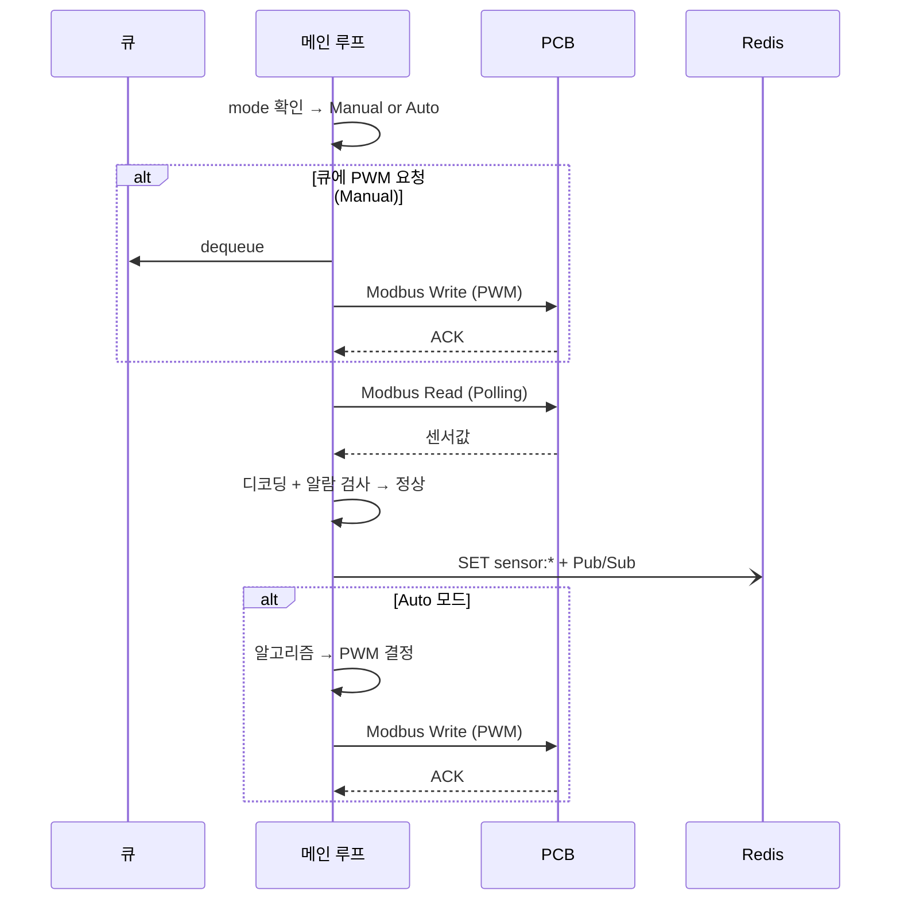
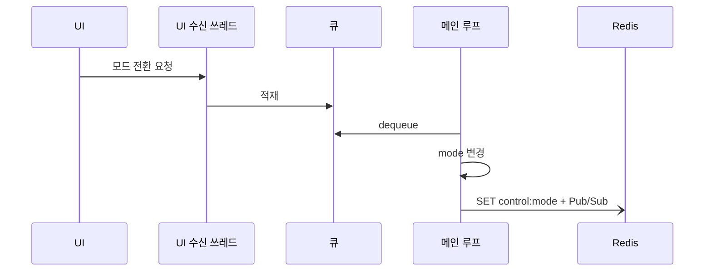

# Modbus Control Gateway (MCG)

## 1. 요구사항

| # | 요구사항 | 설명 |
|---|---|---|
| R1 | **모니터링** | PCB에서 센서값을 주기적으로 읽어와 Redis에 저장. UI에 실시간 표시. |
| R2 | **Manual 제어** | 사람이 UI에서 팬/펌프 PWM을 직접 설정 → PCB에 write |
| R3 | **Auto 제어** | 모니터링값 기반으로 자동으로 팬/펌프 PWM 결정 → PCB에 write |
| R4 | **비상정지** | 지정한 특정 센서가 critical 상태 → 전체 정지 (PWM=0, DOUT=0) |

---

## 2. 구조 개요

### 요구사항에서 도출

- **R1 모니터링** → PCB 센서 레지스터를 주기적으로 Modbus Read. 읽은 값을 Redis SET + 알람 threshold 검사.
- **R2 Manual 제어** → UI에서 PWM 값을 받으면 PCB에 Modbus Write. UI 요청은 **언제든** 올 수 있음.
- **R3 Auto 제어** → 모니터링 결과를 보고 알고리즘이 PWM 결정 → PCB에 Modbus Write.
- **R4 비상정지** → 모니터링 결과에서 특정 센서 critical → 전체 PWM=0, DOUT=0 Write.
- **공통** → Modbus는 단일 시리얼 버스. Read와 Write를 동시에 할 수 없음. 모든 Modbus 통신은 순차 실행.

### 2 쓰레드

| 쓰레드 | 역할 | 근거 |
|---|---|---|
| **UI 수신 쓰레드** | IPC/REST 소켓 listen → 받은 요청을 thread-safe 큐에 적재 | R2: UI 요청은 언제든 올 수 있으므로 항상 listen 필요 |
| **메인 루프 쓰레드** | mode 확인 → 큐 확인 → Polling → 알람 → Auto write. 순차 실행 | R1~R4 + Modbus 순차 제약 |

---

## 3. 제어 모드

메인 루프의 내부 변수 `mode`. 변경 시 Redis `control:mode`에 publish (UI 표시용).

| 모드 | 동작 | 진입 |
|---|---|---|
| **Manual** (기본값) | 큐에서 사람의 PWM 요청 꺼내서 Write + Polling | UI 요청 (모드 전환) |
| **Auto** | Polling 후 알고리즘으로 PWM 결정 → Write | UI 요청 (모드 전환) |
| **Emergency** | TODO — 시스템 안정화 후 설계 | TODO |

### 전환 규칙

| 전환 | 트리거 |
|---|---|
| Manual ↔ Auto | UI 요청 → 큐 → 메인 루프에서 mode 변경 |

### 비상정지 (TODO)

> 비상정지 모드는 특정 센서(예: 누수, 수위 위험)가 critical일 때 전체 PWM=0, DOUT=0을 강제하는 모드.
> 어떤 센서가 비상정지를 트리거할지, 어떤 상황에서 어떻게 제어할지는 시스템 구현·안정화 후 결정.
> 현재는 Manual / Auto 2가지 모드에 집중하여 설계.

---

## 4. 메인 루프

```
매 cycle:

  1. mode 확인

  2. if Emergency: TODO (시스템 안정화 후 설계)

  3. 큐 확인
       → PWM 변경 요청 있음 → Modbus Write (Manual에서만 유효)
       → 모드 전환 요청 있음 → mode 변경

  4. Polling
       → Modbus Read (센서 레지스터)
       → 디코딩 → Redis SET + Pub/Sub
       → 알람 threshold 검사 → Warning: 알람 SET / Critical: 알람 SET

  5. if Auto:
       → 알고리즘 (센서값 → PWM duty 결정)
       → Modbus Write (Holding Register 0~11)
```

> step 3의 Modbus Write와 step 5의 Modbus Write는 같은 시리얼 버스를 사용하므로 동일 cycle 내에서 순차 실행.
> S-Curve 1초 적용 (보드 사양 — [PCB.md](PCB.md) 참고).

---

## 5. 상세

### Modbus Read (Polling)

- PCB Input Register(IR) read → 디코딩 → Redis SET `sensor:*` + Pub/Sub publish (UI 실시간 표시)
- 통신 오류: timeout → retry → 연속 N회 실패 → `alarm:comm_timeout` SET → PCB 무응답 → `alarm:comm_disconnected` SET + Polling 중단

### Modbus Write (제어)

- PWM duty 값 → HR 주소 / register value 변환 → Modbus RTU write → ACK 확인
- Manual 제어 시 Pushgateway POST (이력 기록)
- Auto 제어 시 POST 없음 (Exporter가 `sensor:*`로 수집)
- 모드 전환 시 Pushgateway POST `control_cmd_mode` (이력 기록)

### 알람 검사

- 매 Polling 후 센서값 threshold 비교 → 초과 시 Redis SET `alarm:*`, 복귀 시 DEL
- 알람 검사는 제어 명령을 생성하지 않음 (감지·알람만)
- 비상정지 연동: TODO (시스템 안정화 후 설계)
- threshold 상세: [threshold.md](threshold.md) 참고

### Auto 알고리즘

- **입력**: 냉각수 inlet/outlet 온도, 유량, 현재 Pump/Fan PWM duty
- **출력**: 새 Pump/Fan PWM duty → Modbus Write (Holding Register 0~11)
- **알고리즘**: 지정된 알고리즘에 의해 결정 (상세는 구현 시 정의)
- **적용**: 양 루프(L1, L2) 독립 또는 대칭 (구현 시 결정)

---

## 6. 시나리오

### 정상 동작 (Manual/Auto)



### 비상정지 진입 (TODO)

> 시스템 안정화 후 설계. 특정 센서 critical 시 전체 PWM=0, DOUT=0 강제하는 시나리오.

### 모드 전환



---

## 7. 서비스 초기화

PCB 펌웨어에 초기값 Flash 저장이 미구현이므로, MCG 시작 시 config.yaml에서 로드한 값을 PCB에 Write.

| 대상 | HR 주소 | 비고 |
|---|---|---|
| Pump L1 PWM | Holding Register 0~3 | TIM1 (CH1~4) |
| Pump L2 PWM | Holding Register 4~7 | TIM2 (CH5~8) |
| Fan PWM | Holding Register 8~11 | TIM8 (CH9~12) |
| PWM Freq | Holding Register 12~14 | TIM1/TIM2/TIM8 |
| DOUT | Holding Register 15 | bit0~5 |

> 전원 재인가 시 MCG 재시작(systemd Restart=always)으로 초기값 자동 적용.

---

## 8. 알람 및 이상 감지

모니터링 중 센서값이 정상 범위를 벗어나면 알람을 발생시켜 UI에 표시한다.

### 알람 목록

| 예외 | 심각도 | 알람 키 | 복구 조건 |
|---|---|---|---|
| 수온 경고 (L1/L2) | Warning | `alarm:coolant_temp_l1_warning` / `l2_warning` | 임계치 이하 |
| 수온 위험 (L1/L2) | Critical | `alarm:coolant_temp_l1_critical` / `l2_critical` | 임계치 이하 |
| 누수 감지 | Critical | `alarm:leak_detected` | 누수 비트 해제 |
| 수위 부족 | Warning | `alarm:water_level_warning` | `water_level`≥2 |
| 수위 위험 | Critical | `alarm:water_level_critical` | `water_level`≥1 |
| 유압 이상 | Warning | `alarm:pressure_warning` | 정상 범위 |
| 유량 저하 | Warning | `alarm:flow_rate_warning` | 정상 유량 |
| 장치 내부 온도 경고 | Warning | `alarm:ambient_temp_warning` | 임계치 이하 |
| 장치 내부 온도 한계 초과 | Critical | `alarm:ambient_temp_critical` | 정상 범위 |
| 장치 내부 습도 경고 | Warning | `alarm:ambient_humidity_warning` | 임계치 이하 |
| 장치 내부 습도 한계 초과 | Critical | `alarm:ambient_humidity_critical` | 정상 범위 |
| 통신 연속 실패 | Warning | `alarm:comm_timeout` | 통신 복구 |
| PCB 무응답 | Critical | `alarm:comm_disconnected` | 통신 복구 |

> 비상정지: 어떤 알람이 비상정지를 트리거할지는 TODO. 시스템 안정화 후 결정.

### 복구 원칙

- 알람 해제: threshold 복귀 확인 → `alarm:*` DEL
- 비상정지 복구: TODO (시스템 안정화 후 설계)
- 통신 복구: 재연결 성공 → Polling 재개

---

## 9. DB (Redis / Prometheus)

> Redis는 현재값 전용 DB. 이벤트 이력·명령 기록은 저장하지 않음.

### Redis Key — 센서 (Modbus Read)

| Key | 설명 | PCB Modbus Register | R/W |
|---|---|---|---|
| `sensor:coolant_temp_inlet_1` | 냉각수 입수 온도 L1 | Input Register 32 (Voltage CH1) | Read |
| `sensor:coolant_temp_inlet_2` | 냉각수 입수 온도 L2 | Input Register 33 (Voltage CH2) | Read |
| `sensor:coolant_temp_outlet_1` | 냉각수 출수 온도 L1 | Input Register 34 (Voltage CH3) | Read |
| `sensor:coolant_temp_outlet_2` | 냉각수 출수 온도 L2 | Input Register 35 (Voltage CH4) | Read |
| `sensor:flow_rate_1` | 유량 L1 | Input Register 13 (Pulse Freq CH1) | Read |
| `sensor:flow_rate_2` | 유량 L2 | Input Register 14 (Pulse Freq CH2) | Read |
| `sensor:water_level` | 수위 (2/1/0) | Input Register 25 (DIN) bit 조합 → MCG 판단 | Read |
| `sensor:ph` | pH | Input Register 36 (Voltage CH5) | Read |
| `sensor:conductivity` | 전도도 | Input Register 37 (Voltage CH6) | Read |
| `sensor:leak` | 누수 (NORMAL/LEAKED) | Input Register 25 (DIN) 특정 bit | Read |
| `sensor:pressure` | 유압 (미확정) | Input Register 38 (Voltage CH7) | Read |
| `sensor:ambient_temp` | 장치 내부 온도 | RPi I2C (Modbus 미경유) | — |
| `sensor:ambient_humidity` | 장치 내부 습도 | RPi I2C (Modbus 미경유) | — |

> 레지스터 매핑은 실제 배선에 따라 변경될 수 있음. 위는 초기 할당 기준.

### Redis Key — 제어 (Modbus Write)

| Key | 설명 | PCB Modbus Register | R/W |
|---|---|---|---|
| `sensor:pump_pwm_duty_1` | 펌프 PWM L1 (0–100%) | Holding Register 0~3 (TIM1 CH1~4) | Read/Write |
| `sensor:pump_pwm_duty_2` | 펌프 PWM L2 (0–100%) | Holding Register 4~7 (TIM2 CH5~8) | Read/Write |
| `sensor:fan_pwm_duty_1` | 팬 PWM L1 (0–100%) | Holding Register 8~9 (TIM8 CH9~10) | Read/Write |
| `sensor:fan_pwm_duty_2` | 팬 PWM L2 (0–100%) | Holding Register 10~11 (TIM8 CH11~12) | Read/Write |

### Redis Key — 알람 (MCG 내부 생성)

| Key | 설명 |
|---|---|
| `alarm:coolant_temp_l1_warning` | 수온 경고 — L1 |
| `alarm:coolant_temp_l1_critical` | 수온 위험 — L1 |
| `alarm:coolant_temp_l2_warning` | 수온 경고 — L2 |
| `alarm:coolant_temp_l2_critical` | 수온 위험 — L2 |
| `alarm:leak_detected` | 누수 감지 |
| `alarm:water_level_warning` | 수위 부족 |
| `alarm:water_level_critical` | 수위 위험 |
| `alarm:ph_warning` | pH 이상 |
| `alarm:conductivity_warning` | 전도도 이상 |
| `alarm:flow_rate_warning` | 유량 저하 |
| `alarm:pressure_warning` | 유압 이상 |
| `alarm:ambient_temp_warning` | 장치 내부 온도 경고 |
| `alarm:ambient_temp_critical` | 장치 내부 온도 한계 초과 |
| `alarm:ambient_humidity_warning` | 장치 내부 습도 경고 |
| `alarm:ambient_humidity_critical` | 장치 내부 습도 한계 초과 |
| `alarm:comm_timeout` | 통신 연속 실패 |
| `alarm:comm_disconnected` | 통신 두절 |

### Redis Key — 상태

| Key | 설명 |
|---|---|
| `comm:status` | 통신 상태 (ok / timeout / disconnected) |
| `comm:consecutive_failures` | 연속 실패 횟수 |
| `comm:last_error` | 마지막 오류 |
| `control:mode` | 제어 모드 (manual / auto / emergency) |

### Prometheus (이력)

**Exporter** (Pull): `sensor:*`, `alarm:*` 주기적 수집 → 시계열 적재.

**Pushgateway** (Push): 이벤트 발생 시 MCG가 직접 push.

| Metric | 설명 | push 시점 |
|---|---|---|
| `control_cmd_pump` | Manual 펌프 제어 명령값 | Manual 제어 완료 시 |
| `control_cmd_fan` | Manual 팬 제어 명령값 | Manual 제어 완료 시 |
| `control_cmd_mode` | 모드 전환 (manual/auto) | 모드 전환 시 |
| `comm_event` | 통신 상태 변경 | 상태 전환 시 |

---

## 10. 미구현 — PCB Watchdog

MCG 다운 시 PCB가 자체적으로 안전 모드로 전환하는 기능. MCG로 대체 불가 — 펌웨어 업데이트 필요.

- **현재 한계**: MCG가 죽으면 PCB에 명령을 보낼 수 없음
- **임시 대응**: systemd `Restart=always`로 MCG 자동 재시작
- **상세**: [PCB.md](PCB.md) "미구현 기능" 참고
