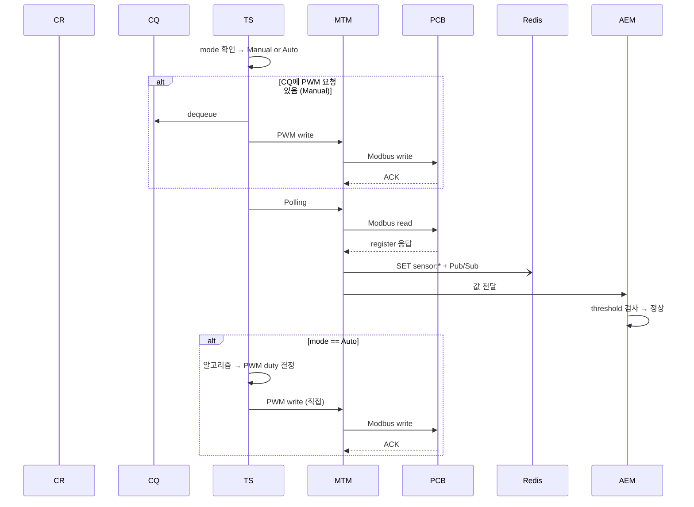
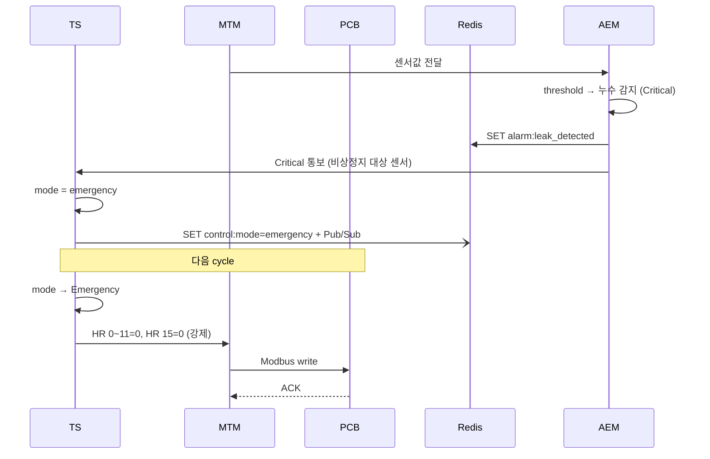
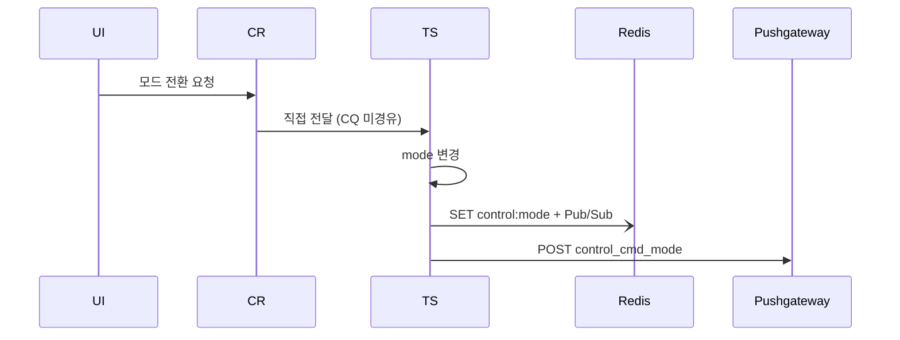

# Modbus Control Gateway (MCG)

## 1. 개요

MCG는 L2A CDU 시스템의 중앙 제어 허브로, PCB(Modbus Slave)와 UI 사이에서 센서 수집·제어 명령·알람 관리를 수행한다.

**컴포넌트 4개:**

| 컴포넌트 | 약어 | 역할 |
|---|---|---|
| Command Receiver | CR | UI 요청 수신 → PWM 제어는 CQ에 적재, 모드 전환은 TS에 직접 전달 |
| Control Queue | CQ | Pump/Fan PWM write 요청 전용 큐 |
| Task Scheduler | TS | MCG의 핵심 주체 — 모드 관리 + CQ 소비 + Polling + Auto write + 비상정지 |
| Modbus Transport Manager | MTM | TS의 지시로 Modbus RTU 송수신 실행 |
| Alarm / Event Manager | AEM | 센서값 threshold 검사 → 알람 SET/DEL. 제어 명령은 생성하지 않음 |

```
UI ──→ CR ──┬──→ CQ (PWM 제어 요청만)──→ TS ──→ MTM ──→ PCB
            │                              ▲
            └──→ TS (모드 전환 직접 전달)    │ critical 통보
                                          │
                                   AEM ←── MTM
                                  (감지·알람만)
```

---

## 2. 제어 모드

TS가 내부 변수(`mode`)로 관리하는 시스템 상태. 모드 변경 시 Redis `control:mode`에 publish (UI 표시용).

### 모드 정의

| 모드 | 동작 |
|---|---|
| **Manual** (기본값) | CQ에서 사람의 PWM 요청을 dequeue → MTM write. Polling 수행. |
| **Auto** | Polling 후 알고리즘으로 PWM 자동 계산 → MTM 직접 write. CQ의 PWM 요청은 무시. |
| **Emergency** | 전체 PWM=0, DOUT=0 매 cycle 강제. CQ/Polling/Auto 중단. |

### 전환 규칙

| 전환 | 트리거 | 경로 |
|---|---|---|
| Manual ↔ Auto | 사용자 UI 요청 | CR → TS 직접 (CQ 미경유) |
| Any → Emergency | 특정 센서 critical | AEM → TS 통보 → TS 내부 mode 변경 |
| Emergency → Manual | 사용자 UI 명시적 복귀 | CR → TS 직접 (CQ 미경유) |

### 비상정지 트리거 센서 (모든 critical이 아닌 특정 센서만)

| 센서 | 조건 | 사유 |
|---|---|---|
| 누수 | `alarm:leak_detected` | 침수 피해 방지 — 즉시 정지 필요 |
| 수위 | `alarm:water_level_critical` | 냉각수 고갈 — 펌프 공회전 방지 |

> 수온 critical, 통신 두절 등은 Emergency가 아닌 **알람만** 발생. 사람이 판단 후 조치.
> 비상정지 대상 센서는 구현 시 확장 가능.

### TS 매 cycle 로직

```
매 cycle:
  1. mode 확인 (TS 내부 변수, 최우선)

  2. if mode == Emergency:
       → HR 0~11=0, HR 15=0 write (매 cycle 강제)
       → 다음 cycle

  3. CQ 확인 → 있으면 dequeue → MTM write (Manual 모드에서만 유효)

  4. Polling → MTM read → 센서 수집 → AEM 검사
       → 비상정지 대상 센서 critical 시: TS가 mode=emergency SET

  5. if mode == Auto: 알고리즘 → MTM 직접 write
```

---

## 3. 컴포넌트 상세

### CR (Command Receiver)

UI(Local PySide6 / Web Svelte)로부터 IPC 또는 REST API로 요청을 수신.
- **PWM 제어 요청** (Pump/Fan duty 변경) → CQ에 적재
- **모드 전환 요청** (Manual↔Auto, Emergency→Manual) → TS에 직접 전달 (CQ 미경유)

### CQ (Control Queue)

Pump/Fan PWM write 요청 전용. 적재 소스는 CR만. TS가 매 cycle Polling보다 우선 dequeue. Auto 모드에서는 CQ의 PWM 요청을 무시(또는 거부)한다.

### TS (Task Scheduler)

MCG의 핵심. 위 §2 "TS 매 cycle 로직" 참고. 내부 변수:
- `mode`: manual / auto / emergency
- 모드 변경 시 Redis `control:mode` publish (UI 표시용)
- 모드 변경 시 Pushgateway POST `control_cmd_mode` (이력 기록)

### MTM (Modbus Transport Manager)

TS의 지시로 Modbus RTU 송수신 실행.
- **Read path**: IR read → 디코딩 → Redis SET `sensor:*` + Pub/Sub → AEM에 값 전달
- **Write path**: 입력값 → HR 변환 → Modbus write → ACK 확인
  - Manual 제어 시 Pushgateway POST. Auto/Emergency 시 POST 없음
- **통신 오류**: timeout → retry → 연속 실패 시 AEM 통보 → PCB 무응답 시 Polling 중단

> 레지스터 맵, S-Curve 등 PCB 하드웨어 상세는 [PCB.md](PCB.md) 참고.

### AEM (Alarm / Event Manager)

MTM으로부터 센서값 수신 → threshold 검사 → 알람 SET/DEL. Critical 알람 시 TS에 통보. AEM은 감지와 알람 전달만 담당하며 제어 명령은 생성하지 않는다.

---

## 4. Auto Control 알고리즘

mode=Auto일 때 TS가 Polling 완료 후 실행.

- **입력**: 냉각수 inlet/outlet 온도, 유량
- **출력**: HR 0~11 (Pump/Fan PWM Duty)
- **알고리즘**: 지정된 알고리즘에 의해 PWM duty 결정 (상세는 구현 시 정의)
- **적용**: 양 루프(L1, L2) 독립 또는 대칭 제어 (구현 시 결정)
- **이력**: Pushgateway POST 없음 — Exporter가 `sensor:*`로 수집

---

## 5. 시나리오

### 시나리오 1. 정상 동작 (Manual/Auto)



### 시나리오 2. 비상정지 진입



### 시나리오 3. 모드 전환



---

## 6. 서비스 초기화

PCB 펌웨어에 초기값 Flash 저장이 미구현이므로, MCG 서비스 시작 시 config.yaml에서 로드한 초기값을 PCB에 write.

| 대상 | HR 주소 | 비고 |
|---|---|---|
| Pump L1 PWM | HR 0~3 | TIM1 (CH1~4) |
| Pump L2 PWM | HR 4~7 | TIM2 (CH5~8) |
| Fan PWM | HR 8~11 | TIM8 (CH9~12) |
| PWM Freq | HR 12~14 | TIM1/TIM2/TIM8 |
| DOUT | HR 15 | bit0~5 |

> 전원 재인가 시 MCG 재시작(systemd Restart=always)으로 초기값 자동 적용.

---

## 7. 예외 처리

### 목표

L2A CDU의 1차 목표는 **서버의 안정적인 냉각 유지**.

| # | 시나리오 | 트리거 조건 |
|---|----------|-------------|
| S1 | 냉각 성능 저하 | 냉각수 온도 임계 초과 |
| S2 | 냉각수 손실 | 수위 부족 |
| S3 | 냉각수 누출 | 누수 감지 |
| S4 | 제어 불능 | Modbus 통신 두절 |
| S5 | 환경 한계 초과 | 장치 내부 온도·습도 한계 초과 |

### 심각도와 MCG 대응

| 심각도 | MCG 동작 |
|---|---|
| **Warning** | AEM → 알람 SET → UI 표시. 사람이 판단. |
| **Critical (일반)** | AEM → 알람 SET → UI 표시. 사람이 판단. |
| **Critical (비상정지 대상)** | AEM → 알람 SET + TS 통보 → **TS가 mode=emergency SET** |

> 비상정지 대상: 누수(`leak_detected`), 수위 위험(`water_level_critical`). 나머지 critical은 알람만.

### 센서별 알람

| 예외 | 심각도 | 알람 키 | 비상정지 | 복구 조건 |
|---|---|---|---|---|
| 수온 경고 (L1/L2) | Warning | `alarm:coolant_temp_l1_warning` / `l2_warning` | — | 임계치 이하 |
| 수온 위험 (L1/L2) | Critical | `alarm:coolant_temp_l1_critical` / `l2_critical` | — | 임계치 이하 |
| **누수 감지** | Critical | `alarm:leak_detected` | **비상정지** | 누수 비트 해제 |
| 수위 부족 | Warning | `alarm:water_level_warning` | — | `water_level`≥2 |
| **수위 위험** | Critical | `alarm:water_level_critical` | **비상정지** | `water_level`≥1 |
| 유압 이상 | Warning | `alarm:pressure_warning` | — | 정상 범위 |
| 유량 저하 | Warning | `alarm:flow_rate_warning` | — | 정상 유량 |
| 장치 내부 온도 경고 | Warning | `alarm:ambient_temp_warning` | — | 임계치 이하 |
| 장치 내부 온도 한계 초과 | Critical | `alarm:ambient_temp_critical` | — | 정상 범위 |
| 장치 내부 습도 경고 | Warning | `alarm:ambient_humidity_warning` | — | 임계치 이하 |
| 장치 내부 습도 한계 초과 | Critical | `alarm:ambient_humidity_critical` | — | 정상 범위 |

### 통신 이상

| 예외 | 심각도 | 처리 | 복구 |
|---|---|---|---|
| 단일 timeout | — | MTM 내부 retry | retry 성공 |
| 연속 N회 실패 | Warning | `alarm:comm_timeout` SET | 통신 복구 |
| PCB 무응답 | Critical | `alarm:comm_disconnected` SET, Polling 중단 | 통신 복구 후 재개 |

### 복구 원칙

- 알람 해제: AEM이 threshold 복귀 확인 → `alarm:*` DEL
- 비상정지 복구: 사용자가 UI에서 Emergency → Manual 전환 (명시적)
- 통신 복구: MTM 재연결 성공 → Polling 재개

---

## 8. 미구현 — PCB Watchdog

MCG 다운 시 PCB가 자체적으로 안전 모드로 전환하는 Watchdog 기능은 MCG로 대체 불가. 펌웨어 업데이트 필요.

- **필요 기능**: Master Heartbeat 감시 → timeout 시 PCB 자체 보호 모드 전환
- **현재 한계**: MCG가 죽으면 PCB에 명령을 보낼 수 없음
- **임시 대응**: systemd `Restart=always`로 MCG 자동 재시작
- **상세**: [PCB.md](PCB.md) "미구현 기능" 참고
