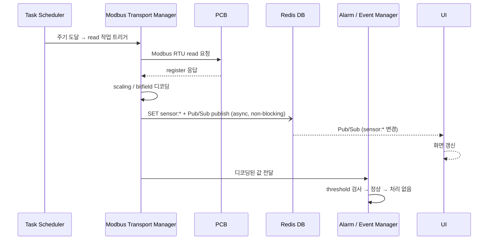
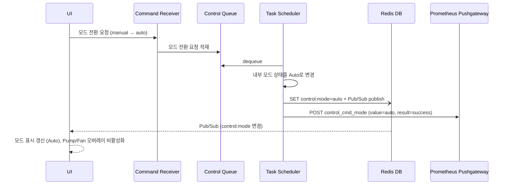
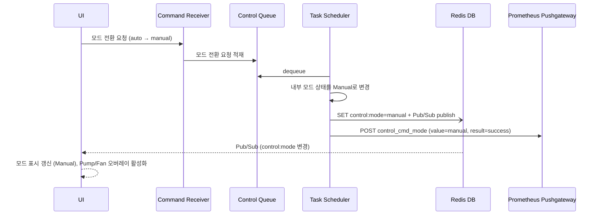

# Modbus Control Gateway (MCG)

## 개요

- 시스템 내 중앙 제어 및 통신 허브
- PCB 대상 단일 Modbus Master
- 센서/액추에이터 레지스터 주기적 polling
- UI 제어 요청 수신 및 처리
- 제어 결과 및 통신 상태 저장
- 이상 상태 이벤트 생성 및 외부 전달

---

## 제어 모드

시스템은 수동(Manual) 및 자동(Auto) 두 가지 제어 모드를 지원한다.

| 모드 | 설명 |
|---|---|
| **Manual** (기본값) | 사람이 UI에서 Pump/Fan PWM을 직접 설정. 시스템은 감지·알람만 담당. |
| **Auto** | MCG가 냉각수온·유량 기반으로 PWM을 자동 계산 → PCB write. 사람은 모드 전환·모니터링 담당. |

- 현재 모드는 Redis `control:mode` 키로 관리 (`manual` / `auto`)
- 모드 전환은 UI 요청으로만 발생
- AEM 동작은 두 모드에서 동일 (감지·알람만, 제어 명령 생성 안 함)
- Auto 모드에서 Pump/Fan 수동 제어 UI는 비활성화 (Manual 전환 시 재활성화)

---

## 컴포넌트 구성

### 요구사항 적합성 검토

| 요구사항 | 관련 컴포넌트 | 판정 | 비고 |
|---|---|---|---|
| 터치/웹 UI를 통한 모니터링 및 제어 | Command Receiver, Modbus Transport Manager | ✅ | IPC + REST API |
| 수동/자동 제어 모드 지원 | Task Scheduler (Auto Control Cycle) | ✅ | Manual/Auto 전환 |
| 키오스크 사용자에게 제한된 기능만 노출 | UI 레이어 (입력 범위 제한) | ✅ | |
| 하드웨어 플랫폼 정보 미노출 | MCG 추상화 계층 | ✅ | UI는 PCB register에 직접 접근 불가 |
| 부팅 후 자동 실행 | Task Scheduler + 서비스 초기화 | ✅ | mcg.service (systemd) |

---

**[레이어 1] 요청 수신**

`Command Receiver`
- UI로부터 제어 요청 수신 (IPC / REST API)
- Control Queue에 적재

**[레이어 2] 스케줄링 & 큐**

`Task Scheduler`
- **Control Queue 소비 + 모드 판단 + Auto 생성 + MTM 디스패치를 전담**
- Control Queue / Polling 두 작업 소스 관리
- **작업 소스 우선순위: Control Queue > Polling** (Modbus 단일 채널 직렬 접근 보장)
- 매 cycle 동작:
  1. Control Queue에 요청이 있으면 dequeue → MTM에 디스패치
  2. Control Queue가 비어있으면 Polling 실행 → 센서값 수집
  3. Polling 완료 후 현재 모드(`control:mode`) 확인 → **Auto이면 알고리즘으로 PWM 계산 → Control Queue에 적재** (다음 cycle에서 우선 처리)
- 주요 Polling 대상 (Modbus via PCB): 수온(inlet/outlet), 유압, 유량, 수위, 누수, 펌프 상태, 팬 상태
- **온/습도는 Polling 대상 제외**: RPi Ambient Sensor Reader가 I2C/GPIO로 직접 수집 → Redis SET

`Control Queue`
- 모든 write 요청의 단일 경로 — Manual/Auto/비상정지 구분 없이 동일 큐 사용
- Task Scheduler가 Polling보다 우선 dequeue → MTM 디스패치
- 적재 소스:
  - **Manual**: UI → Command Receiver → Control Queue
  - **Auto**: Task Scheduler가 Polling 후 알고리즘 계산 → Control Queue 적재
  - **비상정지**: Command Receiver → Control Queue 최우선 적재
- 처리 대상: Pump 출력 변경, Fan 출력 변경, 모드 전환 (manual ↔ auto), 비상정지

**[레이어 3] Modbus 통신**

`Modbus Transport Manager`
- Task Scheduler로부터 요청을 받아 Modbus RTU 송수신 실행
- timeout / retry / reconnect 처리, 연속 실패 횟수 관리
- slave 응답 이상 감지 및 통신 실패 상태 관리
- **Read path**: IR read → scaling / bitfield 디코딩 → Redis SET `sensor:*` + Pub/Sub publish (async) ∥ AEM에 값 전달
  - **수위 센서 융합**: 상·하위 광센서 2개 bit를 조합해 `sensor:water_level` 단일 값(`2`/`1`/`0`)으로 SET
- **Write path**: 0~100% 입력값 → HR 주소 / register value 변환 → Modbus write → ACK 확인 → Pushgateway POST
  - 예: set_pump(70%) → FC06 / HR 0 / value=700
  - 예: set_fan(70%) → FC06 / HR 8 / value=700
- 통신 상태 Redis SET + Pub/Sub: `comm:status`, `comm:consecutive_failures`, `comm:last_error`
- 통신 상태 변경 시 Pushgateway POST (이력용)

**[레이어 4] 이벤트 처리**

`Alarm / Event Manager`
- MTM으로부터 디코딩된 센서값 수신 → threshold 검사 → 이상/복귀 판단
- 경고 / 치명 이벤트 분류, UI 알람 표시용 Redis 키 관리
- 알람 상태 키 관리: 임계치 초과 시 Redis SET (`alarm:*`), 정상 복귀 시 Redis DEL
- 중복 이벤트 억제, 이벤트 발생/해제 시점 기록

> AEM은 감지와 알람 전달만 담당. 제어 명령은 생성하지 않음.
> 제어 명령 결과(success/fail)는 AEM을 거치지 않음. MTM이 직접 Pushgateway POST.

---

## MCG 서비스 초기화

PCB 펌웨어에 초기값 Flash 저장(INIT_DUTY 등)이 미구현이므로, MCG 서비스 시작 시 아래 초기값을 PCB에 write하여 대체한다.

| 대상 | HR 주소 | 초기값 | 비고 |
|---|---|---|---|
| Pump L1 PWM | HR 0~3 | config.yaml에서 로드 | TIM1 (CH1~4) |
| Pump L2 PWM | HR 4~7 | config.yaml에서 로드 | TIM2 (CH5~8) |
| Fan PWM | HR 8~11 | config.yaml에서 로드 | TIM8 (CH9~12) |
| PWM Freq | HR 12~14 | config.yaml에서 로드 | TIM1/TIM2/TIM8 |
| DOUT | HR 15 | config.yaml에서 로드 | bit0~5 |

> 전원 재인가 시에도 MCG 서비스 재시작(systemd Restart=always)으로 초기값 자동 적용.
> PCB Factory Reset(BT2)은 PWM Duty→0, DOUT→OFF로 초기화하므로, MCG 초기화가 이를 덮어씀.

---

## 예외 처리 설계

### 목표 기반 시나리오 정의

L2A CDU의 1차 목표는 **서버의 안정적인 냉각 유지**다.
예외 처리는 이 목표를 위협하는 시나리오를 중심으로 설계한다.

| # | 시나리오 | 위협 대상 | 트리거 조건 |
|---|----------|-----------|-------------|
| S1 | **냉각 성능 저하** | 서버 과열 | 냉각수 온도 임계 초과 |
| S2 | **냉각수 손실** | 순환 불가 | 수위 부족 |
| S3 | **냉각수 누출** | 침수·서버 과열 복합 | 누수 감지 |
| S4 | **제어 불능** | 대응 불가 | Modbus 통신 두절 |
| S5 | **환경 한계 초과** | 장치 동작 불가 | 장치 내부 온도·습도가 동작 한계 초과 |

예외는 심각도에 따라 2단계로 구분.

| 심각도 | 정의 | UI |
|---|---|---|
| **Warning** | 주의 필요, 즉각 조치 불필요 | 알람 배너 표시 |
| **Critical** | 즉각 사람의 판단 및 조치 필요 | 알람 배너 표시 (강조) |

---

### 센서 이상

| 예외 | 감지 주체 | 심각도 | AEM 처리 | 복구 조건 |
|---|---|---|---|---|
| 수온 경고 | AEM | Warning | `alarm:coolant_temp_warning` SET | 임계치 이하 복귀 |
| 수온 위험 | AEM | Critical | `alarm:coolant_temp_critical` SET | 임계치 이하 복귀 |
| 누수 감지 | AEM | Critical | `alarm:leak_detected` SET | 누수 비트 해제 |
| 수위 부족 | AEM | Warning | `alarm:water_level_warning` SET | `sensor:water_level`≥2 |
| 수위 위험 | AEM | Critical | `alarm:water_level_critical` SET | `sensor:water_level`≥1 |
| 유압 이상 | AEM | Warning | `alarm:pressure_warning` SET | 정상 범위 복귀 |
| 유량 저하 (Pump ON) | AEM | Warning | `alarm:flow_rate_warning` SET | 정상 유량 복귀 |
| 장치 내부 온도 경고 | AEM | Warning | `alarm:ambient_temp_warning` SET | 임계치 이하 복귀 |
| 장치 내부 온도 한계 초과 | AEM | Critical | `alarm:ambient_temp_critical` SET | 정상 범위 복귀 |
| 장치 내부 습도 경고 | AEM | Warning | `alarm:ambient_humidity_warning` SET | 임계치 이하 복귀 |
| 장치 내부 습도 한계 초과 | AEM | Critical | `alarm:ambient_humidity_critical` SET | 정상 범위 복귀 |

### 통신 이상

| 예외 | 감지 주체 | 심각도 | AEM 처리 | 복구 조건 |
|---|---|---|---|---|
| 단일 timeout | MTM | — | 내부 retry (AEM 개입 없음) | retry 성공 |
| 연속 N회 실패 | MTM | Warning | `alarm:comm_timeout` SET, Pushgateway POST | 통신 복구 |
| PCB 무응답 (disconnected) | MTM | Critical | `alarm:comm_disconnected` SET, Polling 중단 | 통신 복구 |

### 제어 실패

| 예외 | 감지 주체 | 처리 | 복구 조건 |
|---|---|---|---|
| PCB NACK / write retry 소진 | MTM | Pushgateway POST (result="nack") | 다음 제어 요청 |

> 제어 실패는 AEM 개입 없이 이력 기록만. UI 경고 없음.

### 복구 원칙

- 알람 해제는 AEM이 판단 (MTM이 전달한 값으로 threshold 복귀 확인)
- 해당 센서값이 정상 범위로 복귀 시 `alarm:*` Redis DEL, UI 알람 해제
- PCB 무응답으로 중단된 Polling은 통신 복구 확인 후 재개

---

## 시나리오

### 동작 사이클 개요

```
loop:
  Control Queue에 요청 있음 → MTM write → 다음 cycle
  Control Queue 비어있음   → MTM read → 디코딩
                                ├─ Redis SET sensor:* + Pub/Sub publish
                                │     └─ Redis → UI: Pub/Sub 수신 → 화면 갱신
                                ├─ AEM threshold 검사
                                │     정상 → pass / 이상 → Redis SET alarm:* → UI 알람
                                └─ Auto 모드? → 알고리즘 → PWM write 요청을 Control Queue에 적재
                                                           → 다음 cycle에서 우선 처리
```

---

### 시나리오 1. 주기적 상태 수집 (정상)

트리거: Task Scheduler 주기 도달



---

### 시나리오 2. 주기적 수집 중 제어 요청 수신

트리거: Polling 중 UI로부터 제어 요청 수신

```mermaid
sequenceDiagram
    participant UI as UI
    participant CR as Command Receiver
    participant CQ as Control Queue
    participant TS as Task Scheduler
    participant MTM as Modbus Transport Manager
    participant PCB as PCB
    participant Redis as Redis DB
    participant AEM as Alarm / Event Manager
    participant PGW as Prometheus Pushgateway

    rect rgb(30, 40, 60)
        Note over TS,AEM: Polling cycle (시나리오 1과 동일)
        TS->>MTM: 주기 도달 → read 작업 트리거
        MTM->>PCB: Modbus RTU read 요청
        PCB-->>MTM: register 응답
        MTM->>MTM: scaling / bitfield 디코딩
        MTM-)Redis: SET sensor:* + Pub/Sub publish (async)
        Redis-->>UI: Pub/Sub (sensor:* 변경)
        UI-->>UI: 화면 갱신
        MTM->>AEM: 디코딩된 값 전달
        AEM->>AEM: threshold 검사 → 정상
    end

    rect rgb(40, 55, 30)
        Note over CR,MTM: 제어 요청 처리
        UI->>CR: 제어 요청 0~100% (IPC / REST API)
        CR->>CQ: 요청 적재
        Note over TS: Control Queue 감지 — 다음 cycle 전 우선 처리
        TS->>CQ: dequeue
        TS->>MTM: 제어 요청 전달
        MTM->>MTM: % → HR 주소 / register value 변환
        MTM->>PCB: Modbus RTU write 요청
        PCB-->>MTM: ACK / NACK
        MTM->>PGW: POST control_cmd (value, result, source=manual)
    end
```



---

### 시나리오 3. 센서 임계치 초과 → 알람 → 사람 제어 → 복구

트리거: Task Scheduler 주기 도달 → AEM threshold 검사에서 임계치 초과 판단

```mermaid
sequenceDiagram
    participant UI as UI
    participant CR as Command Receiver
    participant CQ as Control Queue
    participant TS as Task Scheduler
    participant MTM as Modbus Transport Manager
    participant PCB as PCB
    participant Redis as Redis DB
    participant AEM as Alarm / Event Manager
    participant PGW as Prometheus Pushgateway

    rect rgb(30, 40, 60)
        Note over TS,AEM: Polling cycle — 정상 (시나리오 1과 동일)
        TS->>MTM: 주기 도달 → read 작업 트리거
        MTM->>PCB: Modbus RTU read 요청
        PCB-->>MTM: register 응답
        MTM->>MTM: scaling / bitfield 디코딩
        MTM-)Redis: SET sensor:* + Pub/Sub publish (async)
        MTM->>AEM: 디코딩된 값 전달
        AEM->>AEM: threshold 검사 → 정상
    end

    rect rgb(60, 30, 30)
        Note over TS,AEM: 다음 Polling cycle — 이상 감지
        TS->>MTM: read 작업 트리거
        MTM->>PCB: Modbus RTU read 요청
        PCB-->>MTM: register 응답
        MTM->>MTM: scaling / bitfield 디코딩
        MTM-)Redis: SET sensor:* + Pub/Sub publish (async)
        MTM->>AEM: 디코딩된 값 전달
        AEM->>AEM: threshold 검사 → 임계치 초과
        AEM->>Redis: SET alarm:*
        Redis-->>UI: Keyspace Notification (SET 이벤트)
        UI-->>UI: 알람 배너 표시
    end

    rect rgb(40, 55, 30)
        Note over CR,PGW: 사람이 상황 판단 후 직접 제어 (시나리오 2와 동일)
        UI->>CR: 제어 요청 (IPC / REST API)
        CR->>CQ: 요청 적재
        TS->>MTM: 제어 요청 전달
        MTM->>PCB: Modbus RTU write 요청
        PCB-->>MTM: ACK / NACK
        MTM->>PGW: POST control_cmd (value, result, source=manual)
    end

    rect rgb(20, 50, 30)
        Note over TS,AEM: 다음 Polling cycle — 복구 확인
        TS->>MTM: read 작업 트리거
        MTM->>PCB: Modbus RTU read 요청
        PCB-->>MTM: register 응답
        MTM->>MTM: scaling / bitfield 디코딩
        MTM-)Redis: SET sensor:* + Pub/Sub publish (async)
        MTM->>AEM: 디코딩된 값 전달
        AEM->>AEM: threshold 검사 → 정상 복귀
        AEM->>Redis: DEL alarm:*
        Redis-->>UI: Keyspace Notification (DEL 이벤트)
        UI-->>UI: 알람 해제
    end
```



---

### 시나리오 4. 통신 오류 → 알람 → 복구

트리거: MTM Modbus 요청 실패

```mermaid
sequenceDiagram
    participant UI as UI
    participant TS as Task Scheduler
    participant MTM as Modbus Transport Manager
    participant PCB as PCB
    participant Redis as Redis DB
    participant AEM as Alarm / Event Manager
    participant PGW as Prometheus Pushgateway

    rect rgb(60, 30, 30)
        Note over TS,AEM: Polling cycle — 통신 오류 감지
        TS->>MTM: 주기 도달 → read 작업 트리거
        MTM->>PCB: Modbus RTU read 요청
        PCB--xMTM: timeout / 무응답
        MTM->>MTM: retry → 연속 실패 횟수 증가
        MTM-)Redis: SET comm:* + Pub/Sub publish
        Redis-->>UI: Pub/Sub (comm:* 변경)
        UI-->>UI: 통신 상태 갱신
        alt 연속 N회 실패 (Warning)
            MTM->>AEM: 통신 이상 통보
            AEM->>Redis: SET alarm:comm_timeout
            AEM->>PGW: POST comm_event (이력)
            Redis-->>UI: Keyspace Notification
            UI-->>UI: 알람 배너 표시
        else PCB 무응답 판단 (Critical)
            MTM->>AEM: 통신 두절 통보
            AEM->>Redis: SET alarm:comm_disconnected
            Redis-->>UI: Keyspace Notification
            UI-->>UI: 알람 배너 표시 (강조)
            MTM->>MTM: Polling 중단
        end
    end

    rect rgb(20, 50, 30)
        Note over TS,AEM: 복구
        MTM->>PCB: 재연결 시도
        PCB-->>MTM: 응답 성공
        MTM->>MTM: 연속 실패 횟수 초기화, Polling 재개
        MTM-)Redis: SET comm:status=ok + Pub/Sub publish
        MTM->>AEM: 통신 복구 통보
        AEM->>Redis: DEL alarm:comm_*
        Redis-->>UI: Keyspace Notification (DEL)
        UI-->>UI: 알람 해제
    end
```



> Auto 모드 중 통신 두절 → 복구 시, Auto Control Cycle이 자동 재개됨 (`control:mode` 상태 유지).

---

### 시나리오 5. Manual → Auto 모드 전환

트리거: UI에서 Auto 모드 전환 요청



---

### 시나리오 6. Auto 모드 제어 사이클

트리거: Auto 모드에서 Task Scheduler 주기 도달

```mermaid
sequenceDiagram
    participant CQ as Control Queue
    participant TS as Task Scheduler
    participant MTM as Modbus Transport Manager
    participant PCB as PCB
    participant Redis as Redis DB
    participant AEM as Alarm / Event Manager
    participant PGW as Prometheus Pushgateway

    rect rgb(30, 40, 60)
        Note over TS,AEM: Polling cycle — 센서값 수집 (시나리오 1과 동일)
        TS->>MTM: 주기 도달 → read 작업 트리거
        MTM->>PCB: Modbus RTU read 요청
        PCB-->>MTM: register 응답
        MTM->>MTM: scaling / bitfield 디코딩
        MTM-)Redis: SET sensor:* + Pub/Sub publish (async)
        MTM->>AEM: 디코딩된 값 전달
        AEM->>AEM: threshold 검사 (기존과 동일)
    end

    rect rgb(40, 55, 30)
        Note over TS,PGW: Auto Control — PWM 자동 계산 → Control Queue 적재 → 실행
        TS->>TS: 냉각수온 + 유량 → 지정 알고리즘 → Pump/Fan PWM duty 결정
        TS->>CQ: Pump/Fan PWM write 요청 적재 (source=auto)
        TS->>CQ: dequeue (다음 cycle 우선 처리)
        TS->>MTM: Pump PWM write 요청
        MTM->>PCB: Modbus RTU write (HR 0~7)
        PCB-->>MTM: ACK
        TS->>MTM: Fan PWM write 요청
        MTM->>PCB: Modbus RTU write (HR 8~11)
        PCB-->>MTM: ACK
        MTM-)Redis: SET sensor:pump_pwm_duty_* / sensor:fan_pwm_duty_* + Pub/Sub publish
    end
```



> Polling 완료 후 알고리즘이 PWM을 계산하여 Control Queue에 적재. 다음 cycle에서 우선 처리.
> Manual/Auto 모두 동일한 Control Queue를 경유하므로 write 경로가 단일화됨.
> **Auto 제어 시 Pushgateway POST 없음** — PWM 변경 결과값은 Exporter가 `sensor:*`로 수집하므로 이력 누락 없음.

---

### 시나리오 7. Auto → Manual 모드 전환

트리거: UI에서 Manual 모드 전환 요청



> PWM은 마지막 Auto 제어 시점의 값을 유지. 사람이 수동으로 변경하기 전까지 변하지 않음.

---

### 시나리오 8. 비상정지

트리거: UI에서 비상정지 요청

- Control Queue에 **최우선 처리**로 적재
- HR 0~11 = 0 (전체 PWM Duty 0%), HR 15 = 0 (전체 DOUT OFF) write
- **S-Curve 1초 적용됨** (보드 사양 — 즉시 차단 아님)
- Auto 모드였다면 자동으로 Manual 복귀: `control:mode=manual` Redis SET
- 사용자가 명시적으로 Auto를 재활성화해야 함 (안전 설계)

---

## Auto Control 알고리즘

MCG Auto 모드에서 냉각수 inlet temp 및 유량 값을 기반으로 Pump/Fan PWM을 자동 결정.

- **입력 센서**: 냉각수 inlet/outlet 온도, 유량
- **출력**: HR 0~11 (Pump/Fan PWM Duty)
- **알고리즘**: 지정된 알고리즘에 의해 PWM duty 결정 (상세는 구현 시 정의)
- **적용 방식**: 양 루프(L1, L2) 독립 또는 대칭 제어 (구현 시 결정)

---

## 미구현 — PCB Watchdog (펌웨어 업데이트 필요)

MCG 다운 시 PCB가 자체적으로 안전 모드로 전환하는 Watchdog 기능은 MCG 소프트웨어로 대체 불가하다. 현재 PCB 펌웨어에 미구현 상태이며, 펌웨어 업데이트가 필요해 보임.

- **필요 기능**: Master Heartbeat 감시 → timeout 시 PCB 자체 보호 모드 전환
- **현재 한계**: MCG가 죽으면 PCB에 명령을 보낼 수 없으므로, PCB 펌웨어가 자체 판단해야 함
- **임시 대응**: systemd `Restart=always`로 MCG 서비스 자동 재시작 (수 초 이내 복구)
- **상세**: [PCB.md](PCB.md) "미구현 기능" 섹션 참고
