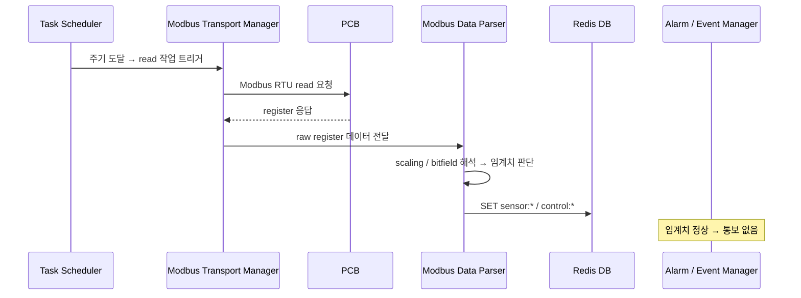
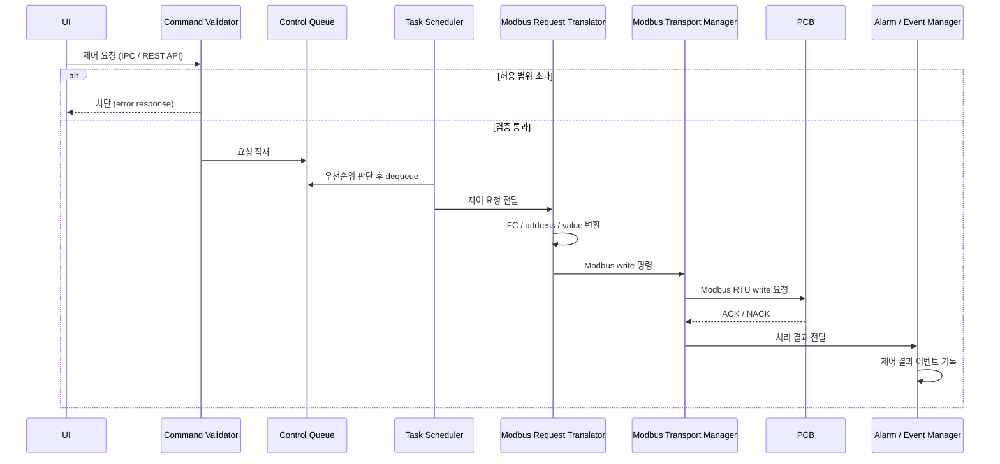

# Python Control Gateway (PCG)

## 개요

- 시스템 내 중앙 제어 및 통신 허브
- PCB 대상 단일 Modbus Master
- 센서/액추에이터 레지스터 주기적 polling
- UI 제어 요청 수신 및 처리
- 제어 결과 및 통신 상태 Redis 저장
- 이상 상태 이벤트 생성 및 외부 전달

**작업 소스 우선순위: Emergency Queue > Control Queue > Polling** *(Task Scheduler가 중재 및 디스패치)*

## 컴포넌트 구성

### 요구사항 적합성 검토

| 요구사항 | 관련 컴포넌트 | 판정 | 비고 |
|---|---|---|---|
| 터치/웹 UI를 통한 모니터링 및 제어 | Command Validator (IPC/REST API 수신), Modbus Data Parser (Redis SET) | ✅ | 양쪽 인터페이스 모두 지원 |
| 키오스크 사용자에게 제한된 기능만 노출 | Command Validator (허용 범위 검증 + privilege check 레이어) | ⚠️ | operator / admin 두 role 설계됨. 코드 구현 미완료. 하단 권한 매트릭스 참고 |
| 하드웨어 플랫폼 정보 미노출 | PCG 추상화 계층 (UI ↔ PCG ↔ PCB), Redis key 추상화 네이밍 | ✅ | UI는 PCB register에 직접 접근 불가 |
| 부팅 후 자동 실행 | Task Scheduler (PCG 기동 시 자동 스케쥴링 시작) | ✅ | Kiosk.md 섹션 4.1 pcg.service 참고 |

**개요 항목 대비 컴포넌트 커버리지**

| 개요 항목 | 담당 컴포넌트 | 판정 | 비고 |
|---|---|---|---|
| 시스템 내 중앙 제어 및 통신 허브 | 전체 구조 | ✅ | |
| PCB 대상 단일 Modbus Master | Modbus Transport Manager | ✅ | |
| 센서/액추에이터 레지스터 주기적 polling | Task Scheduler | ✅ | |
| UI 제어 요청 수신 및 처리 | Command Validator + Control Queue | ✅ | |
| 제어 결과 및 통신 상태 Redis 저장 | Alarm/Event Manager (`control:result:*`), Modbus Transport Manager (`comm:*`) | ⚠️ | key 설계 완료. 코드 구현 미완료. 상세 key: `control:result:pump_duty`, `control:result:fan_voltage`, `comm:status`, `comm:consecutive_failures`, `comm:last_error` |
| 이상 상태 이벤트 생성 및 외부 전달 | Alarm / Event Manager | ✅ | alarm:* → Redis → UI (Local + Web) 경유 외부 노출 확인. Web UI는 원격 브라우저 접근 가능 |

---

**[레이어 1] 요청 수신 & 검증**

`Command Validator / Safety Checker`
- UI로부터 제어 요청 수신 (IPC / REST API)
- 요청값 허용 범위 검증 및 잘못된 값 차단
- 권한 검증 (privilege check): 요청자 role에 따라 허용 동작 제한
- 비정상 상태 시 제어 제한, 긴급 상태 시 일반 요청 차단
- 검증 통과 시 Control Queue에 적재
- 허용 범위 예시: Pump Duty 0~100%, Fan 전압 0~12V
- 누수 감지 시 특정 제어 요청 거부

**권한 매트릭스**

| 동작 | operator | admin |
|---|---|---|
| 모니터링 조회 | ✅ | ✅ |
| Pump Duty 변경 | ✅ | ✅ |
| Fan Voltage 변경 | ✅ | ✅ |
| 임계치 수정 | ❌ | ✅ |
| Polling 주기 변경 | ❌ | ✅ |
| 비상 정지 | ❌ | ✅ |

- Local UI: auto-login → `operator` 고정. PIN 입력 시 `admin` 전환
- Web UI: Bearer Token에 role 포함, FastAPI에서 검증

**[레이어 2] 스케줄링 & 큐**

`Task Scheduler`
- Emergency Queue / Control Queue / Polling 세 작업 소스를 소유하고 Modbus Transport Manager에 순차 디스패치
- 우선순위 중재: Emergency Queue > Control Queue > Polling (Modbus 단일 채널 직렬 접근 보장)
- 선점 처리: Emergency Queue 진입 시 현재 작업 중단 후 즉시 긴급 명령 디스패치
- 긴급 상황 진입 시 Polling 일시 중단, 복구 신호 수신 시 재개
- Polling 주기 설정 및 변경 가능
- 주요 Polling 대상: 수온(inlet/outlet), 유압, 유량, 수위, 누수, 펌프 상태, 팬 상태, 온습도

`Control Queue`
- Command Validator 통과한 일반 제어 요청 순차 적재
- Task Scheduler가 Polling보다 우선 디스패치
- 처리 대상: Pump Duty 변경, Fan 전압 변경, 기타 액추에이터 제어

`Emergency Queue`
- Alarm / Event Manager가 적재하는 긴급 전용 큐
- Task Scheduler가 모든 작업을 선점하여 즉시 디스패치
- 트리거 조건: 누수 감지, 과온, 수위 이상, 통신 이상, 비상 정지
- 실행 동작: Pump OFF, Fan Full Speed, 특정 액추에이터 차단

**[레이어 3] Modbus 통신**

`Modbus Transport Manager`
- Task Scheduler로부터 요청을 받아 Modbus RTU 송수신 실행
- timeout / retry / reconnect 처리, 연속 실패 횟수 관리
- slave 응답 이상 감지 및 통신 실패 상태 관리
- Function code별 요청 송신 및 예외 응답 처리
- 통신 상태 Redis SET: `comm:status`, `comm:consecutive_failures`, `comm:last_error`

`Modbus Request Translator` *(Write 경로 전용)*
- 제어 요청을 Modbus 명령으로 변환 (address 매핑, FC 결정, value encoding)
- 단일/복수 register write 구성
- 예: `set_pump_duty(70)` → `FC06 / addr=0x0012 / value=700`

`Modbus Data Parser` *(Read 경로 전용)*
- raw register 값 해석: scaling, signed/unsigned 변환, bitfield decode
- 센서/상태값 구조화 후 즉시 임계치 판단
- 센서 실시간 값(`sensor:*`, `control:*`)은 항상 Redis SET
- 임계치 초과 / 복귀 감지 시 → Alarm/Event Manager에 통보 (알람 키(`alarm:*`) 조작은 하지 않음)
- 예: `input_reg[3] = 412` → `coolant_temp = 41.2` / `status bit 1` = Leak detected

**[레이어 4] 이벤트 처리**

`Alarm / Event Manager`
- Modbus Data Parser로부터 임계치 초과/복귀 통보 수신
- 경고 / 치명 / 복구 이벤트 분류 후 Emergency Queue에 적재
- 알람 상태 키 관리: 임계치 초과 시 Redis SET (`alarm:*`), 정상 복귀 시 Redis DEL
- 제어 결과 Redis SET: `control:result:pump_duty`, `control:result:fan_voltage` (성공/실패/오류 포함)
- 중복 이벤트 억제, 이벤트 발생/해제 시점 기록
- 주요 이벤트: 온도 임계치 초과, 누수 감지, 수위 부족, 센서 이상, PCB 무응답, 통신 timeout, 복구

## 시나리오

### 시나리오 1. 주기적 상태 수집

트리거: Task Scheduler 주기 도달

---

### 시나리오 2. 일반 제어 요청 처리

트리거: UI로부터 제어 요청 수신

---

### 시나리오 3. 긴급 상황 처리

트리거: Modbus Data Parser 임계치 판단에서 긴급 조건 감지

```mermaid
sequenceDiagram
    participant PS as Task Scheduler
    participant CV as Command Validator
    participant MTM as Modbus Transport Manager
    participant PCB as PCB
    participant MDP as Modbus Data Parser
    participant Redis as Redis DB
    participant AEM as Alarm / Event Manager
    participant EQ as Emergency Queue
    participant MRT as Modbus Request Translator

    rect rgb(60, 30, 30)
        Note over MDP,EQ: 진입 단계
        MDP->>MDP: polling 중 임계치 초과 감지
        MDP->>Redis: SET sensor:* (현재값)
        MDP->>AEM: 임계치 초과 통보
        AEM->>Redis: SET alarm:*
        AEM->>EQ: 긴급 명령 적재
        AEM->>PS: polling 중단 신호
        AEM->>CV: 일반 요청 차단 신호
        PS-->>PS: polling 일시 중단
        CV-->>CV: 긴급 상태 플래그 SET
    end

    rect rgb(60, 45, 20)
        Note over PS,PCB: 안전 동작 단계
        PS->>EQ: 선점 — Emergency Queue dequeue
        PS->>MRT: 긴급 명령 전달
        MRT->>MRT: 긴급 명령 변환 (Pump OFF / Fan 최대 전압)
        MRT->>MTM: Modbus write 명령
        MTM->>PCB: 즉시 송신
        PCB-->>MTM: ACK
    end

    rect rgb(20, 50, 30)
        Note over PS,CV: 복구 단계
        PS->>MTM: 모니터링 Polling 재개 (긴급 상태 유지, 일반 제어 차단)
        MTM->>PCB: Modbus RTU read 요청
        PCB-->>MTM: register 응답
        MTM->>MDP: raw 데이터 전달
        MDP->>MDP: 임계치 복귀 감지
        MDP->>Redis: SET sensor:* (복귀값)
        MDP->>AEM: 복귀 통보
        AEM->>Redis: DEL alarm:*
        AEM->>AEM: 복구 이벤트 기록
        AEM->>PS: 정상 모드 전환 신호
        AEM->>CV: 차단 해제 신호
        PS-->>PS: 일반 Polling 재개
        CV-->>CV: 긴급 상태 플래그 CLR
    end
```

