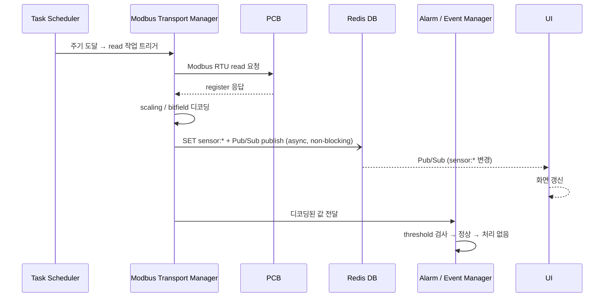
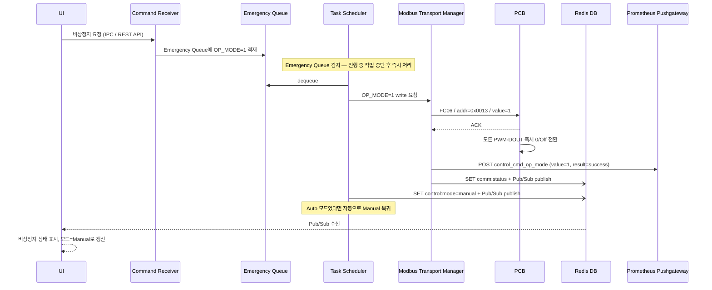
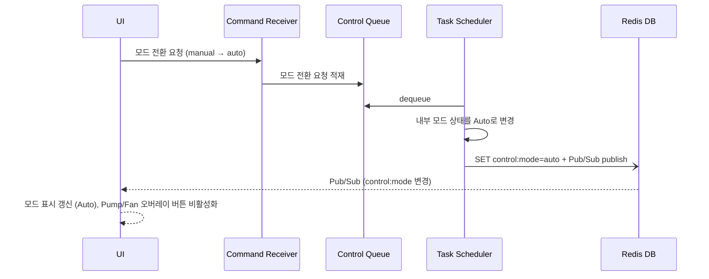
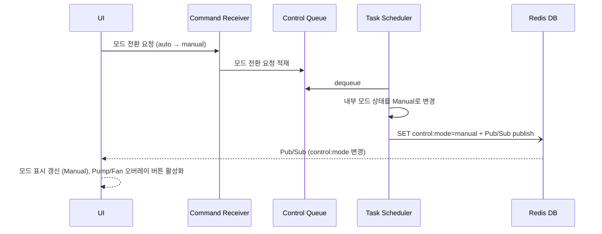

# Modbus Control Gateway (MCG) — v2

> **버전**: v2 — PCB Watchdog / OP_MODE / 비상정지 시나리오 포함.
> **v1** (MCG 단독 시퀀스 처리): [v1/MCG.md](../v1/MCG.md)

## 개요

- 시스템 내 중앙 제어 및 통신 허브
- PCB 대상 단일 Modbus Master
- 센서/액추에이터 레지스터 주기적 polling
- UI 제어 요청 수신 및 처리
- 제어 결과 및 통신 상태 저장
- 이상 상태 이벤트 생성 및 외부 전달

## 컴포넌트 구성

### 요구사항 적합성 검토

| 요구사항 | 관련 컴포넌트 | 판정 | 비고 |
|---|---|---|---|
| 터치/웹 UI를 통한 모니터링 및 제어 | Command Receiver (IPC/REST API 수신), Modbus Transport Manager (Redis SET) | ✅ | 양쪽 인터페이스 모두 지원 |
| 키오스크 사용자에게 제한된 기능만 노출 | UI 레이어 (입력 범위 제한) | ✅ | UI에서 허용 범위 내 입력만 가능하도록 처리 |
| 하드웨어 플랫폼 정보 미노출 | MCG 추상화 계층 (UI ↔ MCG ↔ PCB), Redis key 추상화 네이밍 | ✅ | UI는 PCB register에 직접 접근 불가 |
| 부팅 후 자동 실행 | Task Scheduler (MCG 기동 시 자동 스케쥴링 시작) | ✅ | Kiosk.md 섹션 4.1 mcg.service 참고 |

**개요 항목 대비 컴포넌트 커버리지**

| 개요 항목 | 담당 컴포넌트 | 판정 | 비고 |
|---|---|---|---|
| 시스템 내 중앙 제어 및 통신 허브 | 전체 구조 | ✅ | |
| PCB 대상 단일 Modbus Master | Modbus Transport Manager | ✅ | |
| 센서/액추에이터 레지스터 주기적 polling | Task Scheduler | ✅ | |
| UI 제어 요청 수신 및 처리 | Command Receiver + Control Queue | ✅ | |
| 제어 결과 및 통신 상태 저장 | Alarm/Event Manager (Pushgateway push), Modbus Transport Manager (`comm:*` Redis) | ⚠️ | 설계 완료. 코드 구현 미완료. 제어 이력은 Pushgateway → Prometheus. 통신 상태는 Redis: `comm:status`, `comm:consecutive_failures`, `comm:last_error` |
| 이상 상태 이벤트 생성 및 외부 전달 | Alarm / Event Manager | ✅ | alarm:* → Redis → UI (Local + Web) 경유 외부 노출 확인. Web UI는 원격 브라우저 접근 가능 |

---

**[레이어 1] 요청 수신**

`Command Receiver`
- UI로부터 제어 요청 수신 (IPC / REST API)
- Control Queue에 적재

**[레이어 2] 스케줄링 & 큐**

`Task Scheduler`
- Control Queue / Auto Control Cycle / Polling / Heartbeat 네 작업 소스를 소유하고 Modbus Transport Manager에 순차 디스패치
- **작업 소스 우선순위: Control Queue > Auto Control Cycle > Polling** (Modbus 단일 채널 직렬 접근 보장)
- **Auto Control Cycle**: Auto 모드일 때, polling 결과(inlet temp)를 기반으로 MCG가 룩업 테이블에서 PWM 값을 계산하여 자동으로 write 요청 생성. Auto 모드에서도 Heartbeat 갱신은 계속함.
- **PCB는 OP_MODE=0 (Normal) 유지**: Auto 제어는 MCG가 전담. PCB OP_MODE=3 (펌웨어 PID)는 사용하지 않음.
- 주요 Polling 대상 (Modbus via PCB): 수온(inlet/outlet), 유압, 유량, 수위, 누수, 펌프 상태, 팬 상태
- **온/습도는 Polling 대상 제외**: 장치 내부 온/습도는 RPi Ambient Sensor Reader가 I2C/GPIO로 직접 수집하여 Redis에 SET (`sensor:ambient_temp`, `sensor:ambient_humidity`) — MCG Modbus polling 불필요
- **Heartbeat write**: `MASTER_HEARTBEAT` (HR addr=20)를 주기적으로 갱신 (PCB Watchdog 감시 대상)
  - MCG가 이 값을 갱신하지 않으면 PCB가 `WATCHDOG_TIMEOUT` 경과 후 `WATCHDOG_ACTION_POLICY`에 따라 자동 모드 전환

`Control Queue`
- Command Receiver가 적재한 제어 요청을 순서대로 보관
- Task Scheduler가 Polling보다 우선 디스패치
- 처리 대상: Pump 출력 변경, Fan 출력 변경, `MB_HR_OP_MODE` 변경 (OP_MODE=0 정상복귀), 모드 전환 (manual ↔ auto)

**[레이어 3] Modbus 통신**

`Modbus Transport Manager`
- Task Scheduler로부터 요청을 받아 Modbus RTU 송수신 실행
- timeout / retry / reconnect 처리, 연속 실패 횟수 관리
- slave 응답 이상 감지 및 통신 실패 상태 관리
- Function code별 요청 송신 및 예외 응답 처리
- **Read path**: raw register 값 수신 → scaling / bitfield 디코딩 → function code 이상 없음 → Redis SET `sensor:*` + Pub/Sub publish (async, non-blocking) ∥ AEM에 값 전달
  - **수위 센서 융합**: 상·하위 광센서 2개 bit를 MTM이 조합해 `sensor:water_level` 단일 값(`2`/`1`/`0`)으로 SET — raw bit 개별 키는 저장하지 않음 (단일 진실 원천)
- **Write path**: 0\~100% 입력값 → FC / address / register value 변환 → Modbus write 송신 → ACK 수신 확인 → Pushgateway POST (result label)
  - 예: `set_pump(70)` → `FC06 / addr=0x0012 / value=700`
  - 예: `set_fan(70)` → 70% → 8.4V → `FC06 / addr=0x0014 / value=840`
  - 예: `set_op_mode(1)` → `FC06 / addr=0x0013 / value=1` (비상정지 — Emergency Queue 경로)
  - 예: `set_op_mode(0)` → `FC06 / addr=0x0013 / value=0` (정상 제어 복귀)
- 통신 상태 Redis SET + Pub/Sub publish (실시간 표시용): `comm:status`, `comm:consecutive_failures`, `comm:last_error`
- 통신 상태 변경 시 Pushgateway POST (이력용): `comm_event{status=...}`, `comm_consecutive_failures`

**[레이어 4] 이벤트 처리**

`Alarm / Event Manager`
- MTM으로부터 디코딩된 센서값 수신 → threshold 검사 → 이상/복귀 판단
- 경고 / 치명 이벤트 분류, UI 알람 표시용 Redis 키 관리
- 알람 상태 키 관리: 임계치 초과 시 Redis SET (`alarm:*`), 정상 복귀 시 Redis DEL
- 중복 이벤트 억제, 이벤트 발생/해제 시점 기록
- 주요 이벤트: 온도 임계치 초과, 누수 감지, 수위 부족, 센서 이상, PCB 무응답, 통신 timeout, 복구

> AEM은 감지와 알람 전달만 담당. 제어 명령은 생성하지 않음.
> 제어 명령 결과(success/fail)는 AEM을 거치지 않음. MTM이 직접 Pushgateway POST.

## 예외 처리 설계

### 목표 기반 시나리오 정의

L2A CDU의 1차 목표는 **서버의 안정적인 냉각 유지**다.
예외 처리는 이 목표를 위협하는 시나리오를 중심으로 설계한다.

| # | 시나리오 | 위협 대상 | 트리거 조건 |
|---|----------|-----------|-------------|
| S1 | **냉각 성능 저하** | 서버 과열 | 냉각수 온도 임계 초과 |
| S2 | **냉각수 손실** | 순환 불가 | 수위 부족 |
| S3 | **냉각수 누출** | 침수·서버 과열 복합 | 누수 감지 |
| S4 | **제어 불능** | 대응 불가 | Modbus 통신 두절 |
| S5 | **환경 한계 초과** | 장치 동작 불가 | 장치 내부 온도·습도가 장치 동작 한계 범위 초과 |

- S1, S2는 냉각 성능 저하 계열로 서버 과열로 수렴
- S3은 S2(냉각수 손실)를 포함하면서 침수 피해까지 유발하는 복합 시나리오로, 냉각 유지와 침수 방지가 충돌하는 가장 복잡한 케이스
- S4, S5는 전제 조건 붕괴 계열 — 다른 모든 시나리오에서의 대응 자체가 불가능해지는 상황

---

예외는 심각도에 따라 2단계로 구분.

| 심각도 | 정의 | UI |
|---|---|---|
| **Warning** | 주의 필요, 즉각 조치 불필요 | 알람 배너 표시 |
| **Critical** | 즉각 사람의 판단 및 조치 필요 | 알람 배너 표시 (강조) |

> 시스템은 수동(Manual) 및 자동(Auto) 두 가지 제어 모드를 지원한다.
> - **Manual** (기본값): 사람이 UI에서 직접 제어. 시스템은 감지·알람만 담당.
> - **Auto**: MCG가 센서값 기반 룩업 테이블로 Pump/Fan PWM을 자동 조절. 사람은 모드 전환·모니터링 담당.
> - AEM은 두 모드에서 동일 동작 (감지·알람만, 제어 명령 생성 안 함).

---

### 센서 이상

| 예외 | 감지 주체 | 심각도 | AEM 처리 | 복구 조건 |
|---|---|---|---|---|
| 수온 경고 (warning) | AEM | Warning | `alarm:coolant_temp_warning` SET | 임계치 이하 복귀 |
| 수온 위험 (critical) | AEM | Critical | `alarm:coolant_temp_critical` SET | 임계치 이하 복귀 |
| 누수 감지 | AEM | Critical | `alarm:leak_detected` SET | 누수 비트 해제 |
| 수위 부족 (warning) | AEM | Warning | `alarm:water_level_warning` SET — `sensor:water_level`=1 | `sensor:water_level`≥2 복귀 |
| 수위 위험 (critical) | AEM | Critical | `alarm:water_level_critical` SET — `sensor:water_level`=0 | `sensor:water_level`≥1 복귀 |
| 유압 이상 (warning) | AEM | Warning | `alarm:pressure_warning` SET | 정상 범위 복귀 |
| 유량 저하 (warning, Pump ON 상태) | AEM | Warning | `alarm:flow_rate_warning` SET | 정상 유량 복귀 |
| 장치 내부 온도 경고 (warning) | AEM | Warning | `alarm:ambient_temp_warning` SET | 임계치 이하 복귀 |
| 장치 내부 온도 한계 초과 (critical) | AEM | Critical | `alarm:ambient_temp_critical` SET | 정상 범위 복귀 |
| 장치 내부 습도 경고 (warning) | AEM | Warning | `alarm:ambient_humidity_warning` SET | 임계치 이하 복귀 |
| 장치 내부 습도 한계 초과 (critical) | AEM | Critical | `alarm:ambient_humidity_critical` SET | 정상 범위 복귀 |

---

### 통신 이상

| 예외 | 감지 주체 | 심각도 | AEM 처리 | 복구 조건 |
|---|---|---|---|---|
| 단일 timeout | MTM | — | 내부 retry (AEM 개입 없음) | retry 성공 |
| 연속 N회 실패 | MTM | Warning | `alarm:comm_timeout` SET, Pushgateway POST | 통신 복구 |
| PCB 무응답 (disconnected) | MTM | Critical | `alarm:comm_disconnected` SET, Polling 중단 | 통신 복구 |

---

### 제어 실패

| 예외 | 감지 주체 | 처리 | 복구 조건 |
|---|---|---|---|
| PCB NACK / write retry 소진 | MTM | MTM → Pushgateway POST (`control_cmd_*{result="nack"}`) | 다음 제어 요청 |

> 제어 실패는 AEM 개입 없이 이력 기록만. UI 경고 없음.

---

### 복구 원칙

- 알람 해제는 AEM이 판단 (MTM이 전달한 값으로 threshold 복귀 확인)
- 해당 센서값이 정상 범위로 복귀 시 `alarm:*` Redis DEL, UI 알람 해제
- PCB 무응답으로 중단된 Polling은 통신 복구 확인 후 재개

## 시나리오

### 동작 사이클 개요

```
loop:
  Control Queue에 요청 있음 → MTM write → 다음 cycle
  Control Queue 비어있음   → MTM read → 디코딩
                                ├─ Redis SET sensor:* + Pub/Sub publish (async)
                                │     └─ Redis → UI: Pub/Sub 수신 → 화면 갱신
                                └─ AEM threshold 검사
                                      정상 → 다음 cycle
                                      이상 → Redis SET alarm:* → Keyspace Notification → UI 알람 → 다음 cycle
```

---

### 시나리오 1. 주기적 상태 수집 (정상)

트리거: Task Scheduler 주기 도달



---

### 시나리오 2. 주기적 수집 중 제어 요청 수신

트리거: Polling 중 UI로부터 제어 요청 수신

```mermaid
sequenceDiagram
    participant UI as UI
    participant CR as Command Receiver
    participant CQ as Control Queue
    participant TS as Task Scheduler
    participant MTM as Modbus Transport Manager
    participant PCB as PCB
    participant Redis as Redis DB
    participant AEM as Alarm / Event Manager
    participant PGW as Prometheus Pushgateway

    rect rgb(30, 40, 60)
        Note over TS,AEM: Polling cycle (시나리오 1과 동일)
        TS->>MTM: 주기 도달 → read 작업 트리거
        MTM->>PCB: Modbus RTU read 요청
        PCB-->>MTM: register 응답
        MTM->>MTM: scaling / bitfield 디코딩
        MTM-)Redis: SET sensor:* + Pub/Sub publish (async)
        Redis-->>UI: Pub/Sub (sensor:* 변경)
        UI-->>UI: 화면 갱신
        MTM->>AEM: 디코딩된 값 전달
        AEM->>AEM: threshold 검사 → 정상
    end

    rect rgb(40, 55, 30)
        Note over CR,MTM: 제어 요청 처리
        UI->>CR: 제어 요청 0\~100% (IPC / REST API)
        CR->>CQ: 요청 적재
        Note over TS: Control Queue 감지 — 다음 cycle 전 우선 처리
        TS->>CQ: dequeue
        TS->>MTM: 제어 요청 전달
        MTM->>MTM: % → FC / address / register value 변환
        MTM->>PCB: Modbus RTU write 요청
        PCB-->>MTM: ACK / NACK
        MTM->>PGW: POST control_cmd_* (value, result label, ts)
    end
```



---

### 시나리오 3. 센서 임계치 초과 → 알람 → 사람 제어 → 복구

트리거: Task Scheduler 주기 도달 → AEM threshold 검사에서 임계치 초과 판단

```mermaid
sequenceDiagram
    participant UI as UI
    participant CR as Command Receiver
    participant CQ as Control Queue
    participant TS as Task Scheduler
    participant MTM as Modbus Transport Manager
    participant PCB as PCB
    participant Redis as Redis DB
    participant AEM as Alarm / Event Manager
    participant PGW as Prometheus Pushgateway

    rect rgb(30, 40, 60)
        Note over TS,AEM: Polling cycle — 정상 (시나리오 1과 동일)
        TS->>MTM: 주기 도달 → read 작업 트리거
        MTM->>PCB: Modbus RTU read 요청
        PCB-->>MTM: register 응답
        MTM->>MTM: scaling / bitfield 디코딩
        MTM-)Redis: SET sensor:* + Pub/Sub publish (async)
        Redis-->>UI: Pub/Sub (sensor:* 변경)
        UI-->>UI: 화면 갱신
        MTM->>AEM: 디코딩된 값 전달
        AEM->>AEM: threshold 검사 → 정상 → 처리 없음
    end

    rect rgb(60, 30, 30)
        Note over TS,AEM: 다음 Polling cycle — 이상 감지
        TS->>MTM: 주기 도달 → read 작업 트리거
        MTM->>PCB: Modbus RTU read 요청
        PCB-->>MTM: register 응답
        MTM->>MTM: scaling / bitfield 디코딩
        MTM-)Redis: SET sensor:* + Pub/Sub publish (async)
        Redis-->>UI: Pub/Sub (sensor:* 변경)
        UI-->>UI: 화면 갱신
        MTM->>AEM: 디코딩된 값 전달
        AEM->>AEM: threshold 검사 → 임계치 초과 판단
        AEM->>Redis: SET alarm:*
        AEM->>AEM: 이벤트 기록 (발생 시점)
        Redis-->>UI: Keyspace Notification (SET 이벤트)
        UI-->>UI: 알람 배너 표시 (강조)
    end

    rect rgb(40, 55, 30)
        Note over CR,PGW: 사람이 상황 판단 후 직접 제어 (시나리오 2와 동일)
        UI->>CR: 제어 요청 (IPC / REST API)
        CR->>CQ: 요청 적재
        TS->>CQ: dequeue
        TS->>MTM: 제어 요청 전달
        MTM->>PCB: Modbus RTU write 요청
        PCB-->>MTM: ACK / NACK
        MTM->>PGW: POST control_cmd_* (value, result label, ts)
    end

    rect rgb(20, 50, 30)
        Note over TS,AEM: 다음 Polling cycle — 복구 확인
        TS->>MTM: 주기 도달 → read 작업 트리거
        MTM->>PCB: Modbus RTU read 요청
        PCB-->>MTM: register 응답
        MTM->>MTM: scaling / bitfield 디코딩
        MTM-)Redis: SET sensor:* + Pub/Sub publish (async)
        Redis-->>UI: Pub/Sub (sensor:* 변경)
        UI-->>UI: 화면 갱신
        MTM->>AEM: 디코딩된 값 전달
        AEM->>AEM: threshold 검사 → 정상 복귀 판단
        AEM->>Redis: DEL alarm:*
        AEM->>AEM: 복구 이벤트 기록
        Redis-->>UI: Keyspace Notification (DEL 이벤트)
        UI-->>UI: 알람 해제
    end
```



---

### 시나리오 4. 통신 오류 → 알람 → 복구

트리거: MTM Modbus 요청 실패

```mermaid
sequenceDiagram
    participant UI as UI
    participant TS as Task Scheduler
    participant MTM as Modbus Transport Manager
    participant PCB as PCB
    participant Redis as Redis DB
    participant AEM as Alarm / Event Manager
    participant PGW as Prometheus Pushgateway

    rect rgb(60, 30, 30)
        Note over TS,AEM: Polling cycle — 통신 오류 감지
        TS->>MTM: 주기 도달 → read 작업 트리거
        MTM->>PCB: Modbus RTU read 요청
        PCB--xMTM: timeout / 무응답
        MTM->>MTM: retry → 연속 실패 횟수 증가
        MTM-)Redis: SET comm:status / comm:consecutive_failures / comm:last_error + Pub/Sub publish
        Redis-->>UI: Pub/Sub (comm:* 변경)
        UI-->>UI: 통신 상태 패널 갱신
        alt 연속 N회 실패 (Warning)
            MTM->>AEM: 통신 이상 통보
            AEM->>Redis: SET alarm:comm_timeout
            AEM->>PGW: POST comm_event (이력)
            Redis-->>UI: Keyspace Notification (SET 이벤트)
            UI-->>UI: 알람 배너 표시
        else PCB 무응답 판단 (Critical)
            MTM->>AEM: 통신 두절 통보
            AEM->>Redis: SET alarm:comm_disconnected
            Redis-->>UI: Keyspace Notification (SET 이벤트)
            UI-->>UI: 알람 배너 표시 (강조)
            MTM->>MTM: Polling 중단
        end
    end

    rect rgb(20, 50, 30)
        Note over TS,AEM: 복구
        MTM->>PCB: 재연결 시도
        PCB-->>MTM: 응답 성공
        MTM->>MTM: 연속 실패 횟수 초기화, Polling 재개
        MTM-)Redis: SET comm:status=ok / comm:consecutive_failures=0 + Pub/Sub publish
        Redis-->>UI: Pub/Sub (comm:* 변경)
        UI-->>UI: 통신 상태 패널 갱신
        MTM->>PCB: MB_HR_OP_MODE read (PCB 현재 운전모드 확인)
        PCB-->>MTM: OP_MODE 응답
        alt OP_MODE != 0 (Watchdog으로 인해 모드 전환된 상태)
            MTM->>PCB: MB_HR_OP_MODE=0 write (정상 제어 복귀)
        end
        MTM->>AEM: 통신 복구 통보
        AEM->>Redis: DEL alarm:comm_*
        AEM->>AEM: 복구 이벤트 기록
        Redis-->>UI: Keyspace Notification (DEL 이벤트)
        UI-->>UI: 알람 해제
        Note over TS: control:mode=auto인 경우 Auto Control Cycle 자동 재개
    end
```



> Auto 모드 중 통신 두절 → 복구 시: Watchdog이 OP_MODE을 변경했을 수 있으므로 OP_MODE=0 확인/복구 후 Auto Control Cycle 자동 재개.

---

### 시나리오 5. 비상정지 요청

트리거: UI에서 비상정지 요청 (Emergency Queue 경로 — 최우선 처리)



> Auto 모드에서 비상정지 발생 시 자동으로 Manual 모드로 전환. 사용자가 명시적으로 Auto를 재활성화해야 함 (안전 설계).

---

### 시나리오 6. Manual → Auto 모드 전환

트리거: UI에서 Auto 모드 전환 요청



---

### 시나리오 7. Auto 모드 제어 사이클

트리거: Auto 모드에서 Task Scheduler 주기 도달

```mermaid
sequenceDiagram
    participant TS as Task Scheduler
    participant MTM as Modbus Transport Manager
    participant PCB as PCB
    participant Redis as Redis DB
    participant AEM as Alarm / Event Manager
    participant PGW as Prometheus Pushgateway

    rect rgb(30, 40, 60)
        Note over TS,AEM: Polling cycle — 센서값 수집 (시나리오 1과 동일)
        TS->>MTM: 주기 도달 → read 작업 트리거
        MTM->>PCB: Modbus RTU read 요청
        PCB-->>MTM: register 응답
        MTM->>MTM: scaling / bitfield 디코딩
        MTM-)Redis: SET sensor:* + Pub/Sub publish (async)
        MTM->>AEM: 디코딩된 값 전달
        AEM->>AEM: threshold 검사 (기존과 동일)
    end

    rect rgb(40, 55, 30)
        Note over TS,PGW: Auto Control Cycle — PWM 자동 계산 및 적용
        TS->>TS: inlet temp (max of L1, L2) → 룩업 테이블 → Pump/Fan PWM duty 결정
        TS->>MTM: Pump PWM write 요청 (계산된 값)
        MTM->>PCB: Modbus RTU write 요청
        PCB-->>MTM: ACK
        TS->>MTM: Fan PWM write 요청 (계산된 값)
        MTM->>PCB: Modbus RTU write 요청
        PCB-->>MTM: ACK
        MTM-)Redis: SET sensor:pump_pwm_duty_* / sensor:fan_pwm_duty_* + Pub/Sub publish
        MTM->>PGW: POST control_cmd_pump (value, result=success, source=auto)
        MTM->>PGW: POST control_cmd_fan (value, result=success, source=auto)
    end
```



> Auto Control Cycle은 Polling 결과를 기반으로 동일 주기에서 실행. Heartbeat 갱신은 별도로 계속.
> Pushgateway POST에 `source=auto` 라벨을 추가하여 수동/자동 제어 이력을 구분.
> 룩업 테이블은 v1/MCG.md "Auto Control 룩업 테이블" 섹션 참고.

---

### 시나리오 8. Auto → Manual 모드 전환

트리거: UI에서 Manual 모드 전환 요청



> PWM은 마지막 Auto 제어 시점의 값을 유지. 사람이 수동으로 변경하기 전까지 변하지 않음.
